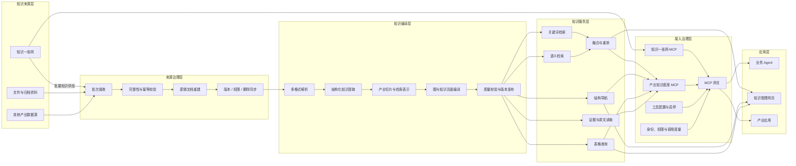
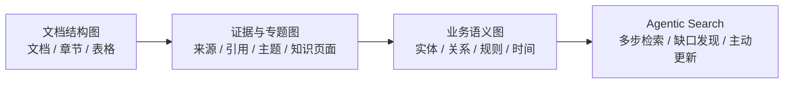

# 产业知识底座技术架构与演进方案

> 版本：V1.1
>
> 日期：2026-09-07

## 一、方案概述

产业知识底座的定位不是重复建设一个通用 RAG，而是在公共知识底座之上，形成面向产业场景的知识加工、组织和消费能力。

未来，知识来源将逐步由 GTS 公共知识底座“知识一张网”统一供给。“知识一张网”负责汇聚各类知识、完成基础切片并提供通用 RAG 服务；产业知识底座接收与产业相关的资料批次，将切片重新组织为逻辑文档，进一步提取章节、表格、来源和业务结构，并按照产业任务需要形成可检索、可导航、可核验的知识资产。

最终，公共知识能力和产业知识能力均通过 MCP 接入企业 Agent。MCP 网关统一完成服务注册、工具发现、工具启停、说明配置、策略管理和调用度量，知识服务则负责各自的数据权限、知识版本和结果可信度。

整体形成以下分工：

```text
知识一张网：解决知识汇聚、基础切片和公共知识服务
产业知识底座：解决产业知识编译、结构化组织和深度消费
MCP 网关：解决知识工具的统一接入、治理和运营
业务 Agent：按任务组合公共知识与产业知识完成工作
```

## 二、建设目标

产业知识底座围绕四个目标建设。

### 1. 统一承接产业知识

知识来源由人工逐份上传，逐步转向从“知识一张网”批量获取。产业底座能够识别同一文档的切片、版本、顺序和权限变化，支持批量入库、增量更新和删除同步。

### 2. 将资料编译成可用知识

在基础切片之上保留和挖掘文档结构、章节上下文、表格、列表、代码、公式、图片说明和来源位置，使知识不仅能够被搜索，还能够被理解、定位和组合。

### 3. 支撑产业化知识消费

同一份知识同时支持网页浏览、混合检索、章节导航、上下文展开、表格查询和 MCP 调用。产业差异通过知识范围、加工配方、消费配方和评价题集表达，不为每个场景复制一套系统。

### 4. 形成可持续演进的图能力

图能力从确定性的文档结构开始，逐步扩展到跨文档专题、证据引用、业务实体、受约束关系和 Agent 主动检索。每一层都必须具备来源、版本、权限、发布和评价闭环。

## 三、当前能力基础

当前系统已经形成“资料入库—知识加工—检索服务—Agent 接入”的主体链路。

| 能力领域 | 当前能力 | 状态 |
|---|---|---|
| 知识管理 | 知识库、目录、文件及归档包入库、文档版本、软删除与恢复 | 已具备 |
| 文档加工 | 支持多类文档解析，提取标题、正文、列表、代码、公式、图片说明和表格 | 已具备 |
| 结构组织 | 保存文档、章节、切片、表格等结构节点及父子、顺序关系 | 已具备 |
| 检索资产 | 生成关键词检索表示、语义向量表示和搜索辅助表示 | 已具备 |
| 知识检索 | 关键词与语义并行召回、结果融合、重排和证据展开 | 已具备 |
| 结构消费 | 章节上下文、结构导航、表格结构查询和证据引用 | 底层能力已具备，网页闭环持续完善 |
| Agent 接入 | 通过 MCP 提供知识搜索、深入读取和资料写入三个稳定工具 | 已具备 |
| 图形化视图 | 将当前文档的章节和表格组织关系展示为文档结构图 | 本阶段完成，随版本发布 |
| 公共知识接入 | 从“知识一张网”批量接收产业知识 | 待对接 |
| 跨文档知识组织 | 知识库级专题、证据网络和带引用知识页面 | 后续建设 |
| 实体与本体 | 受约束的业务实体、关系和规则组织 | 研究储备，暂未进入正式产品 |

当前系统已经超越“文档切片后进行向量搜索”的基础形态，更准确的定位是：

> 已具备结构感知 RAG 和文档级知识编译的主体能力，下一步重点是接入公共知识来源、强化结构消费，并逐步形成知识库级知识编译能力。

## 四、总体技术架构



整个架构包含两条相互配合但职责不同的链路。

### 1. 离线知识供给链路

“知识一张网”按照批次向产业知识底座提供产业相关切片、来源清单、文档身份、内容版本和权限信息。产业知识底座完成数据校验、逻辑文档重建、产业化加工和知识版本发布。

### 2. 在线知识消费链路

“知识一张网 MCP”和“产业知识底座 MCP”同时注册到 MCP 网关。Agent 可以直接使用公共 RAG，也可以使用产业底座提供的结构导航、表格查询和证据读取能力；复杂任务可以在权限允许的范围内组合两类知识服务。

离线批量供给负责稳定的数据同步，MCP 负责运行时知识消费，二者不相互替代。

## 五、“知识一张网”接入方案

### 1. 接入单位

产业知识底座接收的不是缺少上下文的裸切片，而是带完整清单的来源批次。每个批次至少需要包含：

- 来源系统和知识域；
- 稳定的源文档编号；
- 文档内容版本或内容指纹；
- 切片编号、总数和阅读顺序；
- 标题路径及上下级结构；
- 页码、段落、字符范围等来源位置；
- 数据权限范围；
- 新增、修改、删除操作类型；
- 原始文件或版面资产的访问方式。

通过完整批次可以判断切片是否缺失、版本是否混合、顺序是否可靠，并支持安全重试和增量更新。

### 2. 文档重建边界

从切片恢复文档分为两个层级。

**逻辑文档重建**：当上游提供稳定文档身份、同一内容版本、完整切片清单、可靠顺序和章节信息时，可以恢复具有明确阅读结构的逻辑文档，用于浏览、检索和引用。

**原始文件恢复**：只有上游同时提供原始文件，或提供完整的版面、图片、表格、样式和对象信息时，才能恢复原始 PDF、Word 等文件及其精确页面效果。

仅有切片文本时，无法恢复已经在上游切片过程中丢失的图片、表格合并单元格、页眉页脚和版式信息。此类数据只能形成“由上游切片重建的逻辑文档”，不能被标识为原始文件。

当批次不完整、版本不一致或顺序不可信时，系统只将其作为外部证据集合参与检索，不进行强制拼接。

### 3. 增量与删除同步

接入链路需要满足以下要求：

- 同一批次重复发送不会产生重复知识；
- 新版本加工失败时，当前可用版本保持不变；
- 上游新增、修改、删除和权限调整均形成明确事件；
- 上游删除或收紧权限后，旧内容立即从查询范围排除；
- 检索索引、结构资产、缓存和旧引用同步失效；
- 每个知识版本都能追溯到对应的上游文档版本和来源批次。

## 六、产业知识编译

知识编译的核心是把一份资料同时组织成三种互相关联的形态。

### 1. 原始证据面

保留原文、文档版本、解析元素和来源位置，是所有图、摘要和知识页面的最终依据。任何派生知识都不能替代原始证据。

### 2. 结构知识面

组织文档、章节、片段、表格、表格行和其他结构元素，保存父子、顺序和包含关系，用于章节导航、上下文展开、表格查询和结果回源。

### 3. 检索表示面

为同一份知识生成适合不同召回方式的表示，包括关键词文本、语义向量、标题上下文、问题别名和层级摘要。搜索辅助内容只用于帮助发现知识，最终引用仍必须回到原始证据。

三种形态共享同一文档版本和来源身份，作为一个不可拆分的知识版本发布，避免网页、检索和 Agent 读取到不同版本的内容。

### 4. 产业定制方式

产业差异主要由四项配置表达：

- **知识范围**：哪些资料、目录和业务域属于本场景；
- **加工配方**：如何解析、切片、保留表格、生成检索表示和执行质量校验；
- **消费配方**：如何召回、重排、展开上下文、导航结构和查询表格；
- **评价题集**：用哪些真实问题验证能否找到正确、完整且可核验的证据。

这种方式能够在统一平台上持续增加产业能力，同时避免为每个项目复制代码和数据链路。

## 七、图能力分层

图不是单独建设的一套系统，而是结构知识、证据知识和业务语义的统一组织方式。



### 第一层：文档结构图

文档结构图由确定性解析结果生成，表达文档、章节和表格之间的组织关系。当前文档详情已经能够展示：

- 文档和多级章节节点；
- 章节父子关系；
- 文档包含的表格；
- 章节、表格、切片和关系数量；
- 节点选择、画布拖动和缩放。

这一层解决“文档如何组织、某段内容属于哪里、如何补足上下文”的问题。关系来源明确、可以稳定复现，不依赖大模型判断。

### 第二层：证据与专题图

在文档结构之上组织跨文档主题、知识页面、引用和来源覆盖，解决“多篇资料如何共同支撑一个专题结论”的问题。专题中的每个段落都需要绑定来源和版本。

### 第三层：业务语义图

按照明确产业场景建设业务实体、属性、关系、规则和有效时间，解决“业务对象之间是什么关系、在什么版本和时间成立”的问题。

实体与本体能力采用受约束方式推进：

- 先选择对象边界清晰、可人工核验的场景；
- 预先确定允许出现的对象类型和关系类型；
- 实体抽取、实体归一和关系判断分别评价；
- 每条关系绑定原文、知识版本和有效时间；
- 模型生成但未确认的内容只作为候选，不进入正式事实图；
- 通过质量门槛的知识版本才对网页和 MCP 开放。

### 第四层：Agentic Search

Agent 根据任务主动选择搜索、结构导航、表格查询和证据展开工具，通过多步检索解决复杂问题，同时识别缺失知识、失效知识和冲突知识，驱动知识持续更新。

## 八、知识消费与 MCP 体系

### 1. 网页消费

网页面向知识管理者和业务人员提供：

- 原始文档与结构化结果查看；
- 文档结构图和章节浏览；
- 关键词与语义融合检索；
- 搜索结果的来源、章节和内容类型；
- 证据展开、结构导航和表格读取；
- 知识版本、加工质量和运行状态。

### 2. 产业知识底座 MCP

产业知识底座对外保持三个稳定工具：

| 工具 | 作用 |
|---|---|
| `search_knowledge` | 根据问题和知识范围发现可引用证据 |
| `get_knowledge` | 根据证据引用深入读取原文、文档、结构或表格 |
| `upload_document` | 将新资料送入产业知识底座，生产环境按需单独授权 |

行业差异通过知识范围、加工与消费配方、工具说明表达，不为每个行业扩张出大量专用工具。

### 3. MCP 网关

MCP 网关同时注册“知识一张网 MCP”和“产业知识底座 MCP”，主要承担：

- MCP 服务和工具目录管理；
- 工具启用、停用和可见范围控制；
- 工具名称、说明和使用策略配置；
- 身份、客户端和调用范围传递；
- 调用次数、成功率、耗时和异常度量；
- 策略版本、配置变更和调用链审计。

网关配置影响 Agent 如何发现和选择工具，但不能扩大知识权限。每个知识服务在实际读取时仍需校验人员、凭据、知识范围、知识版本和操作权限。

## 九、安全与治理

产业知识通过 MCP 面向 Agent 开放前，需要建立以下治理机制。

### 1. 身份与凭据

- 人员身份、Agent 客户端凭据和服务间身份相互区分；
- 同一人员的不同 Agent 使用独立凭据，可分别限流、轮换和吊销；
- 账号禁用、凭据吊销或过期后，下一次调用立即失效；
- 资料写入权限与读取权限分离，首批接入默认只读。

### 2. 数据权限

- 网关、产业知识 MCP 和底层知识服务分别执行各自的权限校验；
- 实际可用范围是人员权限、凭据范围、开放知识库和当前资源权限的交集；
- 图、摘要、知识页面和其他派生资产继承来源权限；
- 不存在和无权限对象对外返回一致语义，避免泄露资源是否存在。

### 3. 版本与可追溯

- 搜索结果、结构节点和知识页面均绑定明确知识版本；
- 新版本校验成功后再切换，不原地覆盖当前版本；
- 每条可引用结果能够追溯到文档、切片或表格单元格；
- 生成摘要、确定性派生和模型推断使用不同标识；
- 没有可靠来源的内容不能作为正式证据返回。

### 4. 配置治理

- 工具说明和策略分为系统安全约束、组织配置和用户偏好三层；
- 用户配置不能修改工具结构、扩大权限或绕过系统规则；
- 工具启停、说明和策略均具有版本、变更记录和回滚能力；
- 未分类的新工具默认不可见、不可调用。

### 5. 全链路度量

每次调用统一记录调用链编号、人员和客户端、MCP 服务、工具及版本、请求范围、实际知识范围、知识版本、结果数量、错误原因和分阶段耗时。

敏感正文不进入普通运行日志，查询内容和模型输入输出按照数据分级执行加密、限权和保留期限控制。

## 十、产业应用情况

产业知识底座当前已经在 IP、云核心网和站点领域形成应用，政企产业处于场景梳理和能力起步阶段。面向四类产业方向，知识底座复用同一套知识加工、检索和服务能力，但所需要的知识形态并不相同：IP 需要面向配置建模补全设备行为语义，云核心网需要将命令、特性和业务方案组织成可逐层消费的图谱，站点需要围绕专家任务组织信息、文档、方案和基线，政企则需要先从真实业务任务中确定知识边界。

| 产业领域 | 核心应用 | 主要知识形态 | 知识底座的作用 | 当前状态 |
|---|---|---|---|---|
| IP | 配置建模 | 产品手册、已有配置对象和配置操作 | 补全 CLI 语法无法直接推断的设备行为语义 | 已应用，累计形成 19000+ 配置对象 |
| 云核心网 | 配置生成 | 命令图谱、特性图谱、业务图谱 | 将产品知识编译为可检索、可关联、可逐层导航的配置知识 | 命令图谱已覆盖相关网元；特性图谱 5GC 已入库、IMS 待入库；业务图谱已覆盖三个业务域 |
| 站点 | 站点 6 级专家 Agent | 信息库、文档库、方案库、基线库 | 按专家任务提供事实、产品、方案和基线知识 | 已覆盖 RFI、PAV、离网电站和 ODN 数字化场景 |
| 政企 | 待结合业务任务确定 | 待按场景设计 | 从业务任务反向确定知识形态和编译配方 | 起步阶段，业务场景待进一步讨论 |

### 1. IP 配置建模

IP 领域主要将知识底座用于配置建模。知识库中保存两类核心资料：一类是产品手册，另一类是已经完成建模的配置对象和配置操作。AST 建模 Skill 中的 `knowledge_client.py` 在四个关键判断点调用知识检索，将单纯依靠命令行语法无法确定的设备行为补入配置对象模型。

| 建模步骤 | 检索依据 | 需要补全的语义 | 形成的建模结果 |
|---|---|---|---|
| Step1：已有模型理解 | 使用父视图链历史 CLI，即 `preCli` 上下文，检索可能相关的已有配置对象和配置操作 | 当前命令与已有模型的关系及可复用层级 | 选取相关部分并保留完整祖先结构，作为后续层级设计的参考起点 |
| Step6：`createInstance` 判定 | 检索产品手册中关于对象创建和实例隔离的说明 | 同一层级下能否同时存在多个互相隔离的实例 | 形成 `true` 或 `false` 的实例创建属性 |
| Step7：`ifRepeat` 判定 | 检索产品手册中关于重复创建和重复配置的设备行为 | 对象能否创建多个同类型不同名实例，以及同一配置语句重复执行时的处理方式 | 分别形成 `append`、`overwrite`、`error` 等重复处理属性 |
| Step8：`reference` 判定 | 结合 Step1 找到的已有模型和当前参数语义 | 参数值是否引用此前定义的配置对象，以及引用能否跨越当前作用域 | 确定被引用对象类型、引用关系和作用域约束 |

命令语法拆分能够识别参数及其基本结构，但无法单独回答“能否创建多个实例”“重复配置是否覆盖”“参数是否引用其他对象”“引用能否跨作用域”等问题。知识检索通过产品手册和历史建模数据补全这些行为属性，使配置模型从基础的类型和名称进一步扩展到实例、重复处理和引用关系。截至 2026 年 9 月，IP 领域累计形成 19000+ 配置对象。

### 2. 云核心网配置知识图谱

云核心网以配置生成作为主要消费场景，将产品知识组织为命令图谱、特性图谱和业务图谱。5GC 覆盖 UNC、UDG、UDM、UPCF、USC 网元，IMS 和信令覆盖全域网元。

命令图谱组织命令、参数、配置对象及核查规则，已经覆盖 5GC、IMS 和信令相关网元。特性图谱组织产品特性及其与命令、License 等对象的关联，其中 5GC 特性已经入库，IMS 特性已经完成提取、待入库。业务图谱从具体配置目标出发，将业务域、场景和方案与下层知识关联起来，当前覆盖 APN、DPI 和 UELogo 三个业务域。

截至 2026 年 9 月，内网平台统计如下：

| 指标 | 当前数量 | 说明 |
|---|---:|---|
| 命令记录 | 793379 条 | 按内网平台当前统计口径，覆盖 5GC、IMS 和信令相关网元 |
| 核查规则 | 533366 条 | 用于配置生成过程中的规则检查 |
| 网元 | 98 个 | 包含 5GC、IMS 和信令网元 |
| 特性知识 | 27334 条 | 当前已入库部分为 5GC；IMS 已完成提取，待入库 |
| 业务方案 | 31 个 | 覆盖 APN、DPI 和 UELogo 业务域 |

这套图谱不是把产品文档简单转换为图节点，而是将配置生成所需的对象、约束、特性和方案组织成可以逐层检索和追溯的配置知识。Agent 可以从业务方案进入特性和命令，也可以从具体命令回到产品说明与核查规则，在配置生成过程中同时获得操作内容和约束依据。

### 3. 站点 6 级专家 Agent

站点领域围绕“站点 6 级专家”Agent 建设信息库、文档库、方案库和基线库，当前覆盖 RFI 评估、PAV、离网电站和 ODN 数字化四类场景，并纳入相关硬件产品描述等专业资料。

四类知识库按照专家任务分工协同：信息库提供站点、产品和对象信息，文档库提供技术依据，方案库沉淀可复用的场景化方案，基线库提供评估和设计所需的规则、参数与约束。Agent 根据具体任务组合不同知识范围和消费方式，将分散资料转化为可以直接用于分析、评估和方案设计的专业知识。

不同场景使用不同的知识组合。RFI 评估组织相应的评估依据；PAV 场景关联供电架构、设备能力、运行约束和评估基线；离网电站场景组合勘测、设计、设备选型、方案验证、工程实施和验收知识；ODN 数字化场景组织网络勘测、规划设计、成本评估、部署和验收知识。通过场景化知识编译，站点专家 Agent 能够按任务获得完整上下文，而不是只依赖通用文档检索。

### 4. 政企产业

政企产业当前处于起步阶段，具体业务场景仍需进一步讨论和选择。本阶段不预先假设统一的政企知识模型，而是先识别高价值、可验证的业务任务，再确定需要组织的知识对象、关系、规则、方案和证据。

政企场景也是产业知识底座方法能否成立的重要验证：知识平台提供统一的文档解析、检索、版本、权限、来源和 MCP 能力，但面向不同产业，最终交付的知识形态必须由业务场景决定。建设过程以算子化能力为基础，将解析、抽取、关联、校验、检索和证据展开等能力组合成场景配方，再把原始资料编译成 Agent 可以直接消费的定制化知识。

IP、云核心网和站点的已有应用，以及政企产业的起步方向，共同说明产业知识底座的核心不是建设一套固定知识模型，而是形成一条可复用的知识编译链路：

```text
统一资料与知识治理
  → 算子化加工能力
  → 按产业场景选择知识形态和编译配方
  → 形成对象、关系、规则、方案与证据
  → 支撑产业 Agent 完成具体任务
```

## 十一、演进路线

### 阶段一：文档级结构化知识消费闭环

目标是让已提取的结构化信息真正进入使用链路。

- 完善文档结构图；
- 从检索结果进入对应文档和章节；
- 支持章节范围检索和父子内容展开；
- 完善表格发现、精确查询和来源定位；
- 确保网页与 MCP 对同一证据返回一致版本和来源。

### 阶段二：“知识一张网”批量供数接入

目标是将主要知识来源从人工上传转为公共知识底座批量供给。

- 冻结批次、文档身份、版本、切片清单、顺序、定位和权限协议；
- 建设批量接收、完整性校验、幂等重试和增量同步；
- 分别处理可重建逻辑文档与只能作为证据集合的数据；
- 选择一个真实产业知识域完成端到端接入。

### 阶段三：双 MCP 统一接入

目标是让公共知识与产业知识在同一 Agent 接入体系中协同工作。

- 注册知识一张网 MCP 和产业知识底座 MCP；
- 统一人员、客户端凭据、工具范围和调用链编号；
- 接入工具启停、说明和策略版本；
- 建设成功率、耗时、零结果、权限拒绝和来源解析指标；
- 先以只读方式小范围开放，再单独评审资料写入能力。

### 阶段四：知识库级知识编译

目标是从单篇文档结构扩展到跨文档知识组织。

- 建设知识库级结构和覆盖视图；
- 生成带逐段引用的专题知识页面；
- 支持从专题进入文档、章节和原始证据；
- 对比基础 RAG、结构化消费和专题知识消费的任务效果。

### 阶段五：受约束实体、本体与 Agentic Search

目标是在高价值产业场景中形成可核验的业务语义图和主动知识能力。

- 冻结首个场景的对象和关系类型；
- 建设实体抽取、归一、关系判断和人工确认闭环；
- 加入知识有效时间、冲突检测和版本管理；
- 让 Agent 基于图与原文执行多步检索；
- 根据真实任务发现知识缺口并触发受控更新。

## 十二、预期价值与评价指标

### 1. 知识供给效率

- 产业资料从公共底座批量接入，减少重复上传和重复加工；
- 新增、修改和删除能够自动同步；
- 同一平台支持多个产业知识域。

### 2. 知识使用质量

- 搜索结果能够返回正确章节和可核验来源；
- 复杂问题能够通过结构导航和上下文展开获得完整证据；
- 表格类问题能够返回正确行列和对应原始表格；
- 搜索辅助内容不会被误当成原文事实。

### 3. Agent 任务效果

- 提高真实任务完成率；
- 缩短找到可核验证据的时间；
- 降低无结果、错误引用和人工补查比例；
- 能够识别高频知识缺口并形成补充闭环。

### 4. 平台治理能力

- 权限越界、禁用凭据继续访问和删除后旧内容读取均为零；
- 成功工具调用的端到端追踪覆盖率达到 100%；
- 工具和策略配置变更审计覆盖率达到 100%；
- 每条正式知识结论均能追溯到来源和知识版本。

## 十三、边界与原则

本方案遵循以下固定原则：

1. 原始证据是事实来源，图、摘要和知识页面均为可重建派生资产。
2. 图与关键词、语义检索互补，不以图替代现有混合检索。
3. 确定性文档结构优先上线，模型推断关系必须受约束、可核验。
4. 仅靠文本切片不承诺恢复原始文件和已丢失的版面信息。
5. “知识一张网”接入和双 MCP 注册在完成真实联调前不视为现有能力。
6. MCP 网关负责统一接入和运营，不替代知识服务的数据权限。
7. 产业差异通过知识范围、加工配方、消费配方和评价题集表达。
8. 不建设脱离现有知识版本、来源和权限体系的平行图平台。

## 十四、近期建设重点

近期优先完成三项工作：

1. **结构知识可用**：打通检索结果、文档结构图、章节范围、表格查询和原始来源之间的跳转与读取闭环。
2. **公共知识可接**：与“知识一张网”冻结批量供数协议，完成一个真实产业知识域的增量接入和逻辑文档重建。
3. **Agent 接入可治理**：将两个 MCP 纳入统一网关，补齐客户端凭据、工具策略版本、权限复核和全链路度量。

完成以上工作后，产业知识底座将形成稳定的端到端能力：

```text
公共底座供给知识
  → 产业底座完成知识编译
  → 网页和 MCP 提供结构化消费
  → MCP 网关统一接入与治理
  → 业务 Agent 完成可核验的产业任务
```

在这一基础上，再按明确产业场景逐步建设跨文档专题、实体、本体和 Agentic Search，能够兼顾短期可用性与长期演进空间。
