# 产业知识底座：项目全景与下一阶段并行需求

> 版本：V0.1（讨论稿）
>
> 日期：2026-09-08
>
> 文档定位：面向项目规划、需求拆分和多人并行开发，使用业务语言说明本项目是做什么的、当前已经具备什么、下一阶段分别要交付什么。
>
> 关联文档：35号《产业知识底座技术架构与演进方案》是当前现状与总体架构事实源；39号《场景级知识制品：产业Agent知识编译体系与演进方向》是知识制品与持续演进方向。本文件负责把两者转换为可分工、可独立验收、最终能够组合的需求地图，不替代两份原始文档。

## 一、项目是做什么的

产业知识底座不是再建设一个通用RAG，也不是把所有资料统一转换成知识图谱。

本项目要解决的是：公共知识和产业资料进入系统后，如何被持续加工为人和Agent能够直接使用、能够核验来源、能够区分版本、能够按照产业任务继续组合的知识。

完整业务链路是：

```text
知识一张网、文件和其他产业数据源
  → 形成可信、可追溯的知识来源
  → 加工为文档结构、检索证据和场景知识制品
  → 通过网页、在线知识服务和MCP提供给人和Agent
  → Agent使用知识完成查证、比较、判断、设计和核查任务
  → 用真实任务结果决定下一步补充什么知识、改进什么制品
```

系统最终交付的不是“更多切片、更多向量或更多节点”，而是三类业务结果：

1. 用户和Agent能够快速找到正确、完整且可核验的原始证据；
2. 高频产业任务能够直接使用提前整理好的知识制品，不必每次重新阅读和汇总资料；
3. 未覆盖任务仍然可以通过原始检索和工具完成，并把反复出现的知识缺口沉淀为下一轮建设需求。

## 二、当前能力基础

根据35号，当前系统已经形成“资料入库—知识加工—在线检索—Agent接入”的主体链路。

已经具备：

- 知识库、目录、文件、归档包和文档版本管理；
- 多格式文档解析，以及章节、正文、列表、代码、公式、图片说明和表格提取；
- 文档、章节、切片和表格之间的结构关系；
- 关键词检索、语义检索、融合、重排和证据展开；
- 章节上下文、结构导航、表格查询和来源引用的底层能力；
- 网页知识管理、文档结构图和库内检索；
- 面向Agent的三个稳定知识工具：搜索知识、深入读取知识、上传资料；
- 知识加工过程、部分成功、增量重试和当前可搜索版本管理。

当前准确定位是：

> 已具备结构感知RAG和文档级知识编译的主体能力，正在从“资料可以被搜索”演进到“知识能够直接支持产业任务”。

尚未形成完整业务闭环的部分包括：

- 文档结构化信息在网页上的连续消费仍在完善；
- 在线检索质量、范围、权限和异常体验仍需持续演进；
- “知识一张网”尚未完成真实批量接入；
- MCP网关尚未完成双知识服务的统一接入和治理；
- 跨文档专题、知识制品、规则包和业务语义图尚未形成统一产品；
- 真实任务评价和知识持续运营尚未成为稳定机制。

## 三、需求拆分原则

后续多人开发不按“前端、后端、数据库”横向拆分，而按完整业务结果拆分。

每个需求必须满足：

1. 有明确的使用者和业务问题；
2. 从输入、加工、使用到结果评价形成端到端闭环；
3. 有一名明确负责人，对最终用户结果负责；
4. 可以独立开发和验收，不依赖其他需求的内部实现；
5. 与其他需求只通过稳定的业务合同协作；
6. 不另建一套文档、来源、版本、权限和发布体系；
7. 新能力最终能够回到原始证据，不能形成无法核验的平行知识。

## 四、当前已在开展的三项需求

### 需求A：文档级结构化知识消费

**负责人：当前阶段A负责人。**

#### 业务目标

让用户从一次搜索开始，能够进入正确文档和章节，沿文档结构继续阅读，在指定章节范围内搜索，对原始表格进行精确查询，并回到真实原文核验。

#### 端到端交付

```text
搜索或打开文档
  → 找到具体证据
  → 进入对应文档、章节或表格
  → 沿父子和前后章节继续阅读
  → 在整篇、本节或本节及子节内继续搜索
  → 对原始表格进行筛选、排序和统计
  → 回到页、段落、表格行或单元格核验
```

同时完成来源准确率、范围不越界、网页与Agent一致、版本变化和权限撤销等验收。

#### 边界

- 处理单篇文档及其原始结构；
- 不建设跨文档汇总表、专题页或业务本体；
- 不负责MCP服务聚合和网关管理；
- 不负责为具体产业任务设计知识制品。

### 需求B：首个场景化表格知识制品

**负责人：场景化表格知识制品开发者。**

#### 业务目标

选择一个高价值、资料结构相对稳定、结果能够人工验证的任务，把Agent每次都要重复完成的跨文档整理工作提前完成。

首个建议试点是站点硬件规格矩阵：将几十份结构相似的硬件资料整理成一张可查询、可比较、逐字段可回源的规格表。

#### 端到端交付

```text
确定硬件筛选和比较任务
  → 选择资料范围和代表性问题
  → 识别共同字段、型号、单位和版本
  → 形成机器整理草稿
  → 领域专家校准字段、数值、缺失和冲突
  → 发布可查询的硬件规格知识制品
  → Agent直接筛选、比较并查看字段来源
  → 资料变化后只更新受影响内容
  → 用任务准确性、时延和人工补查量评价价值
```

#### 边界

- 负责一项具体场景和一个具体制品的完整价值验证；
- 不建设通用知识制品平台；
- 不重复建设阶段A的原始文档表格查询；
- 不建设MCP网关；
- 不扩展成全行业本体、全场景知识图谱或自动任务发现。

阶段A中的表格是“一份原始文档里的表格”；本需求的规格矩阵是“从多份文档中整理出的场景知识成果”，两者不能混为一项。

### 需求C：MCP聚合网关

**负责人：MCP网关独立系统开发者。**

#### 业务目标

让Agent只连接一个MCP入口，就能够发现和调用知识一张网与产业知识底座提供的工具，并由管理人员统一控制工具是否开放、如何描述和如何度量。

#### 端到端交付

```text
创建一个统一MCP入口
  → 接入知识一张网MCP和产业知识底座MCP
  → 同步双方工具
  → 管理工具启停和对Agent展示的说明
  → 生成Agent接入配置
  → Agent通过统一入口调用下游工具
  → 记录调用结果、耗时和失败原因
  → 单个下游故障时其他工具继续可用
```

#### 边界

- 网关负责服务接入、工具目录、启停、说明、路由和调用度量；
- 网关不决定用户能看哪些知识，不决定知识版本，不理解或改写检索结果；
- 产业知识底座继续负责知识权限、知识范围、知识版本和证据可信度；
- 网关不进行语义选路、知识问答、参数改写或跨工具自动编排；
- 首次接入默认只读，资料上传能力单独授权。

首期如果网关还不具备人员级身份传递，应为每个统一入口绑定一个明确、只读、固定知识范围的服务身份，不能因为工具聚合扩大知识权限。

## 五、需要新增并解耦的需求

### 需求D：在线知识服务持续演进

#### 业务目标

让网页、业务系统和Agent无论通过哪种入口，都能够稳定找到当前有效的知识，得到正确范围内的证据，并在没有结果、没有权限或服务降级时获得真实、可行动的说明。

#### 端到端交付

```text
用户或Agent提出问题并选择知识范围
  → 系统选择适合的检索方式
  → 在正确知识版本和权限范围内寻找候选
  → 返回排序后的原始证据或已发布知识制品
  → 支持继续展开、导航和回源
  → 对无结果、范围错误、权限不足和服务异常给出不同说明
  → 记录本次检索是否成功、为何失败以及使用了什么知识
```

需求内容包括：

- 单库、多库和不同知识域的在线搜索；
- 关键词、语义和结构化知识的协同使用；
- 专业缩写、别名和长文档问题的检索质量提升；
- 搜索结果的完整性、相关性、来源和版本一致；
- 部分文档失败时成功知识仍可检索；
- 管理员、库主、成员和公开库权限一致；
- 稳定响应时间、失败降级和可理解错误；
- 真实问题集上的持续检索效果对比。

#### 边界

- 负责知识“如何被找到和交付”；
- 不负责原始资料如何接入和加工；
- 不负责MCP网关的工具聚合；
- 不负责具体场景知识制品的内容设计；
- 不负责Agent如何完成多步业务任务。

### 需求E：“知识一张网”批量供数接入

#### 业务目标

把产业知识的主要来源从人工逐份上传，转为从公共知识底座稳定、增量地获取，并让接入后的资料能够继续参与产业化知识加工和消费。

#### 端到端交付

```text
知识一张网提供一个来源批次
  → 校验文档身份、版本、切片数量、顺序、位置和权限
  → 判断可恢复原件、可重建逻辑文档或只能作为证据集合
  → 接入产业知识底座
  → 触发后续知识加工
  → 网页和在线服务可以使用新知识
  → 上游新增、修改、删除和权限变化能够持续同步
  → 失败批次可以安全重试且不会产生重复知识
```

#### 边界

- 只负责把外部知识可靠转换为产业底座认可的知识来源；
- 不负责场景知识制品、Wiki、业务实体和Agent策略；
- 不把缺片、乱序或版本混合的切片强行拼成文档；
- 没有原文件或完整页面信息时，只能称为逻辑文档或证据集合，不能冒充原件。

### 需求F：知识版本发布、切换与恢复

#### 业务目标

保证用户和Agent在任何时刻都使用一套明确、完整、经过验证的当前知识；新一轮加工失败时继续使用上一可用版本，并能够安全试用和回退。

#### 端到端交付

```text
资料或加工方式发生变化
  → 形成候选知识版本
  → 检查文档、结构、检索和知识制品是否完整
  → 小范围试用
  → 整体切换为当前版本
  → 网页、在线检索和Agent同时使用新版本
  → 发现问题时恢复上一可用版本
  → 删除或收权后相关旧知识立即停止使用
```

#### 边界

- 负责“哪套知识当前生效”和“如何安全切换”；
- 不负责具体文档怎么解析、检索怎么排序或制品内容怎么生成；
- 所有文档结构、检索结果、知识制品和来源引用共用同一套版本选择；
- 不允许每种知识制品各自维护一套互相独立的当前版本。

### 需求G：统一知识制品管理能力

#### 启动条件

首个场景化表格制品证明业务价值以后启动，不先建设大而全的平台。

#### 业务目标

把首个试点中真正可复用的能力沉淀下来，使后续表格、对象卡、专题页、规则、流程、模板和Skill能够使用一致的登记、校准、发布、查找和回源方式。

#### 端到端交付

```text
产业团队提出一个任务和候选知识成果
  → 登记用途、适用范围和责任人
  → 机器生成或整理草稿
  → 领域专家修改、补充和确认
  → 完成来源、质量和任务效果验证
  → 发布正式版本
  → 人和Agent能够发现、读取和使用
  → 来源变化后提示影响、重新整理或停止使用
  → 低价值或过期制品可以退役
```

#### 边界

- 管理所有制品共有的生命周期，不拥有具体产业内容；
- 产业团队负责场景、字段、规则和专业验收；
- 不取代原始文档、RAG和实时工具；
- 不按制品类型增加大量MCP工具；
- 不让机器草稿未经业务确认直接成为正式知识。

### 需求H：知识库级专题与知识页面

#### 业务目标

帮助用户和Agent理解一个知识库中多份资料共同说明了什么，减少围绕同一专题反复查找和拼接文档的工作。

#### 端到端交付

```text
选择一个知识库和专题
  → 找到相关文档、章节、表格和已有制品
  → 形成带逐段来源的专题知识页面
  → 领域人员检查、修改和发布
  → 用户和Agent按专题阅读并继续下钻原文
  → 资料变化后识别受影响段落并重新确认
  → 与普通RAG效果进行同题对比
```

#### 边界

- 专题页是可重新生成的知识制品，不替代原始资料；
- 每个关键段落必须有直接来源，不能只在页面末尾放一组参考文档；
- 不在这一需求中建设开放式全库本体；
- 不将未经确认的模型总结直接作为正式知识。

### 需求I：对象卡、关系地图与版本差异

#### 业务目标

把分散在多份资料中的同一对象及其关系提前整理清楚，支持Agent理解产品、命令、配置对象、网元、特性和方案之间的对应、依赖与影响。

#### 端到端交付

```text
选择边界清晰的业务对象
  → 汇总属性、别名、版本和来源
  → 连接经过确认的对应、依赖和影响关系
  → 领域专家处理冲突和同名对象
  → 发布对象卡和关系地图
  → Agent可以从对象进入关系和原文依据
  → 新版本进入时生成差异并提示重新确认
```

#### 边界

- 从一个明确产业任务开始，不建设全领域通用本体；
- 机器发现的对象和关系首先是候选；
- 未经确认的关系不能作为正式事实使用；
- 图负责组织和导航，不能替代原始证据和混合检索。

### 需求J：规则、决策指南与检查器

#### 业务目标

把文档中的条件、限制和专家判断整理成可以直接用于筛选、判断和核查的业务依据。

#### 端到端交付

```text
确定一个判断任务
  → 收集适用条件、规则、例外和来源
  → 机器整理草稿
  → 专家确认规则和风险边界
  → 使用正例、反例和边界案例验证
  → 发布规则包、决策指南或只读检查器
  → Agent在任务中执行判断并展示依据
  → 来源变化后重新检查受影响规则
```

#### 边界

- 首批只用于只读判断和变更前检查，不直接执行生产变更；
- 缺少必要输入时必须明确无法判断；
- 实时库存、告警和运行状态由实时系统提供，不能写成长期静态事实；
- 高风险规则需要更严格的专业审核。

### 需求K：作业流程、模板与专业能力包

#### 业务目标

把完成某类专业工作所需的步骤、材料、检查点、模板和知识组合成可复用能力，减少不同Agent重复设计任务流程。

#### 端到端交付

```text
选择一个稳定的专业任务
  → 明确输入、步骤、检查点、异常和输出
  → 组合需要的文档、制品、规则和模板
  → 领域专家校准流程
  → 用真实任务验证
  → 发布作业流程、模板或Skill
  → Agent按步骤执行并保留证据
  → 根据失败和人工修正持续更新
```

#### 边界

- Skill只承载需要Agent理解和执行的流程，不把所有知识制品都包装成Skill；
- 知识服务负责提供已确认内容，不在知识服务中执行任意生成代码；
- 使用经验只能提出修改建议，通过评价和审核后才能发布新版本。

### 需求L：有边界的Agent主动检索与知识缺口

#### 业务目标

让Agent在复杂任务中能够组合原始检索、文档结构、表格、专题、对象和规则完成多步查证，并把确实缺失、过期或冲突的知识反馈给知识建设人员。

#### 端到端交付

```text
Agent收到复杂任务
  → 判断是否需要多步查证
  → 在允许范围内选择知识和工具
  → 逐步搜索、读取、比较和核验
  → 在预算内停止并给出带来源结论
  → 区分无知识、知识冲突、版本过期、权限不足和工具失败
  → 形成可审核的知识缺口
  → 知识建设人员决定补资料、改制品还是调整使用方法
```

#### 边界

- 简单问题继续走低成本在线检索，不默认进入多轮循环；
- Agent不能因为发现缺口直接修改当前正式知识；
- 每个正式结论都必须回到原始证据或已确认知识制品；
- 不允许无限步骤、无限成本或跨权限探索。

### 需求M：知识评价与持续运营

#### 业务目标

建立统一的评价方式，判断问题出在资料接入、知识加工、在线检索、知识制品还是Agent使用，并用真实业务效果决定哪些能力可以发布和扩大使用。

#### 端到端交付

```text
为一个场景建立代表任务和当前基线
  → 分别评价资料、结构、来源、检索、制品和Agent结果
  → 对比新旧版本
  → 定位失败属于哪个环节
  → 决定通过、继续试用、回退或停止发布
  → 收集用户纠正和高频失败
  → 形成下一轮建设优先级
```

统一评价至少回答：

- 资料是否完整进入系统；
- 所需知识是否被找到；
- 来源是否正确且可以打开；
- 制品字段、规则和结论是否准确；
- Agent是否选对并正确使用知识；
- 任务准确性、完整性、时延、成本和人工补查是否改善；
- 新版本是否比当前版本更值得发布。

#### 边界

- 评价团队提供统一方法和平台，各需求负责人提供本场景题目与正确结果；
- 不用文档数、切片数、节点数或制品数代替业务价值；
- 没有真实任务和明确答案时，不宣称业务效果已经提升。

### 需求N：大规模知识供给与服务稳定性

#### 业务目标

保证知识来源、文档和制品规模增长后，批量接入、加工、搜索和Agent调用仍然稳定，不因单个文件、单个下游或单次失败影响整批知识。

#### 端到端交付

```text
大批量知识进入或更新
  → 系统分批处理并展示真实进度
  → 单文档失败不阻断其他内容
  → 中断后从正确位置恢复
  → 新知识可按时进入在线服务
  → 高并发查询保持稳定
  → 容量接近边界时提前预警和扩展
```

#### 边界

- 负责规模、稳定性、恢复和容量，不改变具体知识内容和业务语义；
- 不以降低来源、版本和权限检查为代价换取性能；
- 真实规模和压力数据决定何时扩展，不提前建设无需求的大集群。

### 需求O：图片、公式、扫描件和复杂版面知识

#### 业务目标

当真实任务因为图片、公式、扫描件或复杂版面信息缺失而无法完成时，补齐这些资料的识别、定位、检索和核验能力。

#### 端到端交付

```text
识别当前任务中因版面或非文本内容造成的知识缺口
  → 选择需要支持的资料类型
  → 提取图片说明、公式或扫描内容
  → 保留其原始位置和质量说明
  → 进入检索和知识制品
  → 用户与Agent可以查看并回到原件核验
  → 用真实缺口任务验证是否改善
```

#### 边界

- 根据真实业务缺口启动，不为“格式覆盖率”盲目建设；
- 识别不可靠时必须展示不确定性并允许人工核验；
- 不将无法确认的图片或公式解释作为正式事实。

## 六、需求之间的协作关系

```mermaid
flowchart LR
    A[阶段A：文档结构化消费] --> D[在线知识服务]
    E[知识一张网接入] --> F[知识版本发布]
    A --> F
    F --> D

    B[首个场景表格制品] --> G[统一知识制品能力]
    F --> G
    G --> H[专题知识页面]
    G --> I[对象与关系]
    G --> J[规则与检查]
    G --> K[流程与专业能力包]

    D --> C[MCP聚合网关]
    E --> C
    C --> L[Agent主动检索]
    H --> L
    I --> L
    J --> L
    K --> L

    M[评价与持续运营] --> A
    M --> B
    M --> D
    M --> G
    M --> L
    N[规模与稳定性] --> E
    N --> D
```



需要特别说明：

- 阶段A、在线知识服务、场景表格制品、MCP网关可以并行开发；
- 知识一张网的协议和样例联调可以立即开始；
- 正式跨文档制品需要知识版本发布能力保障完整切换和回退；
- 统一制品管理应从首个场景试点中提炼，不能先于业务价值验证建设大平台；
- Agent主动检索要在已有可用证据、制品和统一调用观测后扩大；
- 评价与运营应从现在开始伴随每条主线，而不是最后补报告。

## 七、建议的并行开发安排

### 当前立即并行

| 需求 | 建议负责人 | 当前输出 |
|---|---|---|
| A 文档级结构化知识消费 | 当前阶段A负责人 | 搜索、章节、原始表格与原文核验闭环 |
| B 首个场景化表格制品 | 当前场景制品开发者 | 硬件规格矩阵或已确定的表格型制品试点 |
| C MCP聚合网关 | 当前网关开发者 | 双MCP接入、工具管理、转发和调用度量 |
| D 在线知识服务持续演进 | 新增独立负责人 | 检索质量、范围、权限、稳定性和证据交付 |
| E 知识一张网批量供数 | 新增独立负责人 | 供数合同、逻辑文档重建和单域真实接入 |
| F 知识版本发布与恢复 | 新增独立负责人 | 完整知识版本切换、试用、回退和失效传播 |
| M 评价与持续运营 | 可设独立负责人，也可先由各主线共同建设 | 统一题集、基线、问题归因和发布判断 |

如果当前只能增加一名开发者，优先安排F“知识版本发布与恢复”。它是跨文档知识制品和后续正式发布的共同保障。

如果可以增加第二名，安排E“知识一张网批量供数”。该项外部协作周期长，应尽早取得真实协议和样例。

如果可以增加第三名，安排D“在线知识服务持续演进”，避免知识加工和制品不断增加而在线消费主线无人长期负责。

## 八、共同业务合同

需求彼此解耦的前提不是互不沟通，而是共同遵守少量稳定合同。

### 1. 来源合同

任何正式知识都必须说明来自哪个系统、哪份资料、哪个版本和什么位置，以及当前调用者是否有权访问。

### 2. 当前知识版本合同

网页、在线检索、MCP和知识制品必须对“当前有效知识”有一致认识。新版本未通过时继续使用旧版本。

### 3. 知识制品合同

任何制品都必须说明用途、适用范围、内容形态、来源、负责人、校准状态、质量结论和失效条件。

### 4. Agent接入与调用合同

网关能够识别由哪个Agent、以什么身份、调用了哪个工具；知识服务仍然独立判断它最终能够读取哪些知识。

### 5. 评价合同

每项需求必须有版本化的代表任务、正确结果、当前基线、评价结果和是否允许发布的结论。

## 九、整体演进节奏

### 第一层：把当前主体能力做稳

- 完成阶段A；
- 持续提升在线知识服务；
- 完成知识一张网单域接入；
- 完成双MCP统一入口；
- 建立完整知识版本发布和评价机制。

### 第二层：证明知识制品价值

- 完成首个场景表格制品；
- 与普通RAG做真实任务对比；
- 形成专家校准、更新和原文回查闭环；
- 只提炼已经被试点证明可复用的通用能力。

### 第三层：扩展知识成果形态

- 专题知识页面；
- 对象卡和关系地图；
- 规则、决策指南和检查器；
- 作业流程、模板和专业能力包；
- 在IP、云核心网、站点和政企选择新的高价值任务验证。

### 第四层：形成持续演进能力

- Agent按复杂度组合检索、制品和工具；
- 识别知识缺失、冲突、过期和使用错误；
- 从真实使用中发现下一批值得编译的知识；
- 经专家校准和任务评价后发布新制品或新能力；
- 不追求穷举全部场景，以高价值任务覆盖和缺口关闭速度衡量进展。

## 十、现阶段明确不做

1. 不先建设大而全的知识制品平台；
2. 不一次性穷举所有产业场景；
3. 不将所有资料统一转换成表格、Wiki或知识图；
4. 不恢复开放式全库实体、本体抽取；
5. 不让模型生成内容未经校准直接成为正式事实；
6. 不让Agent使用经验自动修改产品知识；
7. 不让所有简单问题进入多轮Agent流程；
8. 不让MCP网关替代知识权限和知识版本判断；
9. 不让场景开发者另建一套文档、来源和发布体系；
10. 不以文档数、切片数、节点数或制品数衡量项目成功。

## 十一、下一步需要讨论和冻结的事项

1. 阶段A当前范围和预计收口点，避免与在线知识服务长期重叠；
2. 在线知识服务是否安排独立长期负责人；
3. 首个场景表格制品是否正式确定为站点硬件规格矩阵；
4. “知识一张网”目前能提供原件、文档身份、版本、完整切片清单、顺序、位置和权限中的哪些信息；
5. MCP网关首期是否接受“一个入口对应一个固定只读知识范围”；
6. 知识版本发布与恢复由谁负责、何时开工；
7. 评价与持续运营是设独立负责人，还是先由各需求共同维护后再平台化；
8. 第二个知识制品试点优先选择IP配置行为、云核心网配置生成还是站点规则包。

以上事项冻结后，每个需求可以进一步形成独立需求文档，并分别交给开发者端到端实现和验收。
