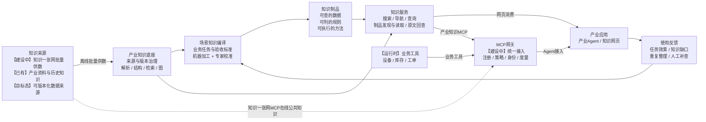

# 产业知识底座：现状、目标架构与演进方案

> 版本：V2.1
>
> 日期：2026-09-08

## 一、方案概述

产业知识底座不是重复建设一个通用RAG，而是在公共知识底座之上，进一步形成面向产业任务的知识加工、组织、编译和使用能力。

当前已经具备资料入库、文档解析、结构化加工、混合检索、文档结构组织和Agent接入能力，并已在IP、云核心网和站点领域形成应用，其中云核心网已形成命令、特性和业务图谱资产。

下一步需要从“帮助Agent找到资料”进一步演进到“提前为Agent准备可以直接使用的知识”：面向高价值产业任务，将Agent反复进行的查找、整理、对齐、判断和准备工作提前完成，形成可重复使用、可由专家校准、可以回到原始依据的知识制品。

知识制品不替代RAG和GraphRAG。原始资料仍是事实依据，RAG继续承担证据发现和长尾问题，GraphRAG承担对象关系和跨文档线索组织，知识制品承担高频任务的提前整理，实时工具提供设备状态、库存和工单等动态信息。

整体路线为：

```text
知识一张网统一供给公共知识
→ 产业知识底座完成深度加工和结构组织
→ 面向产业任务编译知识制品
→ 领域专家修改、校准并通过真实任务验证
→ 通过网页和MCP提供给产业Agent
→ 来源变化和使用反馈推动持续演进
```

目标是形成一套能够持续把原始资料和专家经验转化为产业Agent生产力的知识编译与治理体系。

## 二、总体目标架构与当前能力

### 1. 总体目标架构

总体架构覆盖知识从来源接入、产业加工、知识编译、知识消费到反馈演进的完整链路。



这张图包含三条链路：

**知识供给链路**：知识一张网和现有产业资料进入产业知识底座，统一管理来源、版本、权限和删除变化，再完成文档重建、结构化加工和知识编译。

**知识消费链路**：产业知识底座同时提供原始证据、结构导航、图谱关系和知识制品，通过网页与MCP提供给产业Agent；设备状态、库存、工单等动态信息由业务工具在运行时补充。

**反馈演进链路**：Agent任务中的失败、原文回退、人工补查和重复知识整理形成候选改进，经来源核验、专家确认和任务评价后进入下一轮知识编译。

其中，知识一张网同时存在两种接入方式：离线批量供数用于稳定同步资料，知识一张网MCP用于Agent在线使用公共知识。两条链路职责不同，不能互相替代。

### 2. 当前平台能力

以下状态采用截至2026-09-08的最新进展口径；其中知识一张网接入、MCP网关开发和首个表格知识制品已经进入建设阶段，尚未作为完成能力对外承诺。

| 状态 | 能力领域 | 当前情况 |
|---|---|---|
| 【已有】 | 知识管理 | 支持知识库、目录、文件、归档包、文档版本、删除和恢复 |
| 【已有】 | 文档加工 | 支持多类文档解析，提取标题、正文、列表、代码、公式、图片说明和表格 |
| 【已有】 | 结构组织 | 保存文档、章节、切片、表格及其父子、顺序和包含关系 |
| 【已有】 | 混合检索 | 支持关键词与语义召回、结果融合、重排和证据展开 |
| 【已有】 | 结构化使用 | 具备章节导航、上下文展开、表格查询和证据读取等底层能力 |
| 【已有】 | Agent接入 | 产业知识底座通过MCP提供知识搜索、深入读取和资料写入三个工具；生产资料写入需单独授权 |
| 【已有】 | 图结构 | 已具备文档结构图；云核心网已形成命令、特性和业务图谱资产 |
| 【已有】 | 版本与范围 | 已具备文档/知识版本和本地知识范围基础 |
| 【完善中】 | 用户使用闭环 | 搜索结果、文档结构、表格和原始来源之间的网页闭环持续完善 |
| 【建设中】 | 知识一张网接入 | 正在建设批量供数以及新增、修改、删除和权限同步 |
| 【建设中】 | MCP网关 | 正在开发公共知识、产业知识和业务工具的统一接入与治理能力 |
| 【建设中】 | 首个表格知识制品 | 正在构建首个表格类知识制品，验证从资料编译到Agent直接使用的闭环 |
| 【目标态】 | 知识库级编译 | 建设跨文档证据、专题、实体、本体和场景级知识组织 |
| 【目标态】 | 通用知识制品 | 形成可查数据、可判规则、可执行方法及其治理、消费和演进能力 |

当前系统已经超过“文档切片后进行向量搜索”的基础阶段，更准确的定位是：

> 已具备结构感知RAG和文档级知识编译的主体能力，公共知识接入、MCP统一治理和首个表格知识制品正在建设，下一步向知识库级和场景级知识编译演进。

### 3. 目标架构中各部分的分工

- **知识一张网**：汇聚公共知识，提供基础切片、批量资料和公共知识服务；
- **产业知识底座**：重建逻辑文档，完成产业化解析、结构组织、图谱和知识制品编译；
- **知识服务**：提供混合检索、结构导航、表格与规则查询、制品读取和原文核验；
- **MCP网关**：统一管理公共知识、产业知识和业务工具的服务注册、可见范围、使用策略和调用度量；
- **产业Agent**：按任务组合知识制品、原始证据、图谱关系和实时业务数据完成工作。

MCP网关负责统一接入和运营，但不替代知识服务和业务系统自身的数据权限。

### 4. 产业知识底座的三种基础知识形态

产业知识编译不是只生成切片或向量，而是将同一份资料组织成三种相互关联的基础形态。

| 知识形态 | 主要内容 | 主要作用 | 当前状态 |
|---|---|---|---|
| 原始证据 | 原文、内容版本、解析元素和具体来源位置 | 作为事实依据，支持核验、纠错和追溯 | 【已有，来源定位完善中】 |
| 结构知识 | 文档、章节、片段、表格、列表、代码及其层级和顺序关系 | 支持章节导航、上下文展开、表格查询和结构理解 | 【已有】 |
| 检索表示 | 关键词文本、语义向量、标题上下文、问题别名和层级摘要 | 帮助发现知识和提高召回效果 | 【已有】 |

三种形态需要绑定同一文档身份和内容版本。检索表示只负责帮助找到知识，结构知识负责补足上下文，最终引用和事实核验必须回到原始证据。

知识制品建立在这三种基础形态之上，可以重新组织和派生知识，但不能脱离原始证据、版本和权限形成另一套事实体系。

### 5. “知识一张网”接入原则

知识一张网向产业知识底座提供的不能只是缺少上下文的裸切片，而应是能够识别来源、版本、顺序和权限的完整资料批次。

| 接入原则 | 关键要求 |
|---|---|
| 来源可识别 | 包含来源系统和知识域、稳定文档身份、内容版本或内容指纹 |
| 内容可重建 | 包含切片编号、总数、阅读顺序、标题路径和上下级关系 |
| 证据可定位 | 包含页码、段落、字符范围或其他原始位置；需要恢复原文件时同时提供原始文件或版面资产 |
| 权限可同步 | 包含资料权限以及新增、修改、删除和权限调整类型 |
| 批次可校验 | 能判断切片是否缺失、版本是否混合和顺序是否可靠，重复发送不会产生重复知识 |
| 变化可传播 | 新版本失败时继续使用上一可用版本；删除或收紧权限后，相关检索、图谱和知识制品同步失效 |

接入后需要区分两个边界：

- **逻辑文档重建**：当文档身份、版本、切片清单、顺序和章节信息完整时，可以恢复可浏览、可检索和可引用的逻辑文档；
- **原始文件恢复**：只有同时获得原文件，或完整的图片、表格、样式和版面对象信息时，才能恢复原始PDF、Word等文件的精确效果。

如果批次不完整、版本不一致或顺序不可信，只将其作为外部证据集合参与检索和核验，不强制拼接成完整文档。

## 三、核心演进判断与案例依据

### 1. 硬件资料案例

一份产品文档下面可能有几十个结构相同的HTML，每个HTML分别描述一种硬件。

当前使用方式：

```text
搜索几十个HTML
→ Agent逐页阅读
→ 临时统一字段和单位
→ 每次任务重新汇总和比较
```

目标使用方式：

```text
资料进入后提前抽取、归一和校准
→ 形成可查询的硬件规格矩阵
→ Agent直接筛选和比较
→ 缺失、冲突或版本不适用时回到原文
```

硬件规格矩阵就是一种知识制品。它把Agent每次都要重复做的知识整理提前完成，同时保留字段到原始HTML和产品文档的来源链路。

### 2. RAG、GraphRAG、知识制品和实时工具的分工

| 能力 | 主要作用 | Agent获得什么 |
|---|---|---|
| RAG | 发现原始证据、处理未知和低频问题 | 原始片段和出处 |
| GraphRAG | 组织对象、关系和跨文档线索 | 关系网络、关联内容和摘要 |
| 知识制品 | 提前完成高频任务反复需要的整理和判断 | 可直接查询、判断或使用的任务成果 |
| 实时工具 | 获取不适合固化的动态业务状态 | 当前设备、库存、工单和运行数据 |

GraphRAG本身也会提前构建实体、关系、社区和社区报告，因此已经包含离线知识加工。知识制品与GraphRAG的差异不在于“是否加工”，而在于是否围绕具体任务形成表格、规则、流程、模板或能力包等可以直接使用的成果。

知识制品不是预生成最终答案。它提前准备完成任务所需的知识结构和方法，Agent仍需结合当前要求、实时状态和权限作出最终判断。

### 3. 知识制品的主要形态

| 类型 | 主要作用 | 典型成果 |
|---|---|---|
| 可查的数据 | 帮助Agent看懂对象、查清信息和关系 | 规格矩阵、对象档案、实体、版本对照、对象目录和关系图 |
| 可判的规则 | 帮助Agent按照产品约束和专家标准作出判断 | 配置规则、适配条件、决策指南、基线和检查器 |
| 可执行的方法 | 帮助Agent按正确步骤完成工作 | 作业流程、方案模板、报告模板、Skill和场景知识包 |

其中，实体用于识别和合并资料中指向同一业务对象的信息。本体不是一条普通数据记录，而是统一约束实体类型、属性、关系和规则的语义规范，作为可查数据、可判规则和知识图谱共同使用的基础，也需要进行版本化治理。

同一批硬件资料可以根据任务形成不同制品：查单个型号形成对象档案，多型号筛选形成规格矩阵，环境适配形成规则包，站点设计形成方案模板和场景知识包。

所以，知识编译的重点不是把所有资料都转成表格或知识图，而是根据任务选择最合适的知识形态。

### 4. 外部产品与论文洞察

外部产品、规范和研究尚未形成统一的知识制品标准，但已经共同指向“保留原始事实、提前加工、面向任务交付、持续评价更新”的方向。表中2026年Agent相关论文截至本文日期均按预印本Benchmark证据处理，不视为成熟企业能力。

| 代表 | 主要发现或主张 | 对本方案的洞察 | 适用边界 |
|---|---|---|---|
| [Microsoft GraphRAG](https://github.com/microsoft/graphrag/blob/main/docs/index/default_dataflow.md) | 离线构建实体、关系、可选Claim、社区和社区报告 | 通用图结构适合关系组织，但不能替代任务所需的所有制品形态 | 官方仓库属于研究项目，图索引成本和任务适配需要单独评价 |
| [Pinecone Nexus](https://www.pinecone.io/learn/how-knowledge-engines-work/) | 围绕具体工作、任务要求和评价构建Artifact与Context | 知识建设需要从语料中心进一步走向任务中心 | 产品能力和效果来自厂商材料，不能直接作为本项目收益承诺 |
| [Karpathy LLM Wiki](https://gist.github.com/karpathy/442a6bf555914893e9891c11519de94f)与[LLM-Wiki论文](https://arxiv.org/abs/2605.25480) | 在不可变原始资料之上建立持续维护的派生知识层；论文作者在其多跳测试中报告相对最强图检索基线提升2.0至8.1 F1，但单文档细节并不始终占优 | 编译结果应持续积累，同时保留原始资料核验 | 前者是思想构想，后者是预印本Benchmark，不是企业生产证明 |
| [Google OKF](https://github.com/GoogleCloudPlatform/knowledge-catalog/blob/main/okf/SPEC.md?plain=1) | 为机器生成知识提供来源、验证、陈旧时间和生命周期等可选表达 | 正式知识制品应带完整治理信息 | OKF是交换规范，不规定知识怎样编译和运行；治理字段多数为可选 |
| [EVAPORATE](https://arxiv.org/abs/2304.09433)与[DocETL](https://arxiv.org/abs/2410.12189) | 组合模型、代码、处理步骤和评价完成非结构化资料加工；EVAPORATE在16组、每组1万文档的设置中报告约110倍Token缩减，DocETL在四类任务中报告相对基线提升25%至80% | 知识编译不能只依赖一次大模型总结，应支持代码化和评价驱动 | 论文结果来自各自实验设置，需要在产业语料上重新验证 |
| [WikiSkill](https://arxiv.org/abs/2608.27454) | 从成功与失败轨迹积累经验并验证Skill修改；作者在五个Benchmark、五种模型上报告，相对各模型最强竞争方法的平均提升为3.3至12.0个百分点 | 使用经验可以改进编译和使用方法，但不能直接改写产品事实 | 实验直接提供全部Skill，未解决企业全部场景发现和大规模Skill触发问题 |
| [WiCER](https://arxiv.org/abs/2605.07068) | 作者在17个领域、6,800个问题上报告，盲目Wiki编译出现53%至60%严重失败，一至两轮诊断迭代恢复约80%的损失质量 | 编译结果必须评价，原始资料必须保留 | 论文结论来自特定实验设置，不代表所有产业数据 |
| [Skill Retrieval Augmentation](https://arxiv.org/abs/2604.24594) | 即使正确Skill已被找到，Agent仍可能不知道是否应该加载 | 找到制品不等于正确使用，适用条件和调用方式也需校准 | SRA-Bench为研究基准，包含5,400个测试实例和26,262个Skill语料 |

## 四、目标态业务流程与知识治理

### 1. 以任务和评价驱动知识编译

```text
明确产业任务
→ 给出代表任务和验收标准
→ 选择相关资料与已有知识
→ 机器批量抽取、归一、关联并形成候选制品
→ 领域专家修改、补充和校准
→ 使用真实任务验证
→ 发布给Agent
→ 制品优先使用、原文托底、实时工具补充
→ 来源变化和使用反馈进入下一版本
```

领域人员负责业务目标、知识边界、关键规则和验收标准；平台提供解析、抽取、归一、关联、规则化、代码和模型等可组合能力。制品形态由领域人员与知识编译能力共同形成，不能由模型单方面决定和发布。

不同产业和场景的定制主要通过四项内容表达：

| 定制内容 | 需要回答的问题 | 形成的结果 |
|---|---|---|
| 知识范围 | 这个任务允许使用哪些资料、产品、版本和业务域 | 场景知识边界和来源清单 |
| 加工方式 | 原始知识需要怎样抽取、归一、关联和编译 | 数据、规则、方法等知识制品 |
| 消费方式 | Agent怎样发现、读取、查询、组合和回查知识 | 面向任务的知识使用路径 |
| 评价题集 | 怎样判断知识制品是否真正改善了任务 | 代表任务、正确结果和验收标准 |

这样可以在统一平台上持续增加产业能力，同时避免为每个项目复制一套代码和数据链路。

### 2. 图结构与知识制品协同

图不是单独建设的一套平行系统，而是连接原始证据、结构化知识、知识制品和产业场景的组织方式。

图能力按照以下层次演进：

| 层次 | 解决的问题 | 状态 |
|---|---|---|
| 文档结构图 | 文档怎样组织，某段内容属于哪个章节或表格 | 【已有】 |
| 产业知识图谱 | 命令、配置对象、特性、业务方案怎样关联 | 【已有·产业侧】 |
| 跨文档证据与专题图 | 多份资料怎样共同支撑一个专题、结论或知识制品 | 【目标态】 |
| 业务语义图 | 实体、本体、规则、有效时间和冲突怎样统一表达 | 【目标态】 |

在上述图结构、知识制品和原始证据成熟后，Agentic Search作为后续消费能力，支持Agent开展受限的多步检索并发现知识缺口。它是知识消费方式，不是新的一层图结构。

RAG、GraphRAG和图导航用于发现和理解知识，知识制品用于直接完成任务，二者共享同一来源、版本和权限体系。表格、规则和流程等知识制品可以直接被服务和Agent使用，不需要先全部转换成图；图主要辅助发现、导航和影响分析。

### 3. 人机协同的知识治理

知识编译不能成为黑盒。每条正式知识需要回答：来自哪里、经过什么整理、谁检查和修改过、当前是否仍然有效。

来源事实采用以下链路：

```text
来源系统
→ 原始文档或数据版本
→ 具体章节、表格、字段或记录
→ 机器抽取和整理
→ 领域专家校准或按风险抽样复核
→ 正式知识制品
→ Agent任务中的使用结果
```

专家知识采用以下链路：

```text
领域专家
→ 判断依据、适用范围和例外
→ 专业审核确认
→ 正式专家知识
→ Agent任务中的使用结果
```

机器生成的制品首先是候选结果。领域专家需要能够直接修改表格字段、对象属性、关系、规则、流程、模板和Skill。人工修改不覆盖原始资料，而是保留修改人、理由、时间和适用范围。

资料更新后，系统需要找到受影响的制品重新编译，并将新结果与上一版人工校准一起复核，不能静默覆盖专家修改。来源事实随原始资料重新核验，独立专家判断按照自身适用范围和复核时间重新确认。

不同风险采用不同治理强度：普通知识可以机器生成、人工抽样；关键字段、业务规则和选型条件需要专家确认；生产配置、高风险方案和跨来源冲突必须专业审核。

当前已具备文档/知识版本和本地知识范围基础；目标态补齐人员与Agent凭据、跨系统权限同步、统一调用度量和端到端审计。

### 4. 知识消费

网页面向知识管理者和领域专家，提供原始资料、结构化结果、知识制品、来源链路、人工修改、版本状态和质量结果的统一查看与校准。

| 消费入口 | 主要能力 | 状态 |
|---|---|---|
| 知识网页 | 查看原始文档和结构化结果，浏览章节、表格和图谱，执行搜索和表格查询，核验来源、版本与质量 | 基础能力已有，端到端闭环完善中 |
| 专家校准工作台 | 查看机器编译结果，修改字段、关系、规则、流程和模板，处理冲突并确认发布 | 目标态 |
| 产业Agent | 发现原始证据，读取结构和表格，使用知识制品，并结合业务工具完成任务 | 产业侧已有应用，制品消费持续建设 |
| MCP网关 | 统一注册公共知识、产业知识和业务工具，控制可见范围、策略、身份和调用度量 | 建设中 |

产业Agent通过MCP使用知识：

- 从混合检索中发现原始证据；
- 沿文档和图结构理解上下文和关系；
- 查询表格和规则等结构化知识；
- 发现、读取和组合已经发布的知识制品；
- 在制品不适用时回到原文；
- 通过实时工具补充当前业务状态。

产业知识底座继续保持三个稳定MCP工具，产业差异通过知识范围、加工方式、消费方式和工具说明表达，不为每个产业扩张大量专用工具。

| MCP工具 | 当前能力 | 目标态扩展 |
|---|---|---|
| `search_knowledge` | 根据问题和知识范围发现原始证据 | 增加知识制品发现 |
| `get_knowledge` | 根据引用继续读取原文、文档结构和表格 | 增加图谱和知识制品读取 |
| `upload_document` | 将新资料送入产业知识底座；生产环境按需单独授权 | 根据来源变化触发相关知识重新编译 |

MCP网关统一管理公共知识、产业知识和业务工具的服务注册、可见范围、使用策略和调用度量，但不替代各知识服务和业务系统的数据权限。

### 5. 场景无法穷举时的演进方式

平台不需要提前列出所有产业场景，也不应一开始建设完整的行业任务树。

```text
已知高价值任务：提前编译正式知识制品
未知和低频任务：继续使用RAG、GraphRAG、原始资料和实时工具
反复出现的任务：识别为下一批候选
经过业务验证的候选：升格为正式制品
```

候选机会来自两类信号：

- 使用信号：反复读取相同资料、重复抽取字段、重复编写临时代码、重复失败和人工补查；
- 资料信号：大量同构HTML、重复参数表、统一格式的方案文档。

资料有规律只说明“可能值得加工”，不等于已有业务价值。只有与真实任务结合，并满足价值、稳定性和可验证性要求后，才能形成正式制品。

使用反馈只能提出疑似错误、遗漏、新任务或方法改进，不能直接修改产品事实。事实更新必须经过授权来源核验，专家知识必须经过责任人确认。

偶发一次性任务、实时状态、规则频繁变化、无法明确验收标准或权限边界不稳定的内容，不作为优先预编译对象。

## 五、下一阶段演进路线与评价

基础能力收口和首个知识制品试点可以并行推进，但制品规模化发布必须复用统一的来源、版本、权限、专家校准和任务评价体系。

### 第一阶段：完成当前建设项

当前正在同步推进：

- 知识一张网批量供数以及版本、增量、删除和权限同步；
- MCP网关开发及公共知识、产业知识和业务工具统一接入；
- 搜索结果、文档结构、表格和原始来源之间的使用闭环；
- 首个表格知识制品的构建与验证。

### 第二阶段：完成首个知识制品闭环

以当前表格知识制品建设为基础，完整打通：

```text
同构资料
→ 字段识别和批量抽取
→ 名称、单位和版本归一
→ 领域专家修改和校准
→ 真实筛选、比较任务验证
→ Agent直接查询
→ 字段回到原始资料
→ 资料变化后增量更新
```

这一阶段验证的不是“能否生成一张表”，而是能否形成一条可复用、可治理、可更新、真正降低Agent重复劳动的知识编译链路。

### 第三阶段：形成通用知识编译方法

在IP或云核心网选择一个需要组合数据、关系、规则、流程和Skill的任务，验证多种知识制品能否协同完成完整工作。

重点沉淀：

- 从资料和任务中识别值得加工的知识；
- 组合抽取、归一、关联、规则化、代码和模型能力；
- 形成适合任务的数据、规则和方法；
- 支持专家修改、校准和审核；
- 使用真实任务评价并随来源变化更新；
- 在不同产业间复用编译能力，而不是复制系统。

### 第四阶段：形成使用驱动的持续演进

接入真实任务反馈，识别重复知识整理、高成本路径、常见失败和知识缺口。经过来源核验、领域确认和任务评价后，将稳定、可复用的部分编译成下一批知识制品，并持续改进现有流程和Skill。

最终形成：

```text
统一公共知识供给
+ 产业知识深度编译
+ 可查、可判、可执行的知识制品
+ 文档与图结构协同组织
+ 网页和MCP统一消费
+ 人机协同治理
+ 真实使用驱动的持续演进
```

### 评价方式

下一阶段不以文档、切片、图节点或制品数量作为主要成效，而以产业任务是否做得更好作为标准：

| 评价方向 | 重点关注 |
|---|---|
| 任务效果 | 任务完成率、关键字段准确率、规则判断正确率 |
| 使用效率 | 完成时间、Token消耗、工具调用次数、人工补查比例 |
| 知识质量 | 信息完整性、来源可核验、冲突和过期知识发现 |
| 治理能力 | 专家可修改、校准可追溯、版本和权限正确 |
| 维护成本 | 资料变化后受影响知识的更新范围、时间和人工成本 |

演进过程中不重复建设通用RAG，不用知识制品替代原始资料、图结构和实时工具，不追求穷举场景，不让机器结果未经与风险相匹配的审核直接发布，不让重编译静默覆盖人工校准，不先建设大平台再寻找业务价值。

## 六、当前产业应用

### 1. IP：配置建模

IP知识库保存产品手册、已有配置对象和配置操作，主要用于补全CLI语法本身无法判断的设备行为，包括：

- 同一层级下能否创建多个独立实例；
- 重复创建和重复配置是追加、覆盖还是报错；
- 参数是否引用已有配置对象；
- 引用能否跨越当前作用域。

这些知识已经用于AST配置建模，累计形成19,000+配置对象。IP应用证明，产业知识库不仅能提供文档，还能将产品手册和历史模型转化为Agent可直接使用的行为知识。

### 2. 云核心网：配置生成与核查

云核心网已经形成命令图谱、特性图谱和业务图谱：

- 5GC覆盖UNC、UDG、UDM、UPCF、USC网元；
- IMS和信令覆盖全域网元；
- 业务图谱覆盖APN、DPI和UELogo；
- 主要用于配置生成及配置核查。

截至2026年9月，按内网平台当前统计口径：

| 命令记录 | 核查规则 | 网元 | 特性知识 | 业务方案 |
|---:|---:|---:|---:|---:|
| 793,379条 | 533,366条 | 98个 | 27,334条 | 31个 |

其中，27,334条特性知识当前为已入库的5GC部分，IMS已完成提取、待入库；31个业务方案覆盖APN、DPI和UELogo三个业务域。

### 3. 站点：站点6级专家Agent

站点领域围绕“站点6级专家”Agent建设信息库、文档库、方案库和基线库，当前覆盖：

- RFI评估；
- PAV场景；
- 离网电站场景；
- ODN数字化场景。

站点应用需要同时使用硬件产品信息、技术依据、评估基线、方案结构和专家规则，已经体现出从通用文档检索向场景化知识使用演进的需求。

### 4. 政企：场景起步

政企产业当前处于起步阶段，具体业务任务和知识形态仍需进一步讨论。当前不预设统一知识模型，待从第一个价值明确、结果可验证的业务任务开始。

四类产业应用共同说明：底层平台和知识编译能力可以复用，但最终交付的知识形态必须由产业任务决定。
