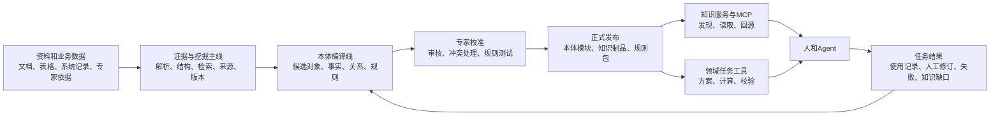

# 产业知识底座：本体并行能力线与人机协同构建消费方案

> 状态：讨论稿。  
> 目标：在现有“资料入库—结构化加工—检索—Agent接入”主线之外，增加一条可逐步验证的本体能力线。  
> 阅读提示：本文将知识底座比作“图书馆加工厂”。原始资料是图书馆，本体是统一的业务地图，领域知识资产是按地图加工出的工具箱，Agent是使用工具箱完成任务的助手。

## 先说结论

产业知识底座不应把每份资料自动变成一张“行业大图”，也不应让领域专家手工维护所有实体、关系和规则。

更可行的目标是建立一个**人和Agent共同工作的本体编译与运营系统**：Agent从资料、数据表和历史案例中提出候选；系统保留来源、版本、权限和变更影响；领域人员确认业务含义、例外和发布；正式本体与知识制品被Agent和业务应用使用；真实任务中的失败和人工修订再回到下一轮建设。

本体不是一个场景的附属物，也不是知识库的目录。它是一个domain中人、Agent和业务系统共同使用的“业务世界地图”。场景决定地图哪些部分需要画细；知识库提供建图材料；业务系统提供当前世界到底是什么样；规则和受控动作让地图能够支持判断和工作。

## 一、为什么需要一条与文档挖掘并行的能力线

现有主线已经能把资料解析为章节、表格、切片和检索表示，并按来源、版本和权限交付给网页和Agent。这是所有产业能力的地基。

但“能找到资料”不等于“能处理业务对象”。例如，资料中出现“设备”“客户”“命令”这些名字，不等于系统知道它们分别指哪一个实际对象、何时有效、能否关联、是否满足规则。

当前仓库也说明了这个边界：实体、本体和图谱生产算子仍被放在研究隔离区，正式加工主链仍是解析、分段、检索投影、向量化、持久化和发布。[研究隔离声明](D:/mywork/AgenticKB/knowledge_mining/mining/workflow/operators/research.py:3) [正式预置链](D:/mywork/AgenticKB/knowledge_mining/mining/workflow/templates.py:60)

因此，本体能力线应当复用现有证据、版本和权限基础，但不应为了“做本体”而强行把研究实体抽取接回文档挖掘主链。

```text
现有主线：资料 → 解析/结构 → 检索证据 → 人和Agent查证

新增并行线：选定domain和任务问题 → 语义模型 → 候选事实/规则
          → 专家校准 → 正式本体与知识制品 → 任务使用和反馈
```

两条线共享来源身份、内容版本、权限、证据位置、发布和审计；它们的加工步骤、质量门槛和责任人不同。

## 二、本体、证据、图谱、Wiki和规则分别在什么位置

| 东西 | 像什么 | 主要职责 | 不能单独保证什么 |
|---|---|---|---|
| 原始证据 | 图书馆里的原书 | 保存原文、表格、业务记录和出处 | 资料被正确理解或正确执行 |
| 文档结构与检索 | 图书馆目录和管理员 | 找到有关章节、表格和上下文 | 找到后一定能作出业务判断 |
| 本体模型 | 城市地图和图例 | 定义对象、属性、关系、时间、版本和规则词义 | 事实完整、字段真实、规则自动执行 |
| 领域知识图谱 | 按地图登记的台账 | 保存已确认对象、关系和事实 | 每个关系都正确或实时有效 |
| LLM Wiki | 可持续整理的业务百科草稿 | 汇总跨资料说明、冲突和经验 | 可作为正式事实或硬规则 |
| 知识制品 | 已备好的工具箱 | 规格表、对象卡、方案、规则包、计算器、方法 | Agent一定选对并用对 |
| 规则与动作 | 交通灯和闸机 | 检查条件、控制业务操作、记录结果 | 未建模问题的普遍正确性 |

本体和证据之间必须有一条可回溯链路：

```text
正式对象、事实、关系或规则
  → 原始资料或权威系统记录
  → 具体文档版本、章节、表格、字段或记录
  → 抽取、修改、审核和发布时间
```

专家规则没有原始文档时，也必须记录责任人、确认依据、适用范围、复核时间和版本。资料更新、删除或权限收紧后，系统需要找到受影响的派生知识，重新审核或停止交付。

## 三、本体面向domain，但不等于为每个场景重建一套

每个domain应有独立本体模块。一个domain至少要有自己的业务对象、权威来源、专业规则、维护责任人和高价值任务。

例如，通信配置、站点设计、设备运维、政企项目交付都可以成为不同domain。它们不需要共用同一组业务字段，却可以共用同一种建设、审核、发布和消费机制。

本体分为三层更容易维护：

| 层 | 内容 | 是否依赖具体场景 |
|---|---|---|
| 平台公共骨架 | 对象、属性、关系、证据、版本、规则、动作、任务、结果 | 不依赖单一行业 |
| Domain核心模块 | 行业稳定对象及其含义，例如网元、设备、客户、订单、工单 | 依赖行业，不依赖一个场景 |
| 场景与企业模块 | 方案、决策点、任务模板、本地政策、系统字段映射 | 依赖具体场景、企业或局点 |

场景不确定时，仍可以建设domain核心模块；但不能决定哪些字段、规则和关系必须被建得很细。正确做法不是等所有场景列完，而是从多个真实任务中寻找反复出现的对象和决策点。

一个概念只在一份资料中出现、没有明确业务使用和验收方式时，可以留在检索与Wiki层；只有它需要被跨资料、跨任务或跨系统统一理解和使用时，才值得进入正式本体。

## 四、本体怎样来：不是单次LLM抽取，而是持续建图

单次LLM可以很擅长做“候选发现”：找名称、别名、表格字段、可能关系、规则句和冲突点。但它不具备发布业务语义的权威。

本体建设需要下面这个循环：

```text
1. 选定一组真实任务与验收标准
2. 写出任务必须回答的业务问题
3. 定义最小对象、字段、关系、版本和时间语义
4. 接入权威资料、业务数据和专家依据
5. Agent批量提出候选事实、关系、规则和映射
6. 系统做结构、来源、冲突和完整性检查
7. 专家校准、确认或拒绝
8. 发布可消费的本体模块、规则包和知识制品
9. 在真实任务中评价、回收错误和人工修订
10. 提出下一版变更，再次审核发布
```

经典本体工程同样强调：没有唯一正确本体；模型必须由其要支持的问题和后续应用决定，并在使用中反复修正。[Ontology Development 101](https://protege.stanford.edu/publications/ontology_development/ontology101-noy-mcguinness.html)

### 1. 任务问题是本体的验收题，不是场景穷举表

先写一批系统必须稳定回答的问题，例如：

- 哪些对象属于同一个产品、项目、设备或客户？
- 某对象的某属性在什么版本和条件下成立？
- 两个对象是否存在经确认的依赖、兼容或影响关系？
- 某方案是否适用于当前业务条件？
- 哪条规则支持“通过”“不通过”或“信息不足”？

这些问题决定本体需要哪些对象、字段和关系。没有任务问题，容易得到一张漂亮但无法帮助工作的大图。

### 2. 先复用权威结构，再让Agent补非结构化部分

优先级应为：

1. 业务系统模式、产品目录、台账、API和行业标准；
2. 命令定义、参数表、配置模型、SOP和核查表；
3. 原始文档与专家资料；
4. Agent从上述资料中提出的候选。

这意味着：可结构化的字段、枚举、单位和系统主键应尽量从权威结构接入，而不是反复让LLM猜。

### 3. Agent输出候选，人和系统决定能否发布

| 产物 | Agent可以做什么 | 系统自动检查什么 | 人必须决定什么 |
|---|---|---|---|
| 对象候选 | 抽名称、别名、类型建议 | 格式、重复、来源是否完整 | 是否真是业务对象、边界和主键 |
| 事实候选 | 从表格和正文抽属性值 | 单位、数据类型、版本冲突 | 来源优先级、异常值和发布 |
| 关系候选 | 找出可能的引用、依赖、影响 | 类型合法、是否有证据 | 关系语义是否真的成立 |
| 规则候选 | 提取条件、例外和建议 | 输入输出是否完整、测试格式 | 是否阻断、适用范围和责任人 |
| 模型变更候选 | 提议新类型或新字段 | 是否破坏已有兼容性 | 是否进入正式domain模型 |

因此，Agent不是一个一次性“大抽取模型”，而是一组可重复运行的知识工程助手：资料发现Agent、抽取Agent、对齐Agent、冲突发现Agent、测试Agent和影响分析Agent。它们之间传递结构化候选和证据引用，不把一段自由文本当作最终结果。

## 五、人、业务团队、知识工程人员和平台各自做什么

| 角色 | 主要责任 | 不应被要求承担的责任 |
|---|---|---|
| 业务／领域负责人 | 选择高价值任务、定义成功标准、确认规则后果、指定权威来源和审批边界 | 手工录入全部实体和资料 |
| 领域专家 | 确认对象含义、处理冲突、说明例外、审核关键规则 | 写平台代码或长期维护检索索引 |
| 知识工程人员 | 把任务问题转成模型、映射、候选流程、质量门和发布过程 | 替领域专家猜业务政策 |
| Agent | 发现候选、提取、对齐、总结、测试、找影响范围 | 自行发布事实、修改正式规则、绕过权限 |
| 平台团队 | 提供来源、版本、权限、候选、审核、规则、发布、消费和观测能力 | 替行业决定业务含义 |

人负责“这个概念和规则在业务上到底是什么意思”；Agent负责“在大量材料中找出可能答案”；平台负责“让候选有出处、有状态、可审核、可回退、可被消费”。

## 六、平台应新增的工程能力

目标不是立即建设一个大而全的本体编辑器。MVP只需要让一个domain跑通“候选—审核—发布—消费—反馈”。

### 本体MVP的六项能力

| 能力 | 最小交付 | 为什么需要 |
|---|---|---|
| Domain与模型注册 | `domain_id`、责任人、本体版本、对象类型、字段、关系、单位和兼容范围 | 不让不同团队各自发明同名但不同义的对象 |
| 候选断言库 | 对象、事实、关系、规则候选；每条都带来源、抽取任务和状态 | 把“模型看到了什么”与“正式知识是什么”分开 |
| 专家校准工作台 | 看原文、修改候选、合并对象、处理冲突、确认或拒绝 | 人能对业务含义承担责任 |
| 规则包与测试 | 规则范围、输入、输出、例外、执行器、正反例和版本 | 让规则可检查、可回归，而不只是文本建议 |
| 发布与影响分析 | 候选、试用、正式、退役状态；来源变化影响列表；回退 | 防止新资料或新模型静默破坏已发布资产 |
| 使用反馈与评测 | 记录任务、使用资产版本、规则结果、人工改动和最终结果 | 用业务效果决定下一轮建设什么 |

### 需要保存的四种核心记录

```text
OntologyModule：一个domain的语义图纸
ClaimCandidate：Agent或人提出、但尚未发布的候选断言
PublishedAssertion / Rule：已确认的对象事实、关系或规则
KnowledgeAssetRelease：一组可被Agent和业务应用使用的正式发布物
```

每条正式断言或规则至少应有：对象或关系、适用范围、有效时间或版本、来源、审核状态、责任人和发布版本。

### 规则和动作不能只存在于自然语言里

规则含义、证据、范围和例外属于知识资产；规则执行可由不同方式承担：

| 规则类型 | 适合的执行方式 |
|---|---|
| 必填、类型、枚举、范围 | schema或通用校验器 |
| 引用、依赖、唯一性、顺序 | 图查询、状态检查或规则引擎 |
| 容量、金额、配额、数量 | 公式、决策表、计算器 |
| 复杂物理、网络或流程行为 | 专业验证器、仿真器、外部业务系统或人工审核 |
| 模糊经验和建议 | Wiki、指南、专家审批，不宣称自动通过 |

规则评估必须能返回 `PASS`、`FAIL`、`UNKNOWN` 或 `ERROR`。`UNKNOWN` 代表信息不足；`ERROR` 代表检查器本身没成功，二者都不能被当成通过。

动作也要分开保存：动作定义说明输入、输出、权限、前置条件和失败含义；动作实现才是实际调用业务系统的代码或API。第一期只需要只读查询、方案生成、规则校验和人工审核，生产写操作应等业务系统具备权限、幂等、回执和回滚能力后再接入。

## 七、端到端怎样完成本体构建和消费



### 1. 构建阶段

领域团队登记domain、任务问题、权威来源、责任人和第一批验收案例。知识工程人员建立最小模型。Agent只在指定知识范围内提出候选，并把每条候选连回资料或系统记录。

系统先做确定性检查：字段类型、单位、对象ID、来源、版本、类型关系和明显冲突。专家随后审核高风险对象、关系和规则。通过后才组成正式发布版本。

### 2. 消费阶段

Agent面对问题时，先尝试发现匹配的domain、已发布对象、规则和制品；如果它们能覆盖问题，就直接按结构化知识和规则完成判断或方案。

如果没有覆盖、存在冲突或需要读细节，Agentic Search回到原始证据继续查找。原始资料永远是核验和长尾问题的托底。

| 消费方式 | Agent得到什么 | 适合什么 |
|---|---|---|
| Agentic Search | 原始证据、结构导航、未知线索 | 长尾问题、查证、解释和知识缺口发现 |
| 本体查询 | 统一对象、属性、关系、版本和适用范围 | 专业问答、对象对齐、跨系统理解 |
| 规则评估 | 通过、不通过、信息不足及原因 | 选型、合规、核查、方案准入 |
| 场景知识制品 | 已发布方案、模板、任务方法和计算器 | 高频方案生成与专业工作 |

本体不替代Agentic Search。搜索是“去图书馆继续研究”，本体是“已经有一张确认过的业务地图”。

### 3. MCP和领域工具的边界

现有 `search_knowledge`、`get_knowledge`、`upload_document` 可以继续作为稳定知识入口：搜索时增加正式知识制品发现，读取时增加对象、规则、关系和回源信息。

不应把业务校验和生产操作偷偷塞进 `get_knowledge`。它们应作为明确的领域工具，通过MCP网关统一注册和审计，例如：

```text
evaluate_rule       检查一组规则，返回PASS/FAIL/UNKNOWN/ERROR
propose_solution    基于已发布资产提出候选方案
validate_solution   检查方案是否满足已声明条件
```

是否有这些工具、输入是什么、谁有权限调用，都由domain模块和业务系统共同定义。网关负责发现、身份传递、策略和度量，不负责猜行业规则或选择事实版本。

### 4. 反馈阶段

每次任务至少记录：使用了哪个知识资产版本、引用了哪些证据、调用了哪些规则、哪些输入缺失、人工改了什么、最终结果如何。

反馈只能形成变更候选，不可直接改写正式事实。资料变化、规则失败、人工高频修改、反复回到同一批原文查找，都是值得建设下一批知识制品或模型变更的信号。

## 八、工业实现和研究给出的真实启示

| 来源 | 可确认的机制 | 对本项目的启示 | 不能外推的结论 |
|---|---|---|---|
| Palantir Foundry | Ontology将真实数据映射为对象、属性和关系，并包含动作、函数与动态安全控制 | 本体要连接真实数据和受控工作，而不只是存术语 | 不能把厂商整个平台的效果归因于类型表或图数据库 |
| Cognite Data Fusion | 核心工业模型连接资产、设备、文件、活动、时序和来源系统 | 工业本体要区分设备类型、实际设备、资料和观测状态 | 接入模型不自动保证数据正确或Agent成功 |
| Camunda | Agent在BPMN流程中与确定性规则、人工任务结合 | 已知检查点由受控流程推进，Agent处理不确定部分 | 工作流本身不补齐缺失领域规则 |
| Batfish | 以网络模型检查配置变更前后的行为 | 可验证的专业问题应交给领域验证器，而非只让LLM自评 | 验证范围受模型和支持语义限制 |
| GraphRAG | 用实体图、社区和摘要组织大语料、回答全局问题 | 图结构适合发现关联证据和主题 | 图检索效果不能等同于业务动作可靠性 |
| LLM-Wiki、WiCER | 将资料编译为持续维护的Wiki，并用诊断修复编译遗漏 | Wiki适合积累派生知识；编译结果必须测遗漏并保留原文回查 | 均为预印本研究，不能承诺产业收益或完整性 |
| τ-Knowledge | 在模拟业务环境评估“查资料+用工具+改变状态”的端到端结果 | 即使给足任务关键资料，Agent仍可能在规则、步骤和状态上失败 | 特定模拟基准及当时模型的结果，不代表所有行业 |
| LLM-Modulo | LLM产候选，外部验证器给反例，再修正 | 候选生成与验证器分工可提高已建模部分可靠性 | 保证范围只覆盖验证器实际表达的条件 |

Palantir官方将Ontology描述为连接数字资产和现实对象的运营层，其中同时包括对象、属性、关系等语义元素，以及动作、函数和动态安全控制等“动态”元素。[Ontology overview](https://www.palantir.com/docs/foundry/ontology/overview)

Cognite公开的核心模型把工业资产、物理设备、文件、活动、时序和来源信息拆开建模，这与“类型、实例、资料和当前状态不能混为一谈”的设计原则一致。[Cognite Core Data Model](https://docs.cognite.com/cdf/dm/dm_reference/dm_core_data_model)

近期研究同样不支持“把资料编译得更好，Agent就自然稳定”的结论。τ-Knowledge在约700篇文档、任务需依赖知识和工具的模拟环境中，最佳检索配置的单次任务成功率为25.52%；即使直接提供关键文档，最佳受测配置也只有39.69%。两项最佳结果来自不同模型，且不能外推到真实行业；但它明确说明检索以外仍存在知识应用、步骤依赖和状态处理瓶颈。[τ-Knowledge](https://arxiv.org/html/2603.04370v1)

## 九、本体并行线的阶段性需求

### 阶段A：建立可管理的语义候选，不发布“自动本体”

**平台需要：** domain注册、模型草稿、候选断言、来源引用、基本状态流转和专家审核页。

**业务需要：** 选择一个domain，给出少量真实任务、验收人、权威资料和关键业务对象。

**知识工程人员需要：** 为任务写出能力问题，定义最小对象、字段、关系、版本和证据要求；配置Agent候选流程。

**验收：** 每个候选都能说明来源；专家能确认、拒绝或修改；系统不会把候选直接当正式知识交付。

### 阶段B：发布最小本体模块和可验证知识制品

**平台需要：** 发布版本、规则包、正反例测试、依赖记录、影响分析和回退。

**业务需要：** 确认哪些规则是提示、哪些阻断、哪些需要人工审批；定义通过、不通过和信息不足的业务含义。

**知识工程人员需要：** 建立字段映射、单位归一、规则表达和验证器接入；维护测试集。

**验收：** 一个真实任务能用正式对象、规则和证据交付“通过／不通过／信息不足”的判断，且每个结论可回源。

### 阶段C：接入领域任务工具和MCP消费

**平台需要：** 领域资产发现和读取、规则评估调用、身份传递、权限、调用度量和审计。

**业务需要：** 提供只读当前状态来源，明确高风险动作的审批边界。

**知识工程人员需要：** 将任务流程拆成“需要搜索”“需要本体查询”“需要规则检查”“需要人工确认”。

**验收：** Agent能在覆盖任务中优先使用已发布资产；不覆盖时退回原文搜索；输入不足时停止并说明缺口。

### 阶段D：使用驱动的持续运营

**平台需要：** 任务追踪、结果关联、变更候选生成、资产质量看板和回归评测。

**业务需要：** 持续提供人工修改、失败原因和最终交付结果。

**知识工程人员需要：** 分析失败归因，决定补资料、改模型、改规则、改制品或改使用方式。

**验收：** 每次知识和规则变更都能在代表任务集上比较新旧版本，并知道哪些任务、领域资产和用户会受影响。

## 十、MVP的边界和验收标准

首个MVP不要以“已有多少实体、多少节点、多少规则”为目标。它只要在一个domain、一个小任务集上证明下面的事情：

1. 能从已有证据生成候选对象、事实和规则，并保留来源；
2. 专家能在一个工作台完成修改、确认、拒绝和冲突处理；
3. 已发布本体模块有明确版本、责任人、适用范围和回退方式；
4. Agent可发现并读取已发布对象、规则和制品，必要时回到原始资料；
5. 至少一种可执行规则能返回可解释结果；
6. 一次真实任务的人工修订或失败能形成变更候选，不直接污染正式知识；
7. 与只使用原始RAG相比，能够测量任务效果、人工补查、错误类型和成本变化。

## 十一、明确不做什么

- 不一开始建设覆盖所有产业、所有场景的大本体；
- 不让单次LLM或多Agent互评直接发布正式实体、关系和规则；
- 不要求全部规则转换成统一代码或统一DSL；
- 不用本体替代原始文档、RAG、业务系统或专业验证器；
- 不把实时状态复制成长期静态事实；
- 不在MVP中直接执行高风险生产操作；
- 不以切片、节点、实体或制品数量作为业务成功证明。

## 十二、当前需要由业务共同确认的问题

1. 首个domain选择哪一个，哪些真实任务最能代表业务价值？
2. 每个任务的最终验收人是谁，正确结果如何获得？
3. 哪些来源是产品事实、业务事实、专家规则和实时状态的权威来源？
4. 哪些规则必须阻断，哪些只提示，哪些必须人工审批？
5. 首批是否只做“经过规则验证的判断／方案”，暂不接生产执行？
6. 已有产业侧图谱、规则和方案资产以何种最小合同接入知识底座？
7. 哪些对象、规则和领域资产可以按当前权限提供给Agent？

## 资料与证据边界

本文将本体视为“语义模型加已确认领域知识加规则和受控动作的共同基础”，而不是强制采用RDF、OWL或图数据库。OWL适合描述领域知识，但不天然承担缺失字段校验；SHACL可以描述图数据的检查条件。非图系统可以使用关系模型、schema、决策表和代码检查器承担相同职责。[OWL 2 Primer](https://www.w3.org/TR/owl2-primer/) [W3C SHACL](https://www.w3.org/TR/shacl/)

本文引用的工业产品资料证明相关平台具备相应机制，不能证明其客户收益完全由本体带来；论文多为研究或预印本，实验数字不能外推为本项目承诺。

### 公开资料

- [Palantir Ontology overview](https://www.palantir.com/docs/foundry/ontology/overview)；[Action types](https://www.palantir.com/docs/foundry/action-types/overview)
- [Cognite Core Data Model](https://docs.cognite.com/cdf/dm/dm_reference/dm_core_data_model)
- [Camunda Agentic Orchestration](https://docs.camunda.io/docs/components/agentic-orchestration/agentic-orchestration-overview/)
- [Batfish Forwarding Change Validation](https://batfish.readthedocs.io/en/latest/notebooks/linked/introduction-to-forwarding-change-validation.html)
- [Ontology Development 101](https://protege.stanford.edu/publications/ontology_development/ontology101-noy-mcguinness.html)
- [GraphRAG](https://arxiv.org/abs/2404.16130)
- [Karpathy LLM Wiki](https://gist.github.com/karpathy/442a6bf555914893e9891c11519de94f)；[LLM-Wiki](https://arxiv.org/html/2605.25480v2)；[WiCER](https://arxiv.org/html/2605.07068v1)
- [τ-Knowledge](https://arxiv.org/html/2603.04370v1)；[τ-bench](https://arxiv.org/abs/2406.12045)；[τ²-Bench](https://arxiv.org/html/2506.07982v1)
- [LLM-Modulo](https://arxiv.org/html/2402.01817v3)

### 本项目依据

- [40号项目全景](D:/mywork/AgenticKB/docs/下一阶段/40-产业知识底座-项目全景与下一阶段并行需求-2026-09-08.md)
- [41号现状与架构](D:/mywork/AgenticKB/docs/下一阶段/41-产业知识底座-现状-目标架构与演进方案-2026-09-08.md)
- [45号通俗讨论稿](D:/mywork/AgenticKB/docs/下一阶段/45-跨行业知识底座-本体知识制品与Agent业务可靠性-调研讨论稿-2026-09-14.md)

## 十三、本体如何与知识制品归一：共用一座工厂，不强迫使用同一台机器

39、40、41号文档已经把知识制品定义为：把Agent反复进行的查找、整理、对齐、判断和准备工作提前完成，形成可复用、可校准、可回源的知识成果。46号提出的本体并行线与这个思想并不冲突，反而应当纳入同一个知识资产运营框架。

但要分清两件事：

> **本体模块可以是一种“语义型知识制品”，但它不是每个场景的最终方案。**  
> **它更像不同场景知识制品共用的词典、图例和尺寸标准。**

可以把产业知识底座想成一个厨房：

| 东西 | 像什么 | 是否直接端给用户或Agent完成任务 |
|---|---|---|
| 原始证据 | 原料和原始配方 | 通常不直接；用于核验和长尾查证 |
| 候选知识 | 厨师试做的半成品 | 不直接；必须经过检查和审核 |
| 本体模块 | 食材名称、计量单位和配伍标准 | 可以被Agent读取，但主要为其他制品提供共同语言 |
| 事实集／对象卡 | 已清洗的食材清单 | 可以直接查询和比较 |
| 规则包 | 食品安全标准和质检表 | 可以直接用于判断和检查 |
| 场景方案包 | 一道已经验证过的菜谱组合 | 可以直接支持某类业务方案生成 |
| 方法包／Skill | 厨房作业流程 | 指导Agent按正确步骤完成工作 |

因此，原始证据和候选不是正式知识制品；经过发布的本体模块、事实集、规则包、场景方案包和方法包，都可以作为正式知识资产交付给人和Agent。

### 1. 统一的是生命周期，不是内部加工流程

所有正式知识资产应共享同一个“外壳”：

```text
登记用途和责任人
→ 选择来源和适用范围
→ 机器生成候选或人工编写草稿
→ 系统检查
→ 领域专家校准
→ 任务验证
→ 试用或正式发布
→ 使用反馈、影响分析、更新或退役
```

这个外壳正是39号“机器编译＋专家校准＋真实任务验证”、40号“统一知识制品管理”、41号“人机协同治理”和46号“候选—审核—发布—消费—反馈”共同指向的部分。

每个资产内部怎么生产，则必须按内容选择不同方法：

| 资产类型 | 它真正要解决的问题 | 主要编译方式 | 核心质量检查 |
|---|---|---|---|
| 本体模块 | 行业对象、字段和关系分别是什么意思 | 任务问题驱动的语义建模、系统字段映射、专家讨论 | 模型是否能回答任务问题；是否破坏已有含义 |
| 事实集／规格矩阵 | 多份资料中相同字段怎样归一 | 批量抽取、单位归一、对象对齐 | 字段来源、单位、版本、冲突和完整性 |
| 规则包 | 什么条件下通过、不通过或信息不足 | 规则提取、决策表、规则表达、验证器接入 | 正反例、边界例、例外、执行器结果 |
| 场景方案包 | 某类业务任务怎样组合数据、规则和方法 | 方案编排、决策点设计、专家校准 | 是否满足真实场景验收；是否引用正确资产版本 |
| Wiki／专题页 | 多份资料共同说明了什么 | 跨文档编译、链接、遗漏诊断 | 每段来源、冲突和遗漏检查 |
| 方法包／Skill | Agent应该按什么步骤工作 | 任务拆解、工具选择、失败处理 | 在独立任务集上是否改善完成率和成本 |

不应为了“归一”而让规格表、本体、规则和Skill都走同一条LLM Prompt。统一治理，允许不同编译器，才是可持续的模式。

### 2. 本体在知识制品体系中的位置

39号提出的三类制品是“可查的数据、可判的规则、可执行的方法”。本体不是第四个彼此平行的业务成果，而是这三类成果共享的语义基础：

```text
本体模块
  → 规定：对象、字段、单位、关系、版本和适用条件是什么意思

可查的数据制品
  → 使用本体字段形成规格矩阵、对象档案、版本对照

可判的规则制品
  → 使用本体对象和字段定义判断条件、例外和结果

可执行的方法制品
  → 使用本体对象、事实和规则组织方案、流程和Skill
```

例如，在站点领域：

```text
本体模块：设备型号、实际设备、站点、环境条件、功耗、版本、兼容关系
事实集：几十个设备型号的规格和字段来源
规则包：高温环境下的设备适配、功耗和库存条件
场景方案包：离网电站设计方案
方法包：站点评估Agent的工作流程
```

它们可以独立发布，也可以独立迭代；但场景方案包和规则包必须显式说明使用的是哪一本体模块、哪一版事实集。否则，“容量”“设备”“版本”可能在不同制品里被赋予不同含义。

### 3. 建议采用“知识资产包”作为统一登记单位

为了避免把所有东西都叫知识制品而造成混淆，平台内部可以使用一个总称：`KnowledgeAsset`（知识资产包）。它是统一治理单位，不限定内容格式。

```text
KnowledgeAsset
  ├─ OntologyModule       语义标准：对象、字段、关系和约束词义
  ├─ DomainFactSet        已确认对象、属性、关系和对象卡
  ├─ RulePackage          规则、决策表、检查器和测试案例
  ├─ DataProduct          规格矩阵、对照表、专题页等可查数据
  ├─ ScenarioPackage      场景方案、决策点、任务组合和适用条件
  └─ MethodPackage        流程、模板、Skill和工具使用方法
```

其中，真正已经发布并面向人或Agent复用的资产，可以称为知识制品；原始资料、解析结果和未审核候选属于制品的输入和中间产物，不应冒充正式资产。

每个资产包的共同登记字段建议为：

```text
asset_id                 稳定身份
asset_type               上述资产类型之一
domain_id                属于哪个领域
purpose                  服务什么业务任务或决策
scope                    适用对象、版本、区域、权限和时间范围
owner / reviewers        责任人和审核人
source_refs              依赖的证据、系统记录或专家依据
dependencies             使用哪些本体、事实、规则、方法资产版本
quality_results          结构检查、专家审核、任务评价结果
lifecycle_status         draft / candidate / trial / published / superseded / retired
release_version          当前发布版本
```

### 4. 场景包是把多个资产“装配成一次可重复工作”

场景业务确实是知识制品最重要的落点。一个场景包不需要复制全部资料，而是声明如何组装已有资产：

```text
场景方案包：某类站点设计 v1
  使用：
  - 本体模块：站点与设备语义 v0.3
  - 事实集：硬件规格数据 2026-09
  - 规则包：环境适配与容量校验 v0.2
  - 方法包：站点评估流程 v0.1
  - 实时工具：库存、站点勘测、工单状态
```

这样，场景制品强相关于业务任务，本体又可以被多个场景复用。资料或规则变化时，系统沿依赖关系找到受影响场景包，重新验证，而不是让每个团队靠记忆排查。

### 5. 对平台能力的直接影响

46号的本体MVP能力需要与40号的“统一知识制品管理能力”合并规划，而不是建设两个资产目录。

平台应新增或统一以下能力：

| 统一能力 | 对本体的作用 | 对知识制品的作用 |
|---|---|---|
| 资产登记与依赖图 | 登记本体模块、事实和规则的版本关系 | 登记场景包、表格、Wiki和Skill依赖什么 |
| 候选与审核工作台 | 审核对象、关系、规则和模型变化 | 审核字段、方案、流程和模板变化 |
| 版本发布与回退 | 防止语义定义悄悄变化 | 防止场景成果引用错误版本 |
| 来源与权限传播 | 让正式事实和规则可回源、可失效 | 让表、专题页、方案和Skill不越权 |
| 质量与任务评价 | 检验语义模型和规则是否支持任务 | 检验制品是否降低人工和提高结果质量 |
| 使用反馈与影响分析 | 找出模型或规则缺口 | 找出值得重编译、升级或退役的制品 |

平台不应强迫每种资产采用同一个数据库表或同一种内容格式。需要统一的是身份、生命周期、依赖、来源、权限、质量和反馈；需要保留差异的是资产正文、编译器、审核重点和验证器。

### 6. Agent怎样在统一模式中工作

Agent在这个体系里有两种身份：

| Agent身份 | 它做什么 | 不允许做什么 |
|---|---|---|
| 知识工程Agent | 对资料做候选抽取、对齐、冲突发现、测试和影响分析 | 直接把候选发布为正式本体或制品 |
| 业务消费Agent | 发现、读取和组合已发布资产，提出方案或解释 | 在没有依据、规则或权限时假装结论已经成立 |

业务消费Agent的优先路径应是：

```text
发现匹配的场景包、规则包、事实集和本体模块
→ 读取并确认资产版本和适用范围
→ 需要时调用规则和实时工具
→ 输出带依据的方案、判断或解释
→ 制品不适用、资料冲突或信息不足时回到Agentic Search
→ 形成知识缺口或变更候选
```

因此，Agentic Search仍然是“去图书馆继续研究”的能力；本体和知识制品是“已经准备好的地图和工具箱”。前者处理未知与长尾，后者处理高频、稳定且已验证的工作。

### 7. 对下一阶段路线的调整

建议将本体并行线作为统一知识资产体系的一个资产类型和编译器，而不是另起一套平台：

```text
阶段1：首个表格制品闭环 + 知识资产共同登记字段
阶段2：首个本体模块、候选审核和事实集发布闭环
阶段3：规则包、场景方案包与本体依赖组合，验证完整任务
阶段4：使用反馈驱动本体、事实、规则和场景制品的持续演进
```

阶段1不应等待本体完成；阶段2也不应等待通用制品平台“大而全”。两者共同复用来源、版本、权限、审核和任务评价能力即可。

## 十四、结合本体与知识制品后的最终判断

产业知识底座最终不是“RAG平台 + 一个图谱功能 + 一堆场景表格”。它应逐步成为一个能持续生产、治理和使用多种知识资产的系统：

```text
原始证据
+ 文档结构与检索
+ 本体模块
+ 事实集
+ 规则包
+ 场景方案包
+ 方法包
+ 实时业务工具
+ 人和Agent协作治理
+ 真实任务评价与反馈
```

本体的价值不是替代知识制品，而是让知识制品在不同团队、不同场景和不同版本之间仍然说同一种业务语言。知识制品的价值不是替代本体，而是把本体、事实、规则和方法装配成能够真正完成一类业务任务的成果。

可以用一句话记住两者关系：

> **本体负责“世界里有什么，以及这些东西是什么意思”；知识制品负责“在一类业务工作里怎样直接使用这些东西”。**
