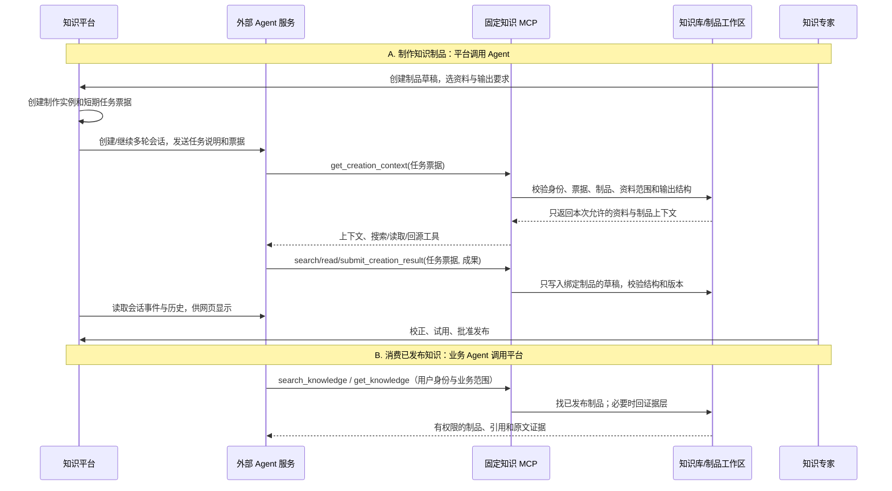
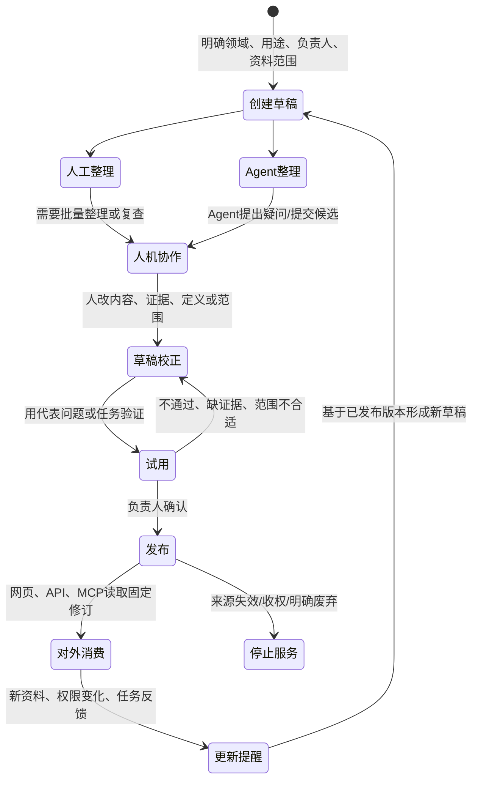

# 产业知识底座：端到端全景架构与知识生命周期

> 版本：V1.1（补充知识制品工作单元、Agent协作与消费细节）  
> 日期：2026-09-15  
> 用途：用一张图讲清楚从“资料进入”到“人和 Agent 使用、反馈、更新”的完整知识底座。它承接 [39号](39-场景级知识制品-产业Agent知识编译体系与演进方向-2026-09-08.md)、[40号](40-产业知识底座-项目全景与下一阶段并行需求-2026-09-08.md)、[41号](41-产业知识底座-现状-目标架构与演进方案-2026-09-08.md)、[46号](46-产业知识底座-本体并行能力线与人机协同构建消费方案-2026-09-14.md)、[47号](47-知识一张网切片接入-实施设计-2026-09-14.md) 和 [48号](48-产业知识底座-统一知识资产体系与本体知识制品协同演进总纲-2026-09-14.md)。本文不替代这些文档中的具体实现设计。

## 一、先用一句话把全局说清楚

把知识底座想成一座工厂。

- **知识一张网和用户资料**是进厂的原材料；
- **知识库**是保管原料、保留出处的仓库；
- **挖掘流水线**把原料整理成目录、段落、表格、检索索引等“方便查找的货架”；
- **知识制品**是在这些有出处的材料上，针对某项工作整理出的“可直接交付的成品”；本体是其中一种负责统一名称、字段和关系的成品；
- **检索、网页和 MCP**是把原料或成品交到人和 Agent 手里的窗口；
- **任务反馈、资料更新和运营**决定下一次该补什么、改什么、下架什么。

因此，项目不是“把所有东西都做成图谱”，也不是“再造一个 RAG”。它要同时保住三种能力：**能回原文、能快速找到、能直接用于业务任务**。

## 二、先按五层看全系统

不要先看所有服务和所有箭头。先只看一条从左往右的主线：

```text
资料从哪里来
    → 资料怎样变得可找、可读
        → 怎样整理成面向业务的知识成果
            → 人和 Agent 怎样取得成果或回查原文
                → 真实使用后怎样更新下一版
```

| 从左到右的层 | 它只负责什么 | 它交给下一层什么 |
|---|---|---|
| ① 接入层 | 接入知识一张网、用户知识库和后续行业数据源；登记来源、版本和权限 | 可追溯的原始资料 |
| ② 证据与挖掘层 | 保存原文；解析文档结构；构建切片、索引、表格和导航 | 有出处、可检索、可回原文的材料 |
| ③ 语义资产层 | 围绕业务任务制作表格、Wiki、方案方法、规则和本体；进行草稿、试用和发布 | 带适用范围、来源和修订的知识制品 |
| ④ 交付层 | 通过网页、在线检索和 MCP 给人、业务系统和 Agent 使用 | 问题、任务结果和使用记录 |
| ⑤ 运营层 | 根据反馈、资料更新、权限变化和效果评估生成下一轮修改 | 需要补资料、改制品、修定义或下架的明确任务 |

权限与范围、来源与版本、过程审计、质量与运行监控不是第六层；它们像厂房的承重结构，从①到⑤全程都在。

下面各节再把最容易混淆的关系拆开。

## 三、把“知识制品层”拆开看：它不是一个文件夹，而是一份可运营的工作单元

前面的五层图中，最容易被压扁的是第三层。知识制品不能只被理解成“保存一张表或一篇 Wiki 的地方”。

一份可正式使用的制品，像一份有封面的业务档案包。它至少要同时装下下面八类内容：

| 这份档案包里有什么 | 用简单的话说 | 平台需要保存什么 |
|---|---|---|
| 1. 身份与归属 | 它叫什么、属于哪个领域、谁负责 | 制品 ID、domain、负责人、可见范围、状态 |
| 2. 用途与验收题 | 它要帮助完成什么工作，什么结果算有用 | 业务描述、适用边界、代表问题/任务、验收要点 |
| 3. 内容定义 | 它准备产出表、正文、本体还是规则；内容要长成什么样 | 类型、字段/对象/正文结构、输出 schema、校验要求 |
| 4. 输入材料 | 这次制作允许依据什么，不能依据什么 | 知识库、文档、章节、已有制品及其固定版本 |
| 5. 制作方法 | 人和 Agent 按什么步骤整理，缺信息时怎么办 | 提示词、业务说明、样例、工具使用说明、冲突处理办法 |
| 6. 工作过程 | 这份草稿怎样产生，谁改过什么 | 草稿、人工修改、制作实例、Agent 对话、工具记录、待确认项 |
| 7. 证据与依赖 | 每个关键结论从哪来，又依赖了什么定义 | 字段/段落/对象到文档锚点的引用；制品到制品/本体修订的引用 |
| 8. 发布与反馈 | 哪一版可以给别人用，使用后效果怎样 | 发布修订、试用记录、问题反馈、影响提醒、退役原因 |

这八类内容的重点是：**制品的内容、制品的制作过程、制品的正式版本不是一件事。**

例如“产品能力规格矩阵”有一个稳定制品 ID。它目前的草稿可能正在由 Agent 整理；发布 v1 仍供业务 Agent 使用；有新手册进入时，系统在 v1 的基础上开出一个更新草稿。三者能关联，但不能互相覆盖。

### 1. 知识库、制品、本体各自负责什么

```text
领域 domain
  ├─ 知识库：放有权限的原始证据和加工视图
  │    ├─ 用户上传的资料
  │    └─ 知识一张网导入后、可被业务库只读引用的逻辑文档
  │
  └─ 知识制品：针对一个业务目的整理出的成果
       ├─ 规格表 / 对象清单 / Wiki / 方案方法 / 规则 / Skill
       └─ 本体模块：给多个制品共用的对象、字段和关系定义
```

- **知识库不是制品的上级目录。** 一个制品可以使用同域多个知识库；一个知识库也可以成为多份制品的材料。
- **制品归属于领域。** 领域说明它使用哪套业务词汇、由谁管理；这不表示同领域所有人自动有权读它。
- **本体是特殊制品。** 它主要提供共同定义，通常被规格表、对象卡、方案方法和规则引用；它不替代事实证据，也不会自动让 Agent 的业务判断正确。
- **图谱不是第四种平行库。** 已确认的对象与关系可以按图浏览；未经确认的实体/关系挖掘结果只能作为制作候选，不能直接当成业务事实发布。

### 2. 制品可以有哪些类型，第一期怎样收敛

制品类型不是为每种类型都建设一套平台。共同复用上面的八类内容；差异只在“内容编辑器、Agent 制作方法、试用方式、消费形式”。

| 类型 | 内容重点 | Agent先做什么 | 人重点确认什么 | 消费方式 |
|---|---|---|---|---|
| 表格/对象清单 | 对象身份、字段、单位、值、来源 | 批量抽取、字段对齐、找缺失 | 同名对象、数值、单位、冲突 | 筛选、比较、统计、结构化读取 |
| Wiki/专题页 | 主题解释、关键结论、段落出处 | 汇总材料、提出冲突和缺口 | 结论、适用范围、每段来源 | 阅读、搜索、专业问答引用 |
| 本体模块 | 类型、字段语义、关系、约束说明 | 从样例和资料提出候选定义 | 定义是否稳定、是否真的能被复用 | 读取定义、查询对象关系、供其他制品引用 |
| 规则/决策指南 | 条件、例外、风险、依据 | 抽取条件、列出歧义和反例 | 是否可执行、缺输入时怎样处理 | 阅读判断依据；必要时调用专用检查器 |
| 方案/方法/Skill | 输入、步骤、模板、检查点、引用知识 | 整理步骤和所需材料 | 业务适用性、关键步骤和边界 | 业务 Agent 读取后完成本次任务 |

第一期不应等待所有编辑器齐备。现有计划已经足够：先支持**表格/对象、最小本体定义、Markdown 正文**；规则、方案和 Skill 先按结构化正文导入、编辑、试用、发布。只有某一种内容被真实任务证明需要专用编辑或执行能力时，才补相应能力。

### 3. 制作设置必须跟着制品走，不跟着某个 Agent 走

每份制品下面维护它自己的业务说明、输入材料、提示词、样例、输出结构和验收问题。这样更换 DeepSeek Harness、公司内其他 Agent 或人工制作，并不丢失这份制品的“做法”。

```text
制品 abc 的制作设置
  = 业务目标 + 输出定义 + 输入材料快照 + 样例/人工决定
    + 提示词/制作方法 + 试用问题 + 当前草稿

外部 Agent 服务的设置
  = 模型地址、通用运行参数、固定 MCP 地址、通用安全限制
```

前者是平台里的业务资产；后者只是可替换的执行环境。两者不能混在一起。

### 4. 人、Agent 和平台的分工

默认的最小协作单位是“一名知识负责人 + Agent”。知识负责人可以同时承担业务说明、资料选择、专业确认和发布；知识工程人员、独立审核人按复杂度或管理要求加入，不是硬性前置条件。

| 谁 | 必须负责的事 | 不应该代替谁做 |
|---|---|---|
| 知识负责人/业务专家 | 说明用途、选择资料、确认歧义、试用、决定发布 | 不必亲自做所有批量阅读和录入 |
| 知识工程人员（可选） | 复杂对象模型、跨系统字段对齐、规则可计算化、质量设计 | 不替业务负责人决定业务含义 |
| Agent | 阅读、抽取、对齐、起草、找证据、提出冲突、按要求提交草稿 | 不自行扩大资料范围、不自行发布、不把猜测写成正式事实 |
| 平台 | 保证范围、权限、版本、过程记录、回源、发布和交付一致 | 不替业务团队判断专业结论 |

人工主导和 Agent 先整理不是两条产品线。它们都在同一草稿上发生：人可以先写结构让 Agent 补齐；Agent 可以先做小样，人修正后再让 Agent 批量继续。

### 5. 制作 Agent 的完整闭环

下面这条链路是 48 号中必须保留、但简单总图里没有放下的关键细节：

```text
知识负责人创建制品草稿
  → 选择资料、输出定义和制作方法
  → 平台创建“制作实例”与短期任务票据
  → 平台通过外部 Agent 的原生接口创建/继续多轮会话
  → Agent 带票据调用固定知识 MCP
  → MCP 服务端按票据只交付 abc 允许的上下文和资料
  → Agent 多轮搜索、读取、回原文、提出问题
  → Agent 只能通过 submit_creation_result 提交到 abc 的草稿
  → 平台校验输出结构、版本、票据和写入幂等性
  → 页面展示对话、工具活动、待确认问题、草稿差异
  → 人修改、试用，必要时继续同一制作实例或新开实例
```

这里有四条不能省的约束：

1. **固定 MCP，不等于固定范围。** MCP 可以全局注册一次；每个工具调用都必须带任务票据。票据在服务端映射到制品、制作实例、输入快照、允许读的范围、输出 schema 和有效期。
2. **制品 ID 不是权限。** Agent 知道 xyz 的 ID，也不能读取 xyz 的资料或向 xyz 提交；票据过期、撤销、换制品或改范围后都必须被拒绝。
3. **聊天回复不是交付。** Agent 在对话里说“我已经完成”不代表有成果。只有 `submit_creation_result` 校验成功，平台才把内容纳入草稿。
4. **平台保存过程，不依赖 Agent 回调。** 平台调用外部 Agent 的原生会话接口，订阅事件并能补读历史；人能在制品页面继续多轮协作，不必跑去外部 Agent 后台找记录。

目标 MCP 工具可以保持少量、稳定，而不是按制品动态注册工具：

| 目标工具 | 仅在什么场景可用 | 它做什么 |
|---|---|---|
| `get_creation_context` | 有效制作票据 | 返回制品用途、输入快照、输出定义、样例、当前草稿摘要和待确认项 |
| 受限 `search_knowledge` / `get_knowledge` | 有效制作票据或普通消费身份 | 制作时只搜索/读取约定材料；消费时只读取已发布且有权内容 |
| 结构化读取/回源工具 | 有效范围内 | 读取章节、表格、对象、制品引用和原文定位 |
| `submit_creation_result` | 有效制作票据 | 向绑定制品草稿提交结构化成果、来源和修改说明 |

这些是目标接口，不宣称当前 MCP 已经全部实现。现有稳定的 `search_knowledge`、`get_knowledge`、`upload_document` 继续承担已有职责；后续应兼容扩展，不重建一套平行知识服务。

### 6. 已发布制品怎样被人和业务 Agent 消费

制作完成后的消费路径要比制作路径简单：普通用户和业务 Agent只接触**已发布修订**，不看别人的草稿、任务票据和制作聊天。

```text
用户/业务 Agent 提出问题
  → 在线知识服务或 MCP 在权限范围内发现相关已发布制品
  → 优先读取制品中已经整理好的结构化内容/正文/定义
  → 需要细节、核验或制品未覆盖时，再下钻到原始证据和加工视图
  → 返回内容时附制品修订、适用范围与来源
  → 记录是否解决问题、是否补查、是否发现错误
```

消费时不是“有制品就不检索”，而是三种情况协同：

| 遇到的情况 | 系统和 Agent 的合适做法 |
|---|---|
| 已发布制品正好覆盖问题 | 直接读取制品；表格和对象关系保留结构化查询，不把它们全部切成普通文本 |
| 制品覆盖一部分，或用户要求核验细节 | 先读制品，再沿引用读原文、章节和原始表格 |
| 没有适合制品，或制品明确不适用 | 走现有 Agentic Search/文档检索；把高频缺口记录为下一轮制品候选 |

所以本体和制品增强的是“先交付什么、怎样理解和查询”，没有取代 RAG。RAG 仍然负责找证据；MCP 仍是对 Agent 的服务入口；业务 Agent 仍负责完成本次问答或方案任务。

### 7. 制品、来源、加工和制作过程的四种版本

以后出现“为什么 Agent 看到的内容和网页不同”时，通常是版本语义没分开。系统必须分别记录：

| 版本 | 例子 | 谁会用它 |
|---|---|---|
| 来源版本 | 手册第二版、一张网 `parsed_version` | 接入、回源、影响分析 |
| 加工版本 | Parse IR 规则、索引/快照构建 | 检索、章节和表格消费 |
| 制品发布修订 | 规格矩阵 v2、本体 v3 | 网页、业务 Agent、被其他制品引用时固定使用 |
| 制作实例快照 | 一次会话、输入范围、任务票据 | Agent协作、审计、取消和重试 |

资料更新会产生新的来源版本；它可能触发重挖，也可能提示某些制品需要复核。它**不会**静默改写已发布制品。制品在试用通过前仍保持旧版对外服务；来源收权或明确失效则按治理规则停止交付，不能只留一个待办。

### 8. 生命周期既管理内容，也管理影响

```text
创建草稿
  → 人工整理 / Agent先整理 / 导入已有成果
  → 人机协作与来源校正
  → 试用（代表问题、任务结果、人工补查）
  → 发布固定修订
  → 网页和 MCP 消费
  → 来源变化 / 问题反馈 / 权限变化
  → 基于当前发布版产生更新草稿，或停止服务
```

首期只做“直接影响”就够了：某个来源文档变化时，能列出直接引用它的制品字段、段落或关系；某个本体修订变化时，能列出固定引用它的制品。递归依赖图、全自动重编译和全量自动审批都不作为首期前置。

### 9. 这层真正需要新增的工程能力

这些能力可以先加在现有平台和数据库里，不需要先拆成“本体平台”“知识制品平台”“Agent 平台”三套服务：

| 最小能力 | 解决的问题 |
|---|---|
| 制品、草稿和发布修订记录 | 能保存、比较、发布、回退和停止交付 |
| 制品类型与内容校验 | 同一工作区支持表格、正文、本体等，但不混淆输出结构 |
| 来源锚点、制品引用和直接影响关系 | 每个关键内容可回原文；资料变化时能找到受影响内容 |
| 最小本体定义与对象/关系内容 | 让字段和关系能被多个制品复用，不只是显示概念名称 |
| 制作实例、任务票据与 Agent 原生接口适配 | 支持外部 Agent 多轮协作、断线补读、取消与审计 |
| 固定 MCP 的范围校验和成果提交入口 | Agent 按制品约束读写，不靠动态改 MCP 解决隔离 |
| 发布制品的发现、读取与结构化查询 | 网页和 MCP 消费同一修订；表格/对象不退化成纯文本 |
| 试用、反馈和更新提醒 | 判断制品是否有用，形成下一轮更新任务 |

## 四、资料不是一路被“变没”，而是多了一层层可用视图

### 1. 原始语料：证据层

原始语料是“厂里的原料”。例如用户上传的 PDF，或知识一张网给出的产品文档切片。它必须保留来源、版本、权限和位置。

知识一张网接入已经冻结的做法尤其重要：上游切片不是旁路资料，也不是另起一套 RAG。它以全字段 JSONL 形式存证，经 `onenet_jsonl` 适配器进入现有 Parse IR 和挖掘主链，最终成为可阅读的逻辑文档。业务知识库通过只读引用复用它，不重复复制、不重复挖掘。

**这一层回答：这句话、这个数字最初从哪里来？现在还有没有权限看？**

### 2. 挖掘后的语料：证据的加工视图

挖掘 Pipeline 做的是给原料贴目录、建货架和索引，不是在发明新的业务结论。它产出：

- 文档、章节、段落、表格等结构；
- 可检索切片、关键词和向量索引；
- 章节导航、表格查询、证据定位等消费能力；
- 构建状态、质量报告和可切换的知识快照。

所以，“挖掘后的语料”最好理解为**证据的加工视图**，而不是脱离原文的第二套真相。它可以帮助 Agent 找到资料、读懂上下文、精确查询表格；最终仍能回到来源。

当前项目已经有这条主体链路。它对应 40 号的文档结构消费、在线知识服务、版本发布与恢复，也承接 47 号导入后自动继承的检索、章节和表格能力。

### 3. 知识制品：面向任务的语义成果

知识制品才是“按业务用途装配后的成品”。它不是把每一份文档再总结一次，而是先有一个具体用途，再决定整理出什么。

例如：

| 要解决的工作 | 适合的制品 | 它与挖掘视图的差别 |
|---|---|---|
| 比较多个产品的硬件条件 | 跨文档规格矩阵 | 把多份资料的同类字段对齐，每格能回源 |
| 回答某类专业问题 | 带引用的专题 Wiki / 对象卡 | 把分散说明整理成可直接阅读的主题知识 |
| 让不同资料中的“设备、版本、接口”叫法一致 | 本体模块 | 定义类型、字段和关系，给其他制品共同使用 |
| 判断输入是否满足规范 | 规则或决策指南 | 写清条件、例外、证据和可计算部分 |
| 生成领域方案 | 方案方法、模板和参考案例 | 说明需要哪些输入、步骤、约束和依据 |

同一份手册既可以被检索，也可以贡献给规格矩阵、本体和方案方法。它们不是互相替代，而是使用同一证据的不同方式。

**这一层回答：面对某项业务工作，应该看哪些已经整理好的内容，按什么共同语言理解它们？**

## 五、本体在全图中的位置

本体不是覆盖整个系统的一张“大图”，也不是把抽出来的所有名词放进数据库。

它是语义资产层里一种有特殊职责的知识制品：给领域内反复出现的对象规定共同的“词典和表格表头”。例如某个领域中的设备、版本、能力、接口、约束、关系分别怎么定义；哪些字段可以比较；两个对象如何关联。

本体有三个边界：

1. **归属于领域，不归属于某一个知识库。** 知识库提供材料；一个领域本体可以被多个知识库和多个制品引用。
2. **由场景校验粒度，不为每个场景单独造一套。** 场景提出“这次必须分清什么”；稳定且可复用的定义进入领域本体。
3. **不替代证据和规则。** 本体说明“字段是什么意思、关系能怎么连”；具体事实还要有来源，硬性校验还要有规则或代码。

一句更直白的话：知识库像档案柜，挖掘像目录系统，本体像统一的字段字典，制品像为工作打包好的材料包。四者需要连接，但不是同一种东西。

## 六、两条 Agent 链路必须分开看

这是后续架构中最关键的分界线。



第一条链路的目标是**做出知识制品**。平台主动管理制作实例、资料范围、过程记录和草稿入口。外部 Agent 只是执行协作任务；它不能自行扩大资料范围，更不能自行发布。

第二条链路的目标是**使用已发布知识**。业务 Agent 或业务系统通过 MCP 找到制品、读取制品、回查原文。它不应该看到别人的草稿或制作过程。

两条链路可以复用同一个固定 MCP 服务和同一类搜索/读取能力，但服务端必须按身份、用途和票据决定它到底能看什么、能提交到哪里。MCP 网关负责一个入口、工具目录、接入配置和调用度量；**知识范围、版本和权限的最终判断仍在知识平台服务端**。

## 七、知识制品自己的生命周期

资料的生命周期和制品的生命周期不同。资料更新不等于制品自动替换；制品发布也不改变原始资料。



制品从创建起就有一个稳定 ID；草稿、试用版、发布 v1、发布 v2 是同一制品的不同修订。每个修订要能说明：谁改了什么、用了哪一版来源、引用了哪一版本体或其他制品、适用于什么范围。

这里还要分清四类“版本”，否则系统以后一定混乱：

| 版本 | 例子 | 用来回答什么问题 |
|---|---|---|
| 来源版本 | 某手册第二版、知识一张网 `parsed_version` | 原材料何时变了？ |
| 加工版本 | 解析规则、索引构建快照 | 这次检索所用的加工结果可靠吗？ |
| 制品修订 | 规格矩阵 v2、本体 v3 | 人和 Agent 正在使用哪份业务成果？ |
| 制作过程版本 | 某次 Agent 会话、任务票据 | 这次草稿怎样产生、能否审计和恢复？ |

## 八、平台应该做什么：先做一条小而完整的线

这张图不是要求先建设一个很大的“语义平台”。现有接入、挖掘、检索和文档消费继续按既定工作推进。第一轮只需要把下列能力接到已有链路上：

| 平台能力 | 为什么需要它 | 首轮最小做法 |
|---|---|---|
| 制品登记和草稿 | 知道这是什么、给谁用、用哪些资料做 | 一个制品 ID、领域、用途、负责人、资料范围、类型 |
| 来源与引用 | 让每个关键结论回原文，资料变化时知道影响谁 | 保存字段/段落/对象到文档锚点的直接关系 |
| 制品内容与发布修订 | 草稿不污染正式消费，旧版可回退 | 先支持表格、Markdown、最小对象/关系定义 |
| 本体最小能力 | 给首个制品提供可复用字段和关系定义 | 类型、字段、关系、样例对象、来源，不做全图推理引擎 |
| 制作实例和 Agent 适配 | 让外部 Agent 可以多轮协作但不接管平台 | 平台创建会话、订阅/补读过程、页面显示对话和工具记录 |
| 固定 MCP 的任务票据 | 每份制品的 Agent 只能读本次材料、只能提交本次草稿 | `get_creation_context`、受限 search/read、`submit_creation_result` |
| 消费服务扩展 | 让发布成果真正可被网页和业务 Agent 使用 | `search_knowledge` 发现制品；`get_knowledge` 读制品、关系、引用；表格/对象保留结构化返回 |
| 试用、反馈和更新提醒 | 让制品因为真实使用而变好 | 保存代表问题、答案/任务结果、人工补查和问题；来源变更提示直接影响 |

首个闭环建议仍然是 40 号已定义的**场景化表格制品**。同时让它能引用一个很小的本体模块，例如“产品型号、规格字段、单位、版本、适用关系”。这样验证的不是一张漂亮的表，而是“证据 → 加工视图 → 制品 → MCP 消费 → 反馈更新”这整条线。

## 九、贯穿所有层的运维与治理，不是最后补的功能

运维不应画成系统最右边的一块，而是贯穿每条线的护栏。第一期至少要统一记录：

- **身份和权限**：用户、业务 Agent、制作 Agent 分别是谁；谁能看来源、改草稿、发布制品；引用资料不能绕开原来源权限。
- **范围**：知识库、文档、章节、制品、领域、制作实例各自允许到哪里。制作场景使用短期任务票据，不能只凭制品 ID。
- **版本与可恢复性**：来源更新、加工失败、草稿失败都不影响上一份已发布的可用知识；失效或收权则必须停止交付。
- **过程审计**：导入、挖掘、人工修改、Agent 工具调用、提交、试用、发布、撤回都有记录。
- **质量和效果**：不仅看检索命中，也看任务是否少补查、答案是否有依据、方案是否被专家修改、Agent 是否越权或提交失败。
- **运行监控**：导入与挖掘队列、在线检索、MCP 调用、外部 Agent 会话、失败重试、延迟和成本各自可观察。

## 十、用一个端到端例子检查这张图是否成立

假设要做“某领域产品能力比较，并供专业问答和方案准备使用”。完整路径应该是：

1. 管理员从知识一张网选定产品资料，或用户上传资料；资料进入同一领域的知识库，保留来源版本和权限。
2. 挖掘 Pipeline 将它们变为可浏览文档、章节、表格和检索视图。这里还没有声称整理出了业务结论。
3. 知识负责人创建“产品能力矩阵”制品，选择资料范围，给出几个要回答的代表问题。
4. 人直接编辑，或让外部 Agent 通过固定 MCP 读取这次允许的资料。Agent 提交候选字段、对象和表格行；每项都带来源定位。
5. 专家纠正冲突和例外；稳定下来的“产品、能力、版本、适用”定义进入小本体模块，矩阵引用它。
6. 用代表问题试用。业务 Agent 先发现并读取已发布矩阵；缺少细节时再沿引用进入原始文档和章节。
7. 资料更新或用户报告错误时，平台按来源与制品的直接关系提示需要复核的字段。负责人产生新草稿，保留旧版继续服务，试用后再发布新修订。

如果这七步中任一步无法说明“谁做、用什么资料、结果放在哪里、如何回源、谁能看、资料变了怎么办”，架构就还缺一块。反过来，只要能跑通这七步，就已经有了一条可扩展到其他行业和其他制品类型的底座主线。

## 十一、这张图对下一阶段的取舍

现在可以把工作分成三类，但不需要分裂成三套系统：

1. **继续做稳已有底座**：知识一张网接入、文档结构消费、挖掘质量、在线检索、版本和 MCP 网关。
2. **增加一条制品闭环**：从首个表格制品开始，补制品登记、来源关系、草稿/发布、最小本体、Agent 协作、试用反馈。
3. **按真实业务扩展内容形态**：需要比较就加表格；需要共同对象语言就补本体；需要判断再加规则；需要方案再加方法和模板。不要先做全行业大图、通用规则语言或复杂多 Agent 调度。

最重要的架构原则只有一条：**原始证据永远可回看，挖掘负责让它可找可读，知识制品负责让它可用，反馈负责让它持续变好。**
