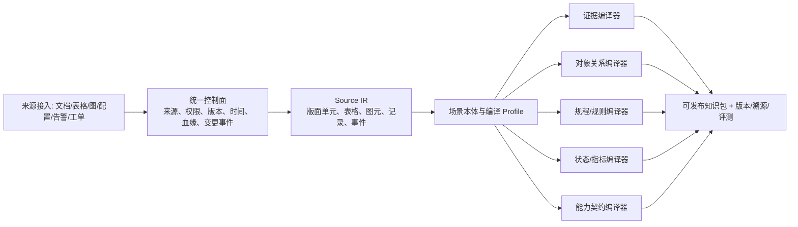

# 知识编译与 Agent 主动知识工程：理论依据与实现框架

> 定位说明：本文是理论与证据材料。代码架构和实施顺序以 [`agent_knowledge_research/implementation/实施蓝图-从文档RAG到Agent知识能力.md`](agent_knowledge_research/implementation/实施蓝图-从文档RAG到Agent知识能力.md) 为准；该蓝图已改为通用 schema/语义资产内核，不按行业对象开发。

> 这轮问题的答案不是“给知识库增加更多类型”。核心是建立一个**类型驱动、可验证、可增量运行的知识编译系统**：不同来源不共享同一条语义流水线；它们共享来源治理和中间表示，再按任务所需的知识形态编译、发布，并由 Agent 在任务中主动选择、获取和补齐知识。

研究时间：2026-08-06。本文区分已经发表的学术研究、预印本和工程推论；后两者不作为已被充分验证的定论。

## 1. 先回答三个问题

| 问题 | 简短结论 |
| --- | --- |
| 是否有“知识编译”与 Agent 知识工程的理论支撑？ | 有，但不是一门已经统一命名、统一验证的“Agent 知识编译学”。它由经典知识编译、本体/知识图谱工程、自动规划中的程序性知识、以及主动/Agentic RAG 四条成熟或快速成熟的研究线共同支撑。 |
| 不同类型的知识如何编译？ | 不能让不同文档走同一条语义 Pipeline。应采用“统一控制面 + 通用 Source IR + 场景本体约束 + 多个目标编译器”。一份文档可同时编译为证据、对象关系、规程和命令规范。 |
| 怎样从被动检索走向 Agent 主动获取？ | 要区分任务内主动检索、任务后的主动知识获取、源系统持续集成。这三件事需要不同的触发、权限和发布机制；开放接口只是前提，不会自动产生主动性。 |

## 2. 理论支撑在哪里，边界又在哪里

### 2.1 经典知识编译：支撑“离线编译、在线高效使用”

经典 AI 中的 Knowledge Compilation 指把一个难以在线推理的形式化知识库，在离线阶段转换成另一种表示，使一类在线查询或变换可以高效执行。Darwiche 与 Marquis 的经典工作将编译结果的比较建立在三个维度：表示紧凑性、可高效执行的查询，以及可高效执行的变换；其动机正是把计算代价摊到离线阶段。[A Knowledge Compilation Map, JAIR 2002](https://www.cs.cmu.edu/afs/cs.cmu.edu/project/jair/pub/volume17/darwiche02a.pdf)

这给语义知识基础设施的不是一个可直接复用的算法，而是一个严谨的**架构原则**：

```text
原始资料 / 事实 / 规则  --离线编译-->  面向某类在线任务的目标表示
                                      └-->  明确它支持哪些查询、验证和变换
```

差异也必须说清：经典理论中的输入通常是命题逻辑或约束；行业资料是非结构化、跨版本且常有歧义的。后者不能宣称继承了前者的复杂度保证。它继承的是“根据要支持的在线操作选择目标表示”的思想。

### 2.2 本体与知识图谱工程：支撑“知识形态、约束与生命周期”

本体工程长期研究概念、属性、关系的建模、获取、验证、复用和演化，而不是只做实体抽取。面向工程资料的早期研究已经将本体获取、词汇层连接、验证与检索效果验证放进同一流程；本体生命周期研究则强调获取、部署、维护和多角色参与。[工程本体获取与验证](https://www.cambridge.org/core/product/identifier/S0890060409000092/type/journal_article) [本体生命周期与演化综述](https://www.cambridge.org/core/journals/knowledge-engineering-review/article/ontology-engineering-methodologies-for-the-evolution-of-living-and-reused-ontologies-status-trends-findings-and-recommendations/7A2D8D844EE0369C24967E156910AB50)

LLM 时代的研究把这条线延展到“LLM 辅助本体建模、扩展、对齐、实体消歧与关系抽取”，但也没有取消领域专家和一致性校验的必要性。[LLM 与本体工程系统综述](https://semantic-web-journal.net/content/large-language-models-ontology-engineering-systematic-literature-review)

这对应知识编译器中的：**本体/Schema 不是输出副产物，而是编译约束与发布契约。**

### 2.3 面向专业领域的 KAG：支撑“图、文本、逻辑与语义对齐的混合编译”

阿里 KAG 研究直接针对专业领域，指出向量相似度与知识推理相关性之间存在缺口，尤其对数值、时间关系和专家规则不敏感。其方法包含图谱与原文片段的双向索引、逻辑形式引导的混合推理，以及知识对齐。[KAG 论文](https://arxiv.org/abs/2409.13731)

它是当前最接近本项目的问题定义之一：不是“建一个图”，而是让不同表示相互索引，再由推理过程按问题选择。但它仍主要面向知识问答/推理，尚未给出行业 Agent 在真实系统中“读—校验—执行—回退”的完整知识工程标准。

### 2.4 程序性知识与自动规划：支撑“把规程编译为可调用、可校验的能力”

自动规划并不把所有知识看成可检索文本。它用状态、动作、前置条件和效果描述一个领域；程序性领域控制知识可以被编译为可调用过程，以约束或指导后续规划。[程序性知识编译为规划过程](https://arxiv.org/abs/1910.04999) 近年的 Proc2PDDL 还专门研究从开放领域的步骤文本预测动作参数、前置条件与效果。[Proc2PDDL, ACL 2024](https://aclanthology.org/2024.nlrse-1.2/)

这正是命令手册、变更规程不应只生成段落向量的理论理由：它们应有一部分被编译成 `Action / Preconditions / Effects / Constraints / Rollback`，由确定性校验器和审批流使用。

### 2.5 LLM Wiki 之后：有延续，但仍处在早期

LLM Wiki 是 2026 年兴起的“原始资料 → LLM 维护的互链 Wiki → Agent 使用”的工程模式，并非一个已经形成共识的学术标准。随后已有直接研究：WiCER 以“编译—评估—精炼”的迭代方式处理 Wiki 编译中关键事实被压缩丢失的问题。它发现盲目将原文压缩为 Wiki 会出现严重信息丢失；迭代诊断可恢复一部分质量。[WiCER 预印本](https://arxiv.org/abs/2605.07068)

这给项目一个非常重要的反证：**“把资料总结成更干净的知识”不是天然可靠的编译。** 编译产物必须可溯源、可诊断、可增量重编，不能用一次性摘要替代原始证据。

当前更值得参考的相邻研究还有：

- Agent 驱动的知识图谱构建与自校正（KnoBuilder，NeurIPS 2025 Workshop），但属于早期研究，不能视为稳定生产方案。[论文页](https://openreview.net/forum?id=teewCPCv2m)
- 用 Agent 失败来决定“下一步补什么上下文”的 Demand-Driven Context，直接提出由真实任务缺口而非预先堆资料来驱动知识工程；目前是预印本。[论文](https://arxiv.org/abs/2603.14057)
- Agent Skills 研究把可复用的程序性知识视作带适用条件、执行策略、终止条件和接口的模块；这与“规程/工具契约是知识资产”的方向一致，但其标准与评测仍在快速演进。[Agent Skills 综述](https://arxiv.org/abs/2602.20867)

## 3. “不同类型的编译”到底是什么

### 3.1 先区分三个维度，避免把问题混在一起

| 维度 | 例子 | 作用 |
| --- | --- | --- |
| 源格式 | PDF、Word、网页、表格、拓扑图、配置快照、告警流、工单 | 决定如何读取、保留版面和做增量检测 |
| 知识语义类型 | 定义、关系、状态、规则、规程、案例、工具能力 | 决定该如何验证和被何种算子消费 |
| 运行时目标表示 | 证据块/倒排/向量、对象图、时序/SQL、规则/状态机、Tool Contract、案例索引 | 决定可支持的查询、推理、计算或执行 |

因此，“产品手册”和“命令手册”都可能是 PDF，却不能只因格式相同走相同语义编译；“参数定义”可能同时出现在 PDF、配置表和接口元数据中，却应收敛到同一个领域对象。

### 3.2 目标架构：共享控制面，分离语义编译器



这里的 `Compilation Profile` 是一个与场景绑定的声明，而不是写死在算子里的规则。它至少声明：

- 可接受的来源和权威优先级；
- 领域对象/关系/版本语义；
- 本来源允许编译出的目标资产；
- 每种资产的抽取器、规则、阈值和人工复核要求；
- 变更后影响哪些资产、应重编还是应失效；
- Agent 允许怎样消费，能否用于建议、校验或执行。

这意味着“一个文档多目标编译”。例如一份核心网版本命令参考可以同时产出：原文证据块、`Command` 对象、`Parameter` 对象、命令—参数关系、参数范围/依赖约束、操作前置条件和变更示例。它们共享同一来源锚点，但不能用同一个向量索引代替。

### 3.3 各类来源的编译方法

| 来源/输入 | 必须保留的中间信息 | 主要产物 | 关键校验 | 不应做的事 |
| --- | --- | --- | --- | --- |
| 产品/规范文档 | 章节、条款、表格、版本、生效范围、原文锚点 | 证据、术语、定义、兼容性/约束候选 | 版本与来源权威性、引用可回跳 | 只切块后靠相似度混用跨版本结论 |
| 方案/设计文档 | 拓扑、假设、选型、边界、适用条件 | 方案对象、依赖/拓扑关系、决策记录 | 与产品版本、Inventory/CMDB 交叉核对 | 把方案描述当作现网事实 |
| 命令参考/变更规程 | 命令语法、参数 schema、前置/后置条件、异常与回退 | CommandSpec、Runbook、校验规则、审批点 | 语法解析、参数范围、规则测试、专家签发 | 让 LLM 摘要后直接生成生产命令 |
| 配置快照/Inventory/指标 | 主键、时间窗、来源系统、状态、计量单位 | 领域对象的状态投影、SQL/查询接口 | Schema、时间新鲜度、单位、主键一致性 | 把动态状态离线嵌入后长期当知识 |
| 告警/日志/工单/案例 | 事件时序、参与对象、处置、结果、人工修订 | Episode/Case、模式候选、评测样本 | 去重、因果与相关性分离、结果确认 | 将一次成功处置直接升级为通用规则 |
| API/工具接口 | 输入输出 schema、权限、幂等、风险、审计、错误码 | Tool/Skill Contract、可调用能力目录 | 契约测试、最小权限、审批与回退 | 把接口说明只作为 RAG 文本暴露给 Agent |

这不是为每种文档重新造一条端到端 Pipeline。共同阶段仍可复用：接入、格式归一、来源治理、版本、血缘、任务编排、质量门禁和发布；不同的是从 `Source IR` 开始，按 Profile 路由到不同的语义编译器。知识图谱工程中的信息抽取、数据转换、本体映射、实体匹配和融合本就被视为可组合的不同工作。[KGpipe 对知识图谱集成流水线的描述](https://dbs.uni-leipzig.de/research/publications/kgpipe-generation-and-evaluation-of-pipelines-for-data-integration-into)

## 4. 从被动检索到主动式知识使用

### 4.1 先分清三种“主动”

| 名称 | 发生时机 | Agent 做什么 | 是否改变知识库 |
| --- | --- | --- | --- |
| 主动检索（active retrieval） | 当前任务内 | 判断是否需要检索、缺什么、再查什么、何时停止 | 通常不改变 |
| 主动知识获取（active acquisition） | 当前任务发现知识缺口时 | 选择允许的外部数据源/人机交互来补证据，生成候选资产 | 产生候选，不应直接发布 |
| 持续知识集成（continuous integration） | 来源变化时 | 订阅版本、配置、告警、工单等事件，增量重编与失效 | 经校验后更新已发布资产 |

学术上，“一次 retrieve-then-generate”之外的主动检索已经有清晰脉络。FLARE 在生成途中根据低置信度内容决定何时、检索什么；2026 ACL 的 SPARKLE 使用独立策略控制检索决策；Agentic-R 则按多轮任务的最终正确性而不只段落相似度训练检索器。[FLARE, EMNLP 2023](https://aclanthology.org/2023.emnlp-main.495/) [SPARKLE, ACL 2026](https://aclanthology.org/2026.acl-long.1793/) [Agentic-R, ACL 2026](https://aclanthology.org/2026.findings-acl.785/)

这证明“检索策略可由任务过程决定”具有研究支撑；但论文里的检索对象大多仍是文档集合。行业系统还要把**图遍历、实时状态查询、确定性计算、仿真/校验和人工提问**纳入同一个获取策略。

### 4.2 Agent 需要的不是更多接口，而是知识获取契约

开放更多 MCP/API 接口只能让 Agent “有可能调用”。MCP 定义的工具可以让模型发现并调用外部查询、API 和计算能力，且工具有 schema；规范也要求应保留人工拒绝调用的能力。[MCP Tools 规范](https://modelcontextprotocol.io/specification/2025-06-18/server/tools)

要让 Agent 会主动获取，应在接口之上定义 `Knowledge Acquisition Contract`：

```text
任务步骤 / 所需知识类型 / 可接受的证据标准 / 新鲜度要求
    / 可调用的检索或工具 / 权限与成本预算 / 停止条件 / 缺口处置方式
```

以“核对某网元参数是否能按目标版本变更”为例：

1. Agent 先确认 `网元、目标版本、变更窗口` 是否已明确；未明确时不能模糊检索后直接结论。
2. 对命令语义查已发布的 `CommandSpec` 和对应版本文档证据；对当前值查配置快照接口；对影响范围查拓扑/依赖图；对容量影响调用确定性 KPI 计算。
3. 每一步检查证据新鲜度、对象身份、版本和权限。任一项不满足，进入“补采集 / 请求人工 / 拒绝推进”，而非继续生成文字。
4. 只有所有前置条件和校验通过，才生成变更建议或创建待审批工单；执行接口始终处在更高风险的权限与审批层。

这才是 Agentic 主动检索：Agent 围绕任务状态主动选择**知识操作**，不是对用户问题循环改写关键词。

### 4.3 让系统连续获得知识：两条触发链

**第一条：源变化触发。**

```text
文档新版本 / CMDB变化 / 配置变更 / 告警模式 / 工单关闭
  → 变更检测
  → 影响分析（哪些对象、关系、规程、评测受影响）
  → 增量编译到候选区
  → 规则/交叉来源/专家校验
  → 发布、失效或回滚
```

时间是知识模型的一等属性。动态时序知识图谱研究正是通过在新知识到来时更新图、让模型选择相关证据子图来处理这一点。[动态时序知识图谱与 LLM](https://proceedings.mlr.press/v274/maio25a.html)

**第二条：任务缺口触发。**

```text
Agent Trace 中出现：未解析实体 / 无足够证据 / 版本冲突 / 工具无权限
  → 生成结构化 Knowledge Gap
  → 按任务频率 × 风险 × 业务价值排序
  → 调度采集、文档补充、专家确认或新工具接入
  → 形成候选资产和新的评测样本
  → 通过后发布
```

Demand-Driven Context 正是把 Agent 失败作为知识建设需求信号；“按需从记忆和技能检索”的近期工作也尝试让 Agent 识别何时需要补充经验，而不是每一步机械检索。[Demand-Driven Context，预印本](https://arxiv.org/abs/2603.14057) [ProactAgent，预印本](https://arxiv.org/abs/2604.20572)

这里有一条不可绕过的治理原则：**Agent 可以创建候选知识与缺口工单，不能自行把高风险候选写入已发布知识，更不能由一次轨迹自动扩大生产权限。**

## 5. 对当前语义知识基础设施的具体落点

### 5.1 新增的核心不是服务，而是三个一等对象

1. **Compilation Profile**：规定某来源/场景如何从 Source IR 编译为哪些目标资产，以及质量门槛和更新策略。
2. **Knowledge Acquisition Contract**：规定某类任务步骤需要什么知识、可以用什么操作拿到、何时停止或升级人工。
3. **Knowledge Gap**：将检索失败、冲突、缺少数据、无权限、执行校验失败规范化，成为持续建设的输入。

它们可以复用现有的 Workflow、资产版本、发布快照、执行记录和评测能力，而非新建一个平行平台。

### 5.2 推荐最小闭环：先做“核心网变更准备”，不做直接变更

选择一条严格只读/准备型任务：给定网元、软件版本和目标参数，形成“变更前检查包”。

- **编译输入**：产品/命令手册、方案约束、配置快照、拓扑/Inventory、历史变更单。
- **编译产物**：版本化 `CommandSpec`、参数依赖/边界、适用条件、检查项、只读查询契约和证据索引。
- **主动获取**：Agent 根据缺失项分别查文档、配置、依赖、KPI；不能补齐就产生结构化缺口。
- **输出**：可追溯的检查结论、差异、风险、证据和待人工确认事项；不下发配置。
- **评测**：版本路由正确、证据完整、规则检查与人工基准一致、错误/缺口能安全停止。

这条闭环能验证三件最关键的事：Profile 是否让不同资料编译成正确形态；Agent 是否真的按任务主动获取；Gap 是否能反向指导下一轮知识建设。

## 6. 最终判断

可以把项目的技术命题收敛为：

> **面向垂直 Agent 的知识工程，不是把所有资料做成更好的 RAG；而是以任务为入口，用本体和编译 Profile 将异构来源转成可验证的多种知识表示，并由 Acquisition Contract 驱动 Agent 主动获取、校验和持续补齐。**

学术上，这一命题的各部分已有扎实或正在快速积累的支撑；但“端到端通用、全自动、可靠的行业知识编译器”尚不存在。项目的价值正在于把这些分散能力落到可组合、可发布、可评测的工程系统中，并以具体场景闭环来验证，而不是宣称一次性解决通用知识工程。
