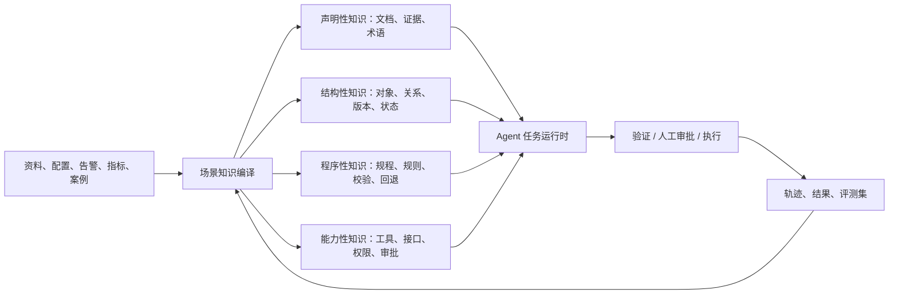

# 面向垂直行业 Agent 的知识库演进研究

> 定位说明：本文用于说明外部实践与问题边界，不是实现设计。当前实现方向采用通用 schema、语义资产与发布范围，详见 [`agent_knowledge_research/implementation/实施蓝图-从文档RAG到Agent知识能力.md`](agent_knowledge_research/implementation/实施蓝图-从文档RAG到Agent知识能力.md)。

> 结论先行：语义知识基础设施不应停在“可组装的挖掘 Pipeline + 可组装的检索 Pipeline”。下一阶段应成为一个**场景驱动的知识与能力编译层**：把资料、关系、实时状态、规程、约束和可执行接口编译为 Agent 可选择、可验证、可追溯地使用的资产。RAG 保留，但只是其中一种证据获取能力。

研究时间：2026-08-06。本文优先使用厂商的一手技术文档和已披露项目；项目效果数据均来自发布方，适合作为架构方向的证据，不等同于独立审计结论。

## 1. 对当前判断的验证：RAG 没有失效，但不能独立承担垂直任务

“RAG 很难落地”需要拆开看。

- 对于**找资料、解释规程、辅助排障**，RAG 已经可以产生实际价值。Georgia-Pacific 在 140 多个制造设施中将设备文档、维修记录、老师傅经验和 IoT 数据汇集给一线人员，用于给出针对具体设备和现场的操作建议；这仍属于“可信辅助”的范畴，而非由 Agent 直接改变生产系统。[AWS 案例](https://aws.amazon.com/solutions/case-studies/georgia-pacific-optimizes-operator-efficiency-case-study/)
- 一旦问题包含**大规模结构化数据、精确计算、跨系统状态或后续操作**，单靠语义片段召回就会露出边界。Swisscom 的网络助手最初把表格和文档送入 RAG；面对数千行参数与 KPI 计算时，无法稳定取回计算所需的精确行。后续加入数据处理/SQL、文档管理与计算等专用 Agent，才形成可用的网络运维助手。[AWS 技术复盘](https://aws.amazon.com/blogs/machine-learning/transforming-network-operations-with-ai-how-swisscom-built-a-network-assistant-using-amazon-bedrock/)
- 更复杂的行业任务不是“回答一个问题”，而是“在约束下完成一条任务链”。Genentech 的研究 Agent 会拆解问题、跨多个知识库检索、调用内部 API 和数据库、带引用综合结果；Covestro 的主数据 Agent 还会采集参数、校验企业数据、生成载荷、提交 SAP 变更请求，并进入既有审批流。[Genentech 案例](https://aws.amazon.com/solutions/case-studies/genentech-generativeai-case-study/) [Covestro 案例](https://aws.amazon.com/blogs/awsforsap/covestro-transforms-master-data-governance-with-ai-agents-on-aws/)

因此，问题不在于“是否继续做 RAG”，而在于不要让 RAG 对本不该由它承担的事情负责：

| 任务所需的事实 | 仅靠文档 RAG 的典型问题 | 应交给的知识/能力形态 |
| --- | --- | --- |
| 某版本产品的定义、命令说明、规范依据 | 能召回相关段落，但可能混入版本、范围或冲突表述 | 带版本、适用范围和证据链的文档知识 |
| 网元、接口、依赖关系、方案拓扑 | 文本片段难保证关系闭合，也难做多跳追溯 | 领域对象、关系、拓扑/依赖图 |
| 当前配置、告警、KPI、容量 | 静态语料会过期；数值计算不应由模型“估算” | 实时数据对象、SQL/指标计算工具 |
| 排障或配置变更步骤 | 只输出文字步骤，无法保证前置条件、顺序和回退 | 规程/Runbook、规则、状态机、校验器 |
| 查配置、下发、开工单、验收 | 自由文本无法约束输入、权限、审批和审计 | 有类型的工具契约、审批点、操作日志 |

## 2. 最有价值的业界信号：知识正在从“文本库”走向“可运营的领域模型”

### 2.1 图谱不是替代向量检索，而是为不同问题提供另一种知识形态

微软 GraphRAG 的索引流程会从非结构化文档生成实体、关系、社区及其摘要；查询端区分局部问题、全局问题和结合两者的 DRIFT Search。它解决的是“跨资料全局归纳、多跳关系、从局部线索扩展上下文”这类向量 Top-K 不擅长的问题，而不是让所有问题都走图谱。微软也明确提示索引成本高，且需要按目标用户/问题调优，不能把 GraphRAG 当作开箱即用的万能方案。[GraphRAG 查询概览](https://github.com/microsoft/graphrag/blob/main/docs/query/overview.md) [DRIFT Search 说明](https://www.microsoft.com/en-us/research/blog/introducing-drift-search-combining-global-and-local-search-methods-to-improve-quality-and-efficiency/)

真实工业系统采用的是混合形态。Everllence 的设备排障系统将 P&ID 转为关系图，用图查询设备关系与流程；文档侧仍用 LightRAG 补足图中没有的上下文。Agent 根据问题在图查询工具、受保护的 Cypher 查询和文档检索工具间选择，而不是把图谱再转回一堆文本交给模型。该项目还保留了专家审核环节，因为 P&ID 这种“单一事实来源”不能接受纯图像抽取造成的不完整数字化。[AWS 技术案例](https://aws.amazon.com/blogs/industries/how-everllence-scaled-pid-intelligence-to-improve-plant-operations/)

### 2.2 生产级 Agent 的共同底座：对象、关系、动作、权限和审计

Palantir 将 Ontology 定义为连接企业数字资产和现实对象的运营层。它不仅包括对象、属性和关系，还包括带动态权限的动作和函数；Agent 通过受作用域限制的 SDK/MCP 读取或写入这些对象。这是从“给模型更多上下文”转向“给 Agent 一个受控的业务世界模型”的代表性产品路线。[Ontology 官方说明](https://www.palantir.com/docs/foundry/ontology/overview) [Agent 官方说明](https://www.palantir.com/docs/foundry/agents/overview)

这条路线的关键不在于必须使用某一厂商的图数据库，而在于下面这条边界：



### 2.3 通信行业的直接佐证

Swisscom 的项目与核心网知识场景最接近：基础 RAG 用于文档与参数解释，但准确 KPI 计算改由 SQL/数据管道执行；再由主管 Agent 协调文档管理 Agent 与计算 Agent。它说明“知识”必须同时覆盖说明资料和可计算的数据资产。[项目复盘](https://aws.amazon.com/blogs/machine-learning/transforming-network-operations-with-ai-how-swisscom-built-a-network-assistant-using-amazon-bedrock/)

更进一步，中兴披露的核心网运维 Agent 将网络、数据、模型、应用和数字孪生分层；列出了 Graph-RAG、多个专长 Agent、MCP 和数字孪生，并面向告警、工单、配置与信令等输入。该材料代表厂商路线，尚不能据此推断通用可复制的效果，但其问题分解与当前方向高度一致。[中兴技术文章](https://www.zte.com.cn/global/about/magazine/zte-technologies/2025/special-topic---nebula-telecom-large-model-/special-topic---nebula-telecom-large-model/core-network-o-m-agent-boosts-efficiency-for-l4-autonomy.html)

Deutsche Telekom 与 Google Cloud 的 RAN Guardian 已披露测试验证：它从监控、资源、性能和覆盖等数据中识别问题，并建议或自主实施配置调整。这个例子强调：到“行动”阶段，系统依赖的不再是资料库，而是实时状态、受控能力和运维治理。[项目公告](https://www.telekom.com/en/media/media-information/archive/deutsche-telekom-and-google-cloud-partner-on-agentic-ai-for-autonomous-networks-1088504)

## 3. 对语义知识基础设施的定位升级

当前“挖掘 Pipeline 算子化 + 检索 Pipeline 算子化”并不是弯路，反而是非常好的底座：它已经具备了把不同场景编译成不同知识形状、把不同问题编译成不同检索/推理路径的机制。

但其中心对象仍偏向**文档及其派生检索单元**。建议将中心对象升级为：

> **场景知识包（Scenario Knowledge Package，SKP）**：针对一类可度量任务定义知识形态、来源、时效规则、可用工具、操作约束和验收标准，并由它驱动挖掘与运行时的组合。

一个 SKP 不等于某一个知识库，也不等于一条检索 DAG。它是“某种任务为什么能安全完成”的最小发布单元。

| SKP 声明项 | 核心网配置场景示例 | 对现有能力的影响 |
| --- | --- | --- |
| 任务目标与风险级别 | 查询配置差异、生成变更建议、执行前校验；不允许直接下发 | 让 Pipeline 由任务目标而不只是数据类型驱动 |
| 领域对象模型 | 产品、版本、网元、接口、参数、命令、告警、KPI、方案、工单 | 新增对象/关系资产，不取代文档与向量资产 |
| 知识来源与生效规则 | 产品手册、方案、命令参考、现网快照；按版本/区域/时间窗生效 | 在检索前完成范围消歧与冲突处理 |
| 程序与约束 | 前置检查、配置顺序、阈值、回退条件、双人复核 | 将“经验文字”编译为可检查的规程资产 |
| 工具契约 | CMDB/Inventory 查询、配置只读检查、KPI 查询、变更单创建 | 将工具输入输出、权限、幂等性和审批建模为知识 |
| 验收用例 | 版本冲突、缺少前置条件、命令参数越界、回退、引用完整性 | 使评测成为发布门禁，而不是上线后的人工抽查 |

## 4. 目标架构：从知识编译器走向“知识 + 能力”编译器

### 4.1 挖掘侧：仍然算子化，但增加五类编译目标

现有挖掘算子继续处理版面、切分、实体、关系、向量和引用。新增的不是另一条孤立流水线，而是可按 SKP 选择输出的资产类型：

1. **证据资产**：原文片段、表格/图片锚点、来源、版本、生效范围、置信度和冲突标记。它服务于解释与审计。
2. **语义对象资产**：从“提及某参数”升级为“某版本产品上的参数定义”，关联对象 ID、类型、关系、同义名和外部主数据键。
3. **规程资产**：将规范、案例和专家经验编译为步骤、输入、前置条件、检查点、异常分支、回退与证据要求。高风险规程必须允许领域专家审核发布。
4. **能力资产**：将 API、SQL 模板、查询工具、配置校验器、工单接口包装成带 schema、权限、风险和幂等性说明的 Tool/Skill Contract；Agent 不直接凭自然语言拼接生产操作。
5. **经验资产**：将“告警—上下文—诊断—处置—结果—人工修订”沉淀为可检索案例和可回归的任务样本。它是后续持续改善的依据，不应未经审查直接改写规范知识。

其中对象、规程、能力、经验四类都应保留到原始证据的可追溯连接。这样一处文档版本变更，才能定位哪些关系、Runbook、评测样本和 Agent 能力说明需要重新编译或复审。

### 4.2 运行时：检索 Pipeline 演进为“任务证据与能力规划”

建议保持现有静态 DAG 和算子编排优势，但将运行时分两类：

- **确定性任务**：如版本差异核对、KPI 计算、配置前置校验。优先编译为固定工作流：结构化查询/规则校验 → 证据汇总 → 结果。这里不需要让 Agent 自由规划。
- **开放性诊断任务**：如跨域故障根因分析。由 Agent 规划，但每一步只能从场景知识包允许的检索、图查询、计算和工具契约中选择，并应记录决策和证据。

运行时的推荐路径：

```text
任务输入
  → 场景识别与风险判级
  → 加载 SKP（对象模型、数据范围、规则、工具权限、评测门槛）
  → 任务分解
  → 文档/图/SQL/实时系统的混合取证与计算
  → 一致性、前置条件、引用完整性校验
  → 输出建议，或经审批后调用受控工具
  → 写入可回放轨迹和结果
```

Everllence 的图查询 + 文档检索 + 受保护 Cypher 工具，以及 Swisscom 的文档 Agent + 计算 Agent，都是这个路径的具体实例。[Everllence](https://aws.amazon.com/blogs/industries/how-everllence-scaled-pid-intelligence-to-improve-plant-operations/) [Swisscom](https://aws.amazon.com/blogs/machine-learning/transforming-network-operations-with-ai-how-swisscom-built-a-network-assistant-using-amazon-bedrock/)

### 4.3 不要把多 Agent 当作第一优先级

多 Agent 是组织复杂任务的手段，不是知识质量问题的替代品。先用一个受控 Agent + 明确的工具/知识包把一条任务闭环；只有当专业边界、权限边界或上下文窗口确实不同，才拆为文档、计算、拓扑、变更等专长 Agent。行业组织 GSMA 也将数据模型、工具集成、编排、协作、身份与信任作为并列能力，而非仅强调多 Agent 协作。[GSMA 白皮书](https://www.gsma.com/solutions-and-impact/technologies/artificial-intelligence/wp-content/uploads/2025/06/Agentic-AI-for-Telco-Whitepaper-digital.pdf)

## 5. 建议的演进优先级

### 阶段 A：把文档知识变成“有边界的可信知识”

- 在现有检索单元上补齐版本、生效范围、对象归属、来源权威度和冲突状态。
- 让场景声明决定挖掘形态与检索策略：问版本/参数，先对象和范围过滤；问关系，走图/拓扑；问全局主题，才走社区摘要或全局检索。
- 将资料中的步骤先产出为“候选 Runbook”，经专家确认后发布；不要自动把模型抽取结果变成可执行规程。

验收标准：在一个只读场景中，答案不仅要有引用，还要能解释“适用于哪一产品版本、哪类对象、为何排除了看似相近的资料”。

### 阶段 B：引入结构化状态和确定性计算

- 对接一到两个只读系统：配置快照、Inventory/CMDB 或 KPI 数据。
- 发布规范化对象模型与查询工具；把计算下推到 SQL/规则引擎，模型只负责意图理解、计划和结果解释。
- 构建“文档定义—当前状态—差异—检查结果”这条证据链。

验收标准：选择一个能人工复核的任务，例如“指定网元在指定版本/窗口下的参数合规检查”，结果可重放、可比对、可定位原始数据。

### 阶段 C：把规程和工具变成受控能力

- 将故障处理、变更准备、回退等流程建模为步骤与状态机；给每个步骤绑定输入 schema、前置条件、风险等级和所需证据。
- 工具先从只读查询、报告生成、工单草拟开始，再进入“创建变更单”；配置下发必须保持人工审批、最小权限、幂等、回退和完整审计。
- 让一次任务的执行轨迹反哺案例资产和评测集，而不是直接改写知识结论。

验收标准：Agent 能完成一条端到端的“建议/准备”任务；对缺少权限、前置条件不满足或证据冲突的输入，必须拒绝推进并指出缺口。

### 阶段 D：将评测和治理做成发布门禁

不能只测 Recall、MRR 或“回答看起来是否流畅”。行业平台已经把**任务完成、工具使用、预期调用序列、线上 trace 采样**纳入评测。AWS 的 AgentCore Evaluations 支持对生产会话持续抽样，也支持参考答案、行为断言、预期工具执行序列和自定义规则；Palantir AIP Evals 支持用测试用例、评价函数和历史版本比较来验证非确定性系统。[AWS Agent 评测](https://aws.amazon.com/about-aws/whats-new/2026/03/agentcore-evaluations-generally-available/) [Palantir AIP Evals](https://www.palantir.com/docs/foundry/aip-evals/overview)

建议把评测拆为四层：

| 层次 | 要回答的问题 | 代表性门禁 |
| --- | --- | --- |
| 知识编译 | 编译出的对象、关系、版本和证据是否正确完整？ | 样本审校、溯源完整率、版本冲突检出率 |
| 取证/计算 | 是否选择了正确来源、图路径、数据范围和计算工具？ | Evidence Recall、范围命中、SQL/规则结果比对 |
| 任务执行 | 是否按规程完成，是否在正确节点停止或请求审批？ | 前置条件通过率、预期工具序列、回退覆盖率 |
| 线上治理 | 是否持续可靠、安全、成本可控？ | 轨迹抽检、异常拒绝率、人工接管率、版本回归 |

## 6. 对当前路线的取舍

**应继续投入的部分**

- 挖掘与检索的算子化、DAG 编排、版本冻结和资产追溯：这是按场景构建不同知识形状的必要基础。
- 文档、段落、实体、关系、向量、来源等资产层：它们将成为上述多种知识资产的共同证据层。
- 检索侧的混合召回、融合、重排和结果组织：它将演进为“混合取证”，而不是被抛弃。

**需要补齐的部分**

- 从“文档中心”到“领域对象中心”：对象需有身份、版本、时间、范围、关系和外部系统键。
- 从“答案生成”到“任务闭环”：规程、规则、工具契约、审批和操作日志必须成为一等资产。
- 从“检索评测”到“任务评测”：以具体场景任务集、预期证据和预期动作序列作为发布门禁。

**暂不建议直接投入的部分**

- 将所有资料自动抽为大而全图谱。先围绕一个任务所需的对象和关系建模，避免高成本、低复用的图谱工程。
- 用自由规划的多 Agent 直接碰生产配置。先闭环只读诊断、变更准备和审批，再扩展执行面。
- 用模型生成的“经验”直接覆盖规范、版本或运行规则。经验必须作为候选证据，由责任人或确定性校验确认。

## 7. 最终判断

语义知识基础设施的真正差异化不应是“有更多检索算子”，而是：

> **同一个场景定义能够编译出与任务相匹配的知识形态，并把它们与受控能力、验证规则和评测闭环一起交给 Agent。**

对核心网配置这样的垂直场景，文档知识、解决方案知识、命令细节知识只是起点。能让 Agent 稳定完成工作的知识，还必须包括产品/网元/参数/版本的对象关系，现网状态与指标，规程与约束，以及查询/校验/变更接口的权限和审计。这样，RAG 从一个试图包办所有问题的应用形态，回到它应有的位置：为 Agent 提供可追溯文本证据的基础能力。
