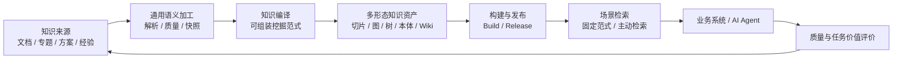

# 语义知识基础设施：从知识来源到知识应用

> 内容范围：建设背景、知识来源、知识构建、知识形态、检索服务、应用消费、评价闭环、当前进展与下一阶段  
> 时间：2026 年 8 月

## 一、核心判断：不同场景需要不同形状的知识

语义知识基础设施不是“更强的文档检索”，而是把复杂资料预先**编译**为能够支撑不同任务的知识资产，再通过与场景匹配的检索方式交付给人和 Agent。

这一区别很关键。面对专业领域，一份资料中通常同时包含概念定义、对象关系、操作步骤、参数约束、版本差异和故障经验。精准查证、关系分析、长文导航、方案设计、配置生成和 Agent 多轮工作所需的知识形态并不相同：有的需要准确原文，有的需要实体关系，有的需要层级目录，有的需要场景本体，有的需要围绕任务组织的规则和步骤。

因此，项目遵循的第一性原理是：

```text
业务场景
→ 所需知识形态
→ 知识加工范式
→ 检索服务范式
→ 应用消费方式
→ 评价标准
```

不是用一条固定流水线和一个搜索框解决所有问题，而是由业务场景反向决定：资料需要被加工成什么形态，Agent 应该怎样获取和使用这些知识，最终又如何判断知识是否真正产生价值。

### 1.1 为什么“知识编译”比单纯检索更重要

AI 正从回答问题走向分析、设计、生成、执行和核查。传统检索的核心产出仍是相关片段；即使增加 Agent 编排，底层资料往往仍保持片段化，版本、关系、约束和证据需要在运行时临时拼接。

| 对比维度 | 传统检索 / RAG | Agentic RAG | 语义知识基础设施 |
|---|---|---|---|
| 主要产出 | 相关文档或文本片段 | Agent 调度后的片段集合 | 面向任务、带来源和版本边界的多形态知识资产 |
| 结构化时点 | 很少或没有 | 查询时临时组织为主 | 资料入库后预先加工和编译 |
| 关系与约束 | 依靠人或 LLM 理解 | 由 Agent 反复检索和推断 | 可沉淀为实体关系、层级结构、本体、规则和证据链 |
| 版本与发布 | 容易混用新旧资料 | 依赖调用方控制 | Snapshot、Build、Release 控制生效范围 |
| 场景适配 | 主要调整切片和提示词 | 主要调整 Agent 流程 | 同时调整知识形态、构建范式、检索范式和评价标准 |
| 面向复杂任务 | 需要大量后续拼接 | 能多轮获取，但成本和不确定性较高 | 先提供结构化、可核验的知识，再交由 Agent 决策 |

这不是否定 RAG 或 Agent，而是为它们提供更可靠的底座：

> Agent 负责理解目标、做出决策和执行任务；语义知识基础设施负责生产、治理和交付可用知识。

## 二、完整知识链路：来源、构建、检索、应用

语义知识基础设施覆盖知识从进入系统到支撑业务的完整过程。



这条链路可以概括为三个相互连接的体系：

1. **知识生产体系**：把多源资料加工成可靠、可追溯的知识资产；
2. **知识服务体系**：按场景组织检索、导航、扩展和证据交付；
3. **知识应用体系**：让 Agent 在任务过程中持续使用知识，并将结果反馈给知识生产。

### 2.1 各层解决的问题

| 层次 | 解决的核心问题 | 主要产物 |
|---|---|---|
| 知识来源 | 知识从哪里来、是否最新、能否追溯 | 文件身份、内容版本、来源范围 |
| 通用语义加工 | 资料结构是否被正确理解和保存 | Parse IR、原子元素、Document Snapshot |
| 知识编译 | 场景需要什么形态的知识 | 切片、检索单元、实体图、树、本体、Wiki 等 |
| 构建与发布 | 哪一版知识可以生效 | Build、Release、质量结论、发布范围 |
| 场景检索 | 应该如何找到、补全和组织知识 | 候选、关系路径、完整原文、ContextPack |
| Agent 应用 | 知识怎样参与任务完成 | 分析、方案、任务计划、生成结果、核查结果 |
| 评价反馈 | 问题发生在哪一层、如何持续改进 | 指标、运行轨迹、问题归因、修复版本 |

## 三、知识来源：复杂专业资料不是一个扁平文档集合

语义知识基础设施面向的输入不局限于普通办公文档。当前及后续需要覆盖的知识来源包括：

- 产品文档、标准规范、命令参考和特性说明；
- 解决方案、配置指导、操作规范、检查清单和故障手册；
- 业务专题、项目资料、设计材料和过程经验；
- Word、Excel、PPT、PDF、HTML、Markdown、TXT 等文件；
- 已有数据库、结构化数据、存量图谱和人工维护知识；
- Agent 执行过程中产生并经过确认的方案、规则、问题和反馈。

这些资料存在四类共同难点。

### 3.1 结构复杂

专业资料的重要信息经常隐藏在标题层级、表格网格、图片、图题、跨页关系和上下文中。若在解析时被压平成纯文本，后续检索和推理无法恢复其原始语义。

### 3.2 类型不同

产品事实、方案原则、操作步骤、参数约束和经验判断不能用同一种方式理解。系统既要保存原文事实，也要允许后续针对场景生成高级知识制品。

### 3.3 版本敏感

同一产品、规则或对象可能存在多个版本。知识不仅要记录内容，还要记录适用范围、来源版本和当前生效状态，避免旧知识被错误用于新场景。

### 3.4 分散但相互关联

完成一个业务任务所需的信息通常分散在不同资料中。资料之间、对象之间和任务之间存在依赖关系，单次相似度召回往往只能找到其中一部分。

因此，资料进入系统后不能直接复制进向量库，而应先建立统一身份、内容版本、来源范围和加工边界。

## 四、知识生产：双侧算子化中的构建侧

知识生产的目标不是把文档切成更多片段，而是形成可复用、可验证、可发布的知识资产。

### 4.1 先把资料变成可靠的知识原料

当前项目已经建立 Word、Excel、PPT、HTML、PDF、Markdown、TXT 七类格式的结构化解析能力。解析结果不仅包含文本，还保留：

- 多级标题树、章节归属和阅读顺序；
- 段落、列表、代码、引用等内容元素；
- 表格网格、表头、合并单元格、公式与显示值；
- 图片、图题、表题及所属关系；
- 页码、区域、工作表单元格、DOM 节点或行号等证据位置。

这些结构被组织为统一 Parse IR 和原子文档元素。它们表达“资料中实际有什么”，是后续多种知识编译的共同原料，但本身还不是针对某个业务场景的最终知识。

### 4.2 用质量门控保证知识生产可信

解析和编译不是“程序执行完成就入库”，而是经过质量决策：

```text
PASS / WARN / REPAIR / FALLBACK / FAIL
```

系统记录每次解析尝试、所用方法、质量结论和失败原因。达到要求的结果形成不可变 Document Snapshot，并保存来源 revision、加工管线指纹、质量报告和运行记录。

当前已经具备以下关键机制：

- 输入冻结，确保一次加工针对确定版本；
- 提交前检查资料是否已更新，过期结果标记为 `SUPERSEDED`；
- 低质量结果不进入正式快照；
- 原始解析制品可以重放，调整编译策略时无需重新解析文件；
- 同一资料可因加工方法或编译策略不同形成多个快照，历史结果不被覆盖。

### 4.3 构建流水线从固定流程演进为挖掘范式

当前构建侧已经形成17类工作流算子，固定主干为：

```text
输入发现
→ 文档解析
→ 切片编译
→ 资产持久化
→ 构建、校验与收尾
```

中间可根据场景组装：

```text
语义增强｜篇章关系｜上下文增强｜检索单元生成｜向量化
实体抽取｜实体归一｜关系抽取｜人工审核｜本体归纳｜图谱写入
```

`document_parse` 和 `segment_compile` 已作为正式工作流算子进入编译约束。每次运行固定绑定工作流版本、图结构和参数，保证“这份知识由什么方法生产”可追溯、可复现。

### 4.4 算子化的价值

算子化不是为了展示更多技术组件，而是降低场景适配成本。

- 共性的文件治理、解析、质量、快照和发布能力由平台统一提供；
- 场景差异通过算子组合、参数档位、知识模板和质量规则表达；
- 同一份 Parse IR 可以被重新编译成不同知识形态；
- 新场景不需要复制完整工程，只需要增加必要的资产定义和少量适配能力。

## 五、知识形态：本体只是多种高级知识资产之一

同一份原始资料不应只产生一种切片。场景首先决定需要什么形态的知识，构建和检索再围绕这种形态进行组装。

| 典型场景 | 所需知识形态 | 主要知识编译 | 主要知识消费 | 当前状态 |
|---|---|---|---|---|
| 精准事实查证 | 结构化切片、表格行、检索单元、来源证据 | 解析、分段、检索单元、向量化 | 全文/向量召回、重排、原文获取 | 已具备基线能力 |
| 关系与影响分析 | 实体、关系、关系证据 | 实体抽取、归一、关系处理 | 实体精确检索、图扩展、证据回溯 | 已有基础，持续补强 |
| 长文理解与章节导航 | 结构目录树、语义层级树、父子节点 | 章节聚合、摘要、树构建 | 树检索、目录下钻 | 下一阶段扩展 |
| 全局主题与跨资料综述 | 社区摘要、主题关系、专题知识 | 聚类、社区报告、跨源合成 | 局部图与全局摘要检索 | 后续扩展 |
| 场景任务执行 | 场景本体、任务链、规则和约束 | 对象抽取、关系链接、规则编译 | 本体导航、关系扩展、任务知识读取 | NewSFCGraph 已形成实践 |
| 知识合成与方案交付 | 带引用的 Wiki 条目、专题文档 | 多来源研究、提纲、生成、引用绑定 | 合成层与原始证据双轨检索 | 已有实践，待接入统一底座 |

这张表的重点不是一次性建设所有形态，而是确立统一扩展方法：

> 每增加一种知识形态，都通过对应的构建算子、资产契约、发布机制和检索范式进入平台，而不是另起一套系统。

### 5.1 场景本体的定位

本体是高级知识资产的一种。这里的本体不只是空的类型定义，而是从零散资料中抽取、组织和校验后形成的场景知识，通常包含：

- 场景中的知识对象；
- 对象之间的关系；
- 条件、约束、顺序和规则；
- 对象、关系和规则对应的来源证据；
- 版本、适用范围和质量状态。

本体适合表达“完成一类业务需要理解哪些对象以及它们如何协作”，但并不替代原始证据、检索单元、层级树或 Wiki 条目。Agent 可以借助本体确定任务路径，再按需回到原文、表格或专题知识取得细节。

### 5.2 同一资料的多视图编译

同一份产品文档可以同时形成：

```text
原文证据视图：用于准确引用和查证
检索单元视图：用于全文、向量和混合召回
关系视图：用于对象关联和影响分析
目录/树视图：用于长文导航和逐层理解
场景本体视图：用于任务规划、规则理解和关系下钻
Wiki/专题视图：用于综合阅读和知识交付
```

这些视图共享同一来源和版本治理，但面向不同消费方式。这正是“知识编译”的核心含义。

## 六、知识发布：让加工结果成为可控的生效版本

知识加工完成不代表可以直接进入在线服务。系统通过 Snapshot、Build 和 Release 建立生效边界：

```text
Document Snapshot
→ 选择进入 Build 的知识版本
→ Build 校验
→ Release 发布
→ Serving 只读消费指定范围
```

这套机制解决四个问题：

1. 同一资料重新加工时保留历史结果；
2. 不同知识库、不同版本和不同场景不相互覆盖；
3. 一次 Agent 回答能够追溯当时实际使用的知识版本；
4. 新编译策略出现问题时可以回滚，而不是直接修改线上知识。

当前库内知识生产闭环已经形成，但“解析完成”“切片完成”“Build 完成”和“Agent 可检索”仍需明确区分。只有对应检索入口资产已经生成、索引已经就绪，并进入正确的 KB 或 Release 范围，才能称为检索就绪。

## 七、知识检索：固定范式与 Agent 主动获取并存

不同知识形态需要不同的消费方式。检索侧同样采用算子和范式，而不是维护一条无法变化的固定搜索链路。

### 7.1 固定检索范式

对于边界清晰、延迟敏感或可以稳定表达的问题，使用预编排的固定范式：

```text
查询理解
→ 知识范围解析
→ 多路召回
→ 融合
→ 重排
→ 原文水合
→ 上下文与证据组装
```

当前检索侧已经具备19类算子，覆盖：

- 查询入口、查询理解、向量化、Multi-Query、HyDE；
- 全文、向量、实体精确、实体图和段落图扩展；
- RRF、加权融合及结果合并；
- 分数、模型和 LLM 重排；
- ContextPack 组装和测试输出。

检索范式以静态 DAG 编译和执行，可保存不可变版本、发布并绑定知识域或知识库。简单事实问题可以使用轻量范式，复杂关系问题可以增加实体和图扩展，而不修改检索框架核心。

### 7.2 Agent 主动检索

复杂任务往往无法在第一次查询时确定全部知识需求。Agent 需要根据中间结果决定下一步：

```text
search：发现相关知识和候选对象
fetch：取得完整对象、原文和上下文
expand：沿关系、目录或引用继续获取
grade：判断知识是否齐全、是否冲突
rewrite：补充问题后再次检索
```

主动检索不是把 embedding、rerank 等底层算子逐个暴露给 Agent，而是提供粗粒度、可审计的知识工具。底层范式负责稳定执行，Agent 负责判断“还缺什么知识”和“下一步去哪里取”。

### 7.3 当前面向 Agent 的知识接口

当前项目已提供：

- `search_knowledge`：按知识域选择默认或指定检索范式，返回带来源的证据结果；
- `get_segment_fulltext`：根据证据 ID 获取完整原文和相邻上下文。

NewSFCGraph 已提供：

- `get_domains`：寻找业务入口；
- `search_objects`：按名称、层次和类型定位对象；
- `search_md`：检索知识对象正文；
- `get_object`：读取对象及显式关系；
- `get_md`：批量读取完整对象并沿 Wiki 引用继续下钻。

后续应将两类能力逐步统一为面向不同资产类型的 `search / fetch / expand` 契约：固定范式负责高效召回，Agent 根据任务主动组合多次知识获取。

## 八、知识应用：NewSFCGraph 是场景化知识编译与消费的先行实践

NewSFCGraph 最终会接入语义知识基础设施。它不是独立于本项目的另一套长期架构，而是一套已经走得更深、但目前偏定制化的场景实践。

### 8.1 已形成的知识资产

NewSFCGraph 将知识组织为对象化 Markdown，并通过 Frontmatter、正文、显式边和 Wiki 引用表达知识。当前目录资产盘点约2.29万份，包括：

| 资产类型 | 数量 |
|---|---:|
| Command | 13,075 |
| ConfigObject | 3,500 |
| Feature | 3,274 |
| AtomTask | 1,885 |
| License | 635 |
| FeatureTask | 419 |
| CompoundTask | 107 |
| Business | 37 |

这些数字只表示当前仓库中的资产规模，不作为真实业务效果或生产验证结论。

### 8.2 已形成的知识组织方式

其核心关系可概括为：

```text
业务域 → 场景 → 解决方案
                 ↓
特性任务 → 复合任务 → 原子任务
                 ↓
特性 / License → 命令 / 配置对象
```

其中既包括场景本体，也包括任务知识、原始产品知识和 Wiki 合成知识。它并不是单一“本体库”，而是围绕 Agent 完成任务组织的一组多形态知识资产。

### 8.3 已形成的 Agent 使用流程

在配置生成实践中，Agent 不依赖一次 RAG 结果直接生成，而是：

```text
定位业务域、场景和方案
→ 下钻任务、特性和命令知识
→ 判断知识是否齐全
→ 结合现网信息分析差异
→ 形成方案并确认
→ 形成规划数据并确认
→ 生成配置
→ 调用核查能力检查并修正
```

这套实践验证了三个通用方向：

1. 知识需要按任务关系组织，而不仅是按相似度召回；
2. Agent 需要连续搜索、读取和扩展知识，而不是一次被动检索；
3. 最终结果需要通过规则、证据和外部核查能力共同验证。

### 8.4 接入统一基础设施后的定位

NewSFCGraph 中可复用的能力应逐步平台化：

- 对象化知识和 Wiki 引用的通用资产契约；
- 产品资料到不同知识对象的构建算子；
- 本体、任务、Wiki 和原始证据之间的来源关系；
- 全文、对象、关系导航等检索能力；
- MCP 工具、遥测、测试用例和问题归因机制。

具体业务对象、任务分解和规则仍保留在场景资产包中。这样既避免把平台做成某个场景的专用系统，也避免每个新场景重新建设文件、版本、索引、权限和工具接口。

## 九、当前进展：基础闭环与新增能力

### 9.1 知识库和资料管理

当前已支持：

- 知识库创建、编辑、软删除和可见范围；
- 拥有者、编辑者、查看者等基础角色；
- 文件夹新建、重命名、移动和删除；
- 单文件上传、ZIP 解压和目录结构保留；
- 文档查看、修改、下载、删除和移动；
- 文件身份与存储位置分离，改名和移动不破坏知识链路。

### 9.2 库内知识生产闭环

用户可以选择已发布挖掘范式，对整库做增量加工，也可以指定文件或强制重加工。系统记录 Run、文档动作和阶段进度；工作流版本或参数变化后，可按新范式重新加工。

近期补强包括：

- `document_parse` 与 `segment_compile` 进入标准工作流；
- 解析质量档位真正参与门控并持久化观测结果；
- 冻结输入过期检查进入主链路；
- API 重启时自动发现并恢复可恢复的 Workflow Run；
- 旧解析结果路由退役，减少新旧链路并存；
- 内部接口鉴权改为默认拒绝，部署凭据初始化更加严格。

### 9.3 检索范式与 Agent 接口

当前已具备多路召回、融合、重排、证据组织，以及检索范式的创建、版本、发布、知识域绑定和执行能力。MCP 可以让 Agent 使用默认或显式指定的检索范式，并在需要准确引用时继续取得完整原文。

### 9.4 场景实践

NewSFCGraph 已形成规模化对象资产、Wiki 导航、五类 MCP 工具、调用遥测、测试用例和配置生成流程，为多形态知识、主动检索和任务消费提供了可迁移的实现参考。

### 9.5 当前真实边界

当前仍需明确以下边界：

1. 部分资料只达到“解析与切片就绪”，尚未执行到检索单元或向量阶段，不能直接视为 Agent 可检索；
2. NewSFCGraph 仍使用独立的构建、版本和索引体系，尚未消费当前项目的 Snapshot、Build 和 Release；
3. 固定检索与 Wiki 主动导航仍使用不同资产模型和工具契约；
4. NewSFCGraph 部分使用规范仍引用已删除的旧 REST 接口，需要统一迁移到 MCP；
5. 场景本体、任务知识和 Wiki 对象到原始文档快照的统一证据链尚未建立；
6. 构建评价、检索评价和应用评价尚未形成一条端到端问题归因链。

## 十、如何评价知识：不只看回答对不对

知识基础设施不能只用一次问答准确率评价。一个回答得分高，可能是模型猜对，也可能使用了不适用版本。评价需要覆盖从资料进入到任务完成的全过程。

| 评价层 | 核心问题 | 关注内容 | 作用 |
|---|---|---|---|
| L1：知识构建层 | 资料是否被正确加工 | 内容覆盖、结构、表格、证据定位、版本、编译质量 | 判断资料是否正确进入知识系统 |
| L2：检索与证据层 | 所需知识是否被找到并组织正确 | HitRate、Recall、MRR、NDCG、来源、关系路径、完整原文 | 区分构建问题与检索问题 |
| L3：答案与任务层 | 知识是否真正改善任务完成 | 完整性、准确性、核查通过、人工修改量、任务效率 | 衡量真实任务价值 |

对于本体、任务图或 Wiki 等高级资产，还需要增加：

- 对象和关系完整性；
- 规则一致性；
- 悬空引用与错误链接；
- 关键知识证据覆盖；
- Agent 是否漏读关键对象或提前停止下钻。

### 10.1 端到端问题归因

```text
资料没有进入系统       → 来源接入问题
原文结构丢失           → 解析问题
知识形态不适合场景     → 编译范式问题
对象、关系或规则缺失   → 高级知识资产问题
正确知识没有被找到     → 检索范式问题
找到知识但 Agent 用错  → Agent 策略问题
结果不符合业务要求     → 知识、规则、核查或应用流程问题
```

当前项目已具备解析质量、运行审计、版本来源和范式执行轨迹；NewSFCGraph 已具备工具遥测、测试运行、人工评审和问题归因。下一步需要把这些记录连接为统一评价链。

## 十一、下一阶段：从两个可用闭环走向一套统一基础设施

### 11.1 完成检索就绪与多知识库在线服务

- 增加明确的 retrieval readiness 状态和门禁；
- 确保需要服务的资料执行到检索单元、索引和向量等必要阶段；
- 让每个知识库拥有清晰的生效版本；
- 检索按指定知识库和 Release 范围解析资产，并返回来源。

### 11.2 建立可扩展的知识资产契约

- 在切片、检索单元和实体资产之外，逐步支持树、本体、任务知识和 Wiki 等资产；
- 统一资产身份、来源、版本、质量和发布字段；
- 高级知识资产必须能回到 Document Snapshot 和原始证据；
- 新增资产类型不修改工作流和检索执行器核心。

### 11.3 把 SFCGraph 的通用部分迁入构建侧

- 将产品资料解析和对象构建接入统一的输入冻结和快照；
- 将对象抽取、关系链接、规则编译、Wiki 合成和核查沉淀为可组合算子；
- 以场景资产包保存业务对象定义、模板和规则；
- 复用统一 Build/Release，不再维护独立生效版本。

### 11.4 统一固定检索与主动检索

- 统一 `search / fetch / expand` 知识访问契约；
- 固定范式负责低成本、确定性召回；
- Agent 根据任务复杂度进行多轮读取、关系扩展和查询改写；
- 简单问题不进入高成本 Agent loop，复杂任务才启动主动检索；
- 检索全程记录范式、资产版本、对象访问和停止原因。

### 11.5 建立场景化评价与持续治理

- 为不同知识形态建立对应的构建质量标准；
- 以真实高价值场景建立检索、答案和任务基线；
- 把应用失败归因到来源、编译、资产、检索或 Agent；
- 将高频缺失知识转为新一轮构建需求；
- 通过新版本发布验证修复是否真正改善结果。

## 十二、总结

语义知识基础设施的技术路线可以概括为：

```text
从多源资料中保真获得知识原料；
按照不同业务场景，将资料编译为切片、图、树、本体、任务知识和 Wiki 等多形态资产；
再通过可编排的固定检索和 Agent 主动检索，将知识可靠交付给业务系统和 Agent；
最后用构建质量、证据质量和任务价值评价驱动知识持续演进。
```

当前已经形成知识库管理、库内可控加工、结构化解析、质量门控、版本化工作流、检索范式和证据获取等基础闭环；NewSFCGraph 则进一步验证了对象化知识、场景本体、Wiki 导航、主动检索和任务执行流程。

下一阶段的重点不是继续堆叠独立功能，也不是把平台收缩为本体系统，而是把两个项目中已经形成的能力统一到同一套知识资产、构建发布和检索接口下，使新增知识形态和新增业务场景都能够以更低成本接入。

---

### 事实依据

- 总体路线：`docs/语义知识基础设施-项目概述.md`
- 数据形态与流转：`docs/融合-数据形态与流转模型.md`
- 构建侧：`knowledge_mining/mining/workflow/`、`docs/文档解析平台化-里程碑报告/`
- 检索侧：`agent_serving_java/.../operator/`、`docs/检索算子底座-演进框架.md`
- 场景驱动：`docs/检索与挖掘-场景驱动需求文档.md`
- 场景实践：`D:/mywork/KnowledgeBase/NewSFCGraph/`
- 历史验证材料仅用于说明技术路线和演示输入，不作为真实业务规模、性能或效果成果引用。
