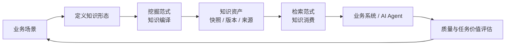

# 语义知识基础设施：从资料检索到知识编译

> 内容范围：建设背景、技术路线、当前进展与下一阶段
> 时间：2026 年 8 月

## 一、核心判断：不同场景需要不同形状的知识

语义知识基础设施不是“更强的文档检索”，而是把复杂资料**编译**为能够直接支撑不同任务的知识资产。

这一区别很关键。面对云核心网等专业领域，一份资料中同时包含概念定义、接口关系、操作步骤、参数约束、版本差异和故障经验。精准查证、关系分析、长文导航、方案设计和 AI Agent 多轮工作所需的知识形态并不相同：有的需要原文证据，有的需要实体关系，有的需要层级结构，有的需要围绕任务组织的结论。

因此，项目遵循的第一性原理是：

```text
业务场景 → 所需知识形态 → 知识加工范式 → 检索服务范式 → 评价标准
```

不是用一条固定流水线和一个搜索框解决所有问题，而是由业务场景反向决定“要把资料编译成什么、再如何消费”。

### 为什么“知识编译”比单纯检索更重要

旧版材料中已明确提出，AI 正从“回答问题”走向“分析、设计、核查和生成”。传统检索的核心产出仍是相关片段；即使加上 Agent 编排，底层资料往往仍保持片段化，版本、约束和证据需要在运行时临时拼接。

| 对比维度 | 传统检索 / RAG | Agentic RAG | 语义知识基础设施 |
|---|---|---|---|
| 主要产出 | 相关文档或文本片段 | Agent 调度后的片段集合 | 面向任务的、带来源与版本边界的知识资产 |
| 结构化发生的时点 | 很少或没有 | 主要在查询时临时组织 | **主要在资料入库后预先编译** |
| 关系与约束 | 依靠人或 LLM 临时理解 | 由 Agent 反复检索和推断 | 可逐步沉淀为实体、关系、层级和证据链 |
| 版本与发布 | 易混入新旧资料 | 依赖调用方自行控制 | 快照、构建和发布机制控制生效范围 |
| 面向复杂任务 | 需要大量后续拼接 | 能编排，但成本和不确定性较高 | 先提供结构化、可核验的知识，再交由 Agent 决策 |

这不是否定 RAG 或 Agent，而是给它们提供更可靠的底座：**Agent 负责决策与行动，知识基础设施负责生产和交付可用证据。**

## 二、业务输入：复杂专业资料的真实挑战

项目当前以云核心网技术资料为主要验证输入，覆盖标准规范、产品文档、配置说明和过程经验。以“业务感知”为例，为支持视频大带宽、游戏低时延、远程控制极低时延等差异化诉求，需要串起流量识别、规则下发、计费/QoS/限速/重定向以及用量反馈等信息，并理解 PCF、SMF、UPF、CHF 等网元之间的职责与约束。

这个例子说明了问题本质：资料并不是孤立的答案库。一个可用结论必须回答至少四件事：

1. 依据来自哪份资料、哪一处内容；
2. 适用的版本、范围和前提是什么；
3. 与哪些对象、步骤或约束存在关系；
4. 是否能够被后续分析、核查或生成任务继续使用。

这也是项目将“文档”升级为“知识资产”的原因。

## 三、总体技术框架：双侧算子化的知识编译与消费体系

系统的技术主线不是简单串联多个服务，而是把“知识构建”和“知识使用”分别组织为可编排的流水线，并由同一套资产治理机制连接。



### 1. 挖掘侧：把原始资料编译成可用知识

挖掘侧的当前主链路可概括为：

```text
资料接入
→ 结构解析与规范化
→ 分段与内容增强
→ 实体抽取、消歧与关系处理
→ 生成检索单元与向量
→ 资产入库
→ 构建、校验与发布
```

这条流水线的产物不只有原始文本。当前资产体系已能够承载文档身份、内容快照、原始切片、切片关系、检索单元、向量、实体提及以及构建/发布版本等信息。这样一份文档重新加工时，系统可以保留原始身份和历史快照，而不是覆盖旧结果；同内容也可以复用已有加工成果。

更重要的是，挖掘流水线正在从固定流程演进为**挖掘范式**：管理员可以发布不同的加工工作流，知识库选择范式后再执行。每次运行固定绑定范式版本、图哈希和执行清单，保证“同一资料由什么方法加工出来”可追溯、可复现。

### 2. 检索侧：把知识资产组织成可核验的结果

检索侧的稳定主链路覆盖：

```text
查询理解
→ 知识范围解析
→ 多路召回
→ 融合与重排
→ 上下文 / 证据组装
→ 面向 Agent 或业务应用返回结果
```

当前已具备 19 类检索算子与版本化范式机制。算子可覆盖查询理解、查询扩展、范围控制、向量/全文/实体检索、关系扩展、融合、重排和结果组装等能力；范式以静态 DAG 方式编译和执行，并有不可变版本。其价值是：针对不同场景，可以组合不同的检索路径，而不必不断修改核心检索系统。

例如，简单事实查询可走“全文/向量召回 → 融合 → 重排 → 证据组装”的轻量路径；复杂关系问题可增加实体识别与关系扩展；Agent 则应调用 `search / fetch / expand` 等粗粒度知识工具，而不是直接操作底层向量或重排算子。

### 3. 双侧算子化：快速适配场景，而不是反复重建系统

算子化是本项目的核心架构选择。

- **挖掘算子**负责生产：解析、分段、抽取、归一、构建不同知识形态；
- **检索算子**负责消费：召回、融合、重排、扩展、组装不同形态的知识；
- **范式**负责把算子按场景组装成一条可发布、可版本化、可复现的 DAG；
- **资产层**负责让挖掘产物经过构建/发布后被检索侧只读消费。

这样，新增一个业务场景不等于重写平台。原则上只需要明确四件事：需要什么知识形态、需要哪些加工算子、需要哪些检索算子、如何评价结果。当前检索侧的算子与范式底座已经落地；挖掘侧已完成可发布工作流和版本冻结，并将继续向更细粒度的算子化编译能力演进。

## 四、场景驱动的知识形态：一份资料可以被编译成多种资产

同一份原始资料不应只产生一种“切片”。以下矩阵定义了项目的演进方向，也解释了为什么必须采用算子化架构。

| 典型场景 | 需要的知识形态 | 对应的知识编译 | 对应的知识消费 | 当前状态 |
|---|---|---|---|---|
| 精准事实查证 | 结构化切片、检索单元、向量、来源 | 解析、分段、检索单元构建、向量化 | 全文/向量召回、融合、重排、证据组装 | **已具备基线能力** |
| 关系与影响分析 | 实体、关系、证据链 | 实体抽取、消歧、关系归纳 | 实体精确检索、关系扩展、证据回溯 | **已有基础，持续补强** |
| 长文理解与章节导航 | 语义层级树、结构目录树 | 基于章节与语义聚合构建树 | 树检索、目录下钻 | **下一阶段优先扩展** |
| 全局主题与跨资料综述 | 社区摘要、主题关系 | 图谱聚类、社区报告生成 | 局部图检索、全局摘要检索 | **依赖图谱能力完善后扩展** |
| 知识合成与方案交付 | 带引用的知识条目/专题文档 | 多来源研究、提纲、生成、引用绑定 | 合成层与原始证据双轨检索 | **中长期方向** |

这张表的重点不是一次性建设所有形态，而是确立扩展方法：先用已成熟的“检索单元”完成基础闭环，再按场景逐步增加树、图、社区或知识条目等资产；每增加一种资产，都通过对应的挖掘算子、发布机制和检索范式进入平台，而不是另起一套系统。

## 五、当前进展：基础能力已从研发链路进入知识库闭环

### 1. 知识库和资料管理已产品化

资料不再是一次后台任务的临时输入。当前已支持：

- 知识库创建、编辑、软删除，以及私有/共享/公开三种可见范围；
- 拥有者、编辑者、查看者等基础成员角色；
- 文件夹新建、重命名、移动和删除；
- 单文件上传、ZIP 自动解压并保留目录结构；
- 文档查看、修改、下载、删除和移动。

文档身份与存储位置分离：文件改名或移动不会中断其已加工的知识链路。这是后续长期维护资料和知识版本的基础。

### 2. 库内知识编译闭环已打通

用户可以在知识库内选择已发布的挖掘范式，对整库做增量加工，也可指定文件加工或强制重加工。系统会记录任务、文档处理动作和阶段进度；范式/版本/图变化后，已有结果会自动失效并按新范式重新加工。

加工完成后，用户可回看原始预览、切片分段、检索单元和实体提及。这使“资料上传—后台处理—不可见结果”的流程，变成“可配置、可追踪、可检查”的知识生产过程。

### 3. 检索与结果组织底座已形成

当前检索侧已经具备多路召回、融合重排和证据组织能力，能够在明确知识范围内将候选内容组织为带来源依据的结果。当前阶段的验证重点是技术链路正确性与可追溯性，不将演示语料的处理规模、检索数量或性能数据作为真实业务成果。

### 4. 当前关键边界

当前已完成的是**库内知识生产闭环**，而不是所有多库知识服务能力。多知识库按范围组合的在线检索、每库独立发布并安全进入在线服务、企业级 SSO 等仍在后续收口中。

其中，知识库加工结果目前先构建并在库内回看，不自动进入域级在线检索发布；这是为避免同一领域不同知识库相互覆盖而采取的阶段性隔离措施。下一阶段将通过按库发布与检索范围控制把这条链路完整接通。

## 六、如何评价知识：不只看“回答对不对”

知识基础设施的评估不能只看一次问答准确率。一个回答得分高，可能只是模型猜对；也可能检索没有找全、引用不可靠、版本不适用。项目采用三层评价思路：

| 评价层 | 核心问题 | 关注指标/证据 | 作用 |
|---|---|---|---|
| **L1：知识构建与检索层** | 关键资料和证据是否被正确加工、召回并排到前面？ | 资料覆盖、结构保留、去重/版本正确性、HitRate、Recall、MRR、NDCG | 定位“资料没进来”还是“资料没找到” |
| **L2：证据与答案层** | 在给定证据下，结论是否完整、准确、可引用？ | 证据覆盖、引用正确性、答案 Coverage/Precision/F1、冲突或版本边界检查 | 区分“检索问题”和“生成问题” |
| **L3：任务价值层** | 接入知识后，是否真正改善业务任务完成质量？ | 与闭卷/普通检索对照的完成质量、胜率、回归率、人工耗时与复核成本 | 衡量真实业务增益 |

当前已具备版本、来源、任务过程和结果回看的基础，因此可以建立上述评测闭环。下一阶段需要围绕真实场景补充题集、基线和持续回归机制；在此之前，不把评估框架中的待填数字当作已取得的业务成果。

## 七、下一阶段：把“可编译”推进到“可按场景稳定交付”

### 1. 完成多知识库在线服务化

让每个知识库拥有清晰的生效版本，检索时能按指定知识库范围解析资产，并在结果中标记来源。这将把当前库内已经完成的加工闭环，安全接入面向业务系统和 Agent 的在线服务。

### 2. 补齐挖掘侧算子化与新知识形态

在已有工作流版本化基础上，将现有加工阶段进一步封装为可组合算子，并优先验证低依赖的层级树、目录树等新资产。后续再逐步推进图谱社区摘要和带引用知识条目。目标是让“新增一种知识形态”成为新增资产和范式，而不是重写主流程。

### 3. 让检索范式真正按复杂度和任务选择

继续完善检索算子的正交化、资产抽象、并行 fan-out、缓存与观测能力。简单问题走低成本固定范式，复杂问题再使用关系扩展、层级导航或 Agent 多轮工具，兼顾效果、成本和可解释性。

### 4. 建立场景化评价与持续治理

以高价值真实场景建立覆盖“资料加工—证据检索—答案质量—任务增益”的评测集和回归机制；同时完善来源、版本、质量、更新与人工审核治理，确保知识随着资料和业务变化持续演进。

## 八、总结

本项目的技术路线可以概括为：

```text
把资料预先编译成多形态、可追溯的知识资产；
再用可编排的检索范式，按不同业务任务把知识可靠地交付给人和 Agent。
```

当前已完成知识库管理、库内可控加工、版本化工作流、知识结果回看以及检索证据组织等基础闭环。下一阶段将把双侧算子化进一步落地，完成多知识库在线服务化，并通过场景化知识形态和评价体系，让知识从“能被检索”走向“能稳定支撑任务”。

---

### 事实依据（供核查）

- 当前代码与规划：本仓库的知识库、工作流、检索算子模块，以及 `docs/融合-KB中心化挖掘-设计规格.md`、`docs/检索与挖掘-场景驱动需求文档.md`、`docs/检索算子底座-演进框架.md`。
- 历史业务输入：既有知识库工程中的背景、场景和流程材料。
- 历史验证材料：仅用于梳理技术路线和演示输入，不作为真实业务规模、性能或效果成果引用。
